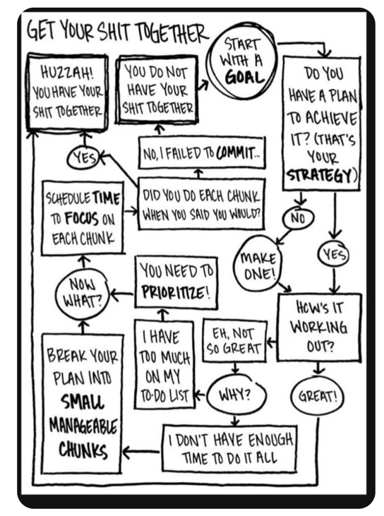
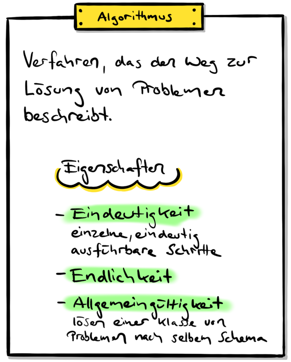

# 1a - Grundlagen Algorithmus

Was sind überhaupt Programme, was sind Algorithmen? Sie lernen mit der
Entwicklungsumgebung Eclipse ein HelloWord-Programm zu schreiben.

:::info Ziele

- Sie können erklären, was ein Algorithmus ist und welches die wichtigsten
  Kontrollstrukturen sind.

:::

## Code.org

<div class="grid"><div>

Einige Programmierer geben Einblick darein, was sie am programmieren
faszinierte. Bei welchen einfachen Aufgaben die Herausforderungen bestanden.
Welche Aufgaben sie zuerst lösen konnten. Und was sie über die Informatik und
Bedeutung von Programmen und Algorithmen denken.

> "Everybody in this country should learn how to programm a computer... because
> it teaches you how to think." _--&nbsp;Steve Jobs_

</div><div>

<YouTube id="nKIu9yen5nc" />

</div></div>

## Was ist programmieren?

Viele Informatiker argumentieren, dass das Erlernen des Programmierens ohne
einen Computer anfangen sollte. Auch im Unterricht zeigt sich oft, dass
Einsteiger viel zu schnell aufhören, über die grundsätzliche Aufgabenstellung
für ein Programm nachzudenken.

### Dazu Zitate einiger Informatiker:

> "Ich glaube eines der Missverständnisse ist, dass viele bei Informatik zuerst
> an Computer und Bildschirme denken. Für mich ist Informatik aber etwas
> anderes: Es ist eine Denkschule, die mir hilft, Probleme auseinanderzunehmen
> und in einzelnen Schritten zu lösen. Wenn ich eine Lösung vor Augen habe, muss
> ich sie genau durchdenken, denn eine kleine Variation kann alles verändern.
> Funktioniert die Lösung, frage ich mich, ob es noch einen einfacheren oder
> schnelleren Weg gibt. Das ist es, was algorithmisches Denken ausmacht. Und
> Algorithmen bestimmen – egal, ob wir es wahrhaben wollen oder nicht –
> zunehmend unsere Welt."<br/>
> --[ETHZ: Gaertner Informatik](https://www.ethz.ch/de/news-und-veranstaltungen/eth-news/news/2018/05/gaertner-informatik-weltsprache-fuer-kinder.html)

> "Wer ist sich schon bewusst, dass ‚digital‘ bedeutet, Information als Folge
> von Symbolen darzustellen? Der erste grosse Schritt der Digitalisierung war
> die Erfindung der ersten Schriften vor Jahrtausende."<br/>
> --[ETHZ: Hrmokovic](https://www.ethz.ch/content/main/de/news-und-veranstaltungen/eth-news/news/2018/07/blog-hromkovic-informatikunterricht.html)

> "Diese Fähigkeit wird auch als Computational Thinking bezeichnet, was deren
> Erfinderin, Jeannette Wing, 2006 beschrieb als: Computational Thinking is the
> thought process involved in formulating a problem and expressing its
> solution(s) in such a way that a computer—human or machine—can effectively
> carry out."<br/>
> --[Swissinformatics Magazine](https://magazine.swissinformatics.org/de/computational-thinking-%E2%89%A0-programming/)

## :pencil: Welche Tätigkeiten mit "Problemlösungsschritten" sind Ihnen bekannt?

Sie konnten im Unterricht diskutieren oder dies nun noch selbst als
Gedankenexperiment nachholen, welche Tätigkeiten Ihnen einfallen, bei denen Sie
Probleme analysiert, Lösungen gesucht und gefunden haben, und einen Bauplan
entwickelt haben, um eine Aufgabe oder ein Problem zu lösen.

<details><summary>Einige Beispiele: Bitte zuerst selbst denken!</summary>

Hier einige Beispiele von Tätigkeiten, die es erforderlich machen, Probleme
auseinanderzunehmen und in einzelnen Schritten zu lösen.

- Anleitung zum Aufbau einer kleinen LEGO-Welt
- Anleitung zum Aufbauen eines Schrankes
- Lösungsvorgehen für einfarbige Flächen beim Rubix-Cube
- Mise-en-place und die Umsetzung eines Kochrezeptes

</details>

## Let's Play!

Hier sieht ihr ein lustiges Flussdiagram. Spiele in dieser Art kennt ihr
bestimmt aus Magazinen und Witz-Seiten. Ihr werdet sehen, dass Quitz wie dieses
die Grundlagen vom Programmieren sehr gut zusammenfassen.



Später, wenn wir die Entwicklungsumgebung zusammen aufgebaut habt, können wir
den Code hier kopieren und dieses Quizz interaktiv spielen. Es fasst alle
Konzepte dieses Moduls zusammen. Am ende des Moduls solltet Ihr fähig sein
solche Quizz selbst zu programmieren.

<details><summary>Code zum Kopieren</summary>

```java
import java.util.Scanner;

public class ShitTogether {

  public static void main(String[] args) throws InterruptedException {
    Scanner scanner = new Scanner(System.in);
    boolean goalFullfiled = false;
    String plan = "";
    String goal = "";
    System.out.println("Get Your Shit Together!\n");
    do {
      System.out.println("Start with a GOAL: ");
      goal = scanner.next();
      System.out.println("\nDo you have a plan to achieve it? (That's your strategy)");
      System.out.println("1: Yes");
      System.out.println("2: No");
      if (scanner.nextInt() == 1) {
        System.out.println("\nMake One!: ");
        plan = scanner.next();
      }
      System.out.println("\nHow is it working out?");
      System.out.println("1: Great!");
      System.out.println("2: Not so Great!");
      if (scanner.nextInt() == 1) {
        goalFullfiled = true;
      } else {
        System.out.println("\nWhy?");
        System.out.println("1: I don't have enough Time to Do it all!");
        System.out.println("2: I have too much on my to-do list!");
        if (scanner.nextInt() == 1) {
          System.out.println("- Berak your plan into Small manageable chunks!");
        } else {
          System.out.println("- You need to priorize!");
        }
        System.out.println("- Schedule Time to focus on each chunk");
        System.out.println("\nDid you do each chunk when you saild you would?");
        System.out.println("1: Yes");
        System.out.println("2: No I failed to commit...");
        if (scanner.nextInt() == 1) {
          goalFullfiled = true;
        } else {
          System.out.println("You do not have your shit together!\n\n");
          goal = "";
          plan = "";
        }
      }
    } while (!goalFullfiled);

    System.out.println("HUZZAH! You have your shit together");
    System.out.println("You archived your goal: " + goal);
    if (!"".equals(plan)) {
      System.out.println("Whith the plan: " + plan);
    }
    scanner.close();
  }
}
```

</details>

## Die Grundformen der Programmierung

Die folgenden Grundbegriffe wurden im Unterricht definiert

- Sequenz (Schritt für Schritt)
- Selektion / Bedingung (if, else, ...)
- Iteration (do, while, for, ...)
- Algorithmus
  - Spezifische Kombination von Sequenz, Bedingung und Iteration

<div class="grid"><div>



</div><div>


</div></div>

## :pencil: Definition Algorithmus und Kontrollstrukturen

In diesem Auftrag geht es darum, zu verstehen was Algorithmen überhaupt sind und
welche grundlegenden Kontrollstrukturen sie mitdefinieren.

- :link:
  [**Aufgabenblatt**](https://drive.google.com/file/d/1ToXES69-oAbJMEc9H9H4NJ404kYyDtIe/view)

<details><summary>Musterlösung</summary>

:link:
[**Ausgefülltes Aufgabenblatt**](https://drive.google.com/file/d/1-j3JmnWYRX8tI3H8-T-2K5RE-FV5YWdO/view)

- Ein Algorithmus ist eine endliche Folge (Ablauf) aus eindeutigen und
  ausführbaren Anweisungen.
  - Eine eindeutige Handlungsvorschrift zur Lösung eines Problems oder einer
    Klasse von Problemen
- Ein Programm ist ein Algorithmus, der in einer formalisierten Sprache
  abgefasst ist und maschinell ausgeführt werden kann.
- Eine lineare Folge von Anweisungen nennt man Sequenz.
  - Ein Viereck zeichnen.
  - Die Wörter Hello, World hintereinander ausgeben.
  - ...
- Wenn eine Sequenz in zwei Sequenzen verzweigt, spricht man von
  Selektion/Bedingung.
- Die Wiederholung eines Abschnitts einer Sequenz wird als Iteration bezeichnet.

**Kein Algorithmus sind:**

- einschlafen
- aufstehen
- Emotionen
- Moral

</details>

## :pencil: Zusätzliche Aufgaben

<DocCardList />
