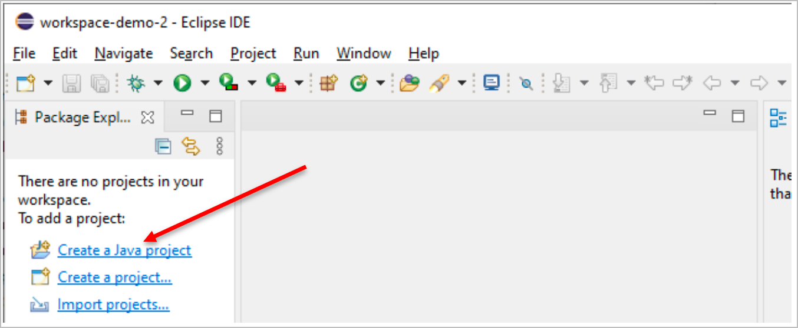

---
keywords:
  - pdf
---
# Hello World Programm

Das «Hello-World»-Programm ist das wohl berühmteste Programm für Programmierer.
Es ist das erste Programm, dass man üblicherweise programmiert, wenn man mit dem
Programmieren anfängt oder eine neue Sprache (und Umgebung) beginnt.

## 1. Hello-World Tutorial in Eclipse starten

Nach dem ersten Start mit einem neuen Workspace zeigt Eclipse den folgenden
Splash-Screen.

- Hier wählen wir «Create a Hello World application».
  

- Dann sieht Eclipse folgendermassen aus. Rechts werden wir nun auf Wunsch durch
  alle wesentlichen Schritte geleitet:
  

## 2. Ein Java Projekt erstellen

Wir wählen oben rechts «Create a Java project». Ohne diese Hilfe von Eclipse
lässt sich das gleich erreichen via Menü _**File ➔ New ➔ Java**_ Project (je
nach Version erst Other, dann Java öffnen).



- Wir geben als Projektname _**«Projekt erste Woche»**_ ein, und lassen die
  anderen Einstellungen unverändert und klicken dann auf **Next**
- Im nächsten Dialog drücken wir direkt auch «Finish».
- Die Rückfrage «Create module-info.java» beantworten wir mit «Don’t create».


## 3. Eine Klasse anlegen

- Links **(Punkt 1)** ist der «Package Explorer», eine baumartige Darstellung
  unseres Workspace und seines Projektes.
- Rechts **(Punkt 2)** werden verschiedene Hilfsangebote angezeigt, die jeweils
  zur Anzeige entsprechender Hinweise führen, um die gewählte Aufgabe _"Create
  Hello World application"_ zu lösen.


- Via Menü _**File ➔ New ➔ Class**_ gelangen Sie in den folgenden Dialog, in
  welchem Sie den Namen **"HelloWorld"** eingeben und bei
  `public static void main(String[] args)` ein Häckchen setzen.
- In Java sind alle Programme in Klassen (Classes) organisiert, daher dieser
  Begriff.


## 4. "Hello World" programmieren

1.  Links vom Projektnamen im «Package Explorer» wird dies `>` Zeichen
    angezeigt. Wenn Sie darauf klicken, dreht es sich, so dass es nach unten
    zeigt und damit den geöffneten Zustand anzeigt.
2.  Auf der rechten Seite beanspruchen «Outline» und «Cheat Sheets» bereits mehr
    als 1/3 der Breite, und diese Darstellung kann man optimieren. Solche Views
    können maximiert, minimiert, geschlossen und gestapelt werden. Probieren Sie
    es aus.


3. In der Mitte des Programms beginnt auf `Zeile 4` die _main-Methode_, die Java
   in allen ausführbaren Programmen erwartet und die Sie auf `Zeile 6` mit
   folgenden Quelltext ergänzen:

```java
System.out.println("Hello World");
```

4. Klicken Sie nun auf den **Play-Button**, damit das Programm ausgeführt
   wird.<br/> In der Console sehen Sie die Ausgabe des Programms:
   

<details><summary>Musterlösung</summary>

```java title="HelloWorld.java"
public class HelloWorld {
  public static void main(String[] args) {
    // highlight-next-line
    System.out.println("Hello World");
  }
}
```

</details>

:::tip Falls die Console nicht sichtbar ist, können Sie diese wie alle Views via
Menü _**Window ➔ Show View ➔ Console**_ wieder aufrufen

:::
