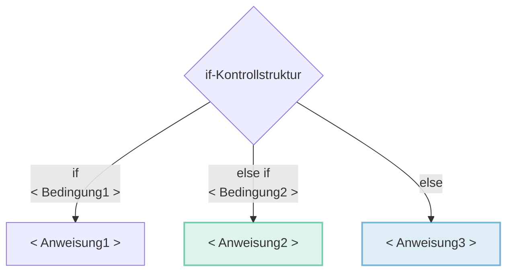
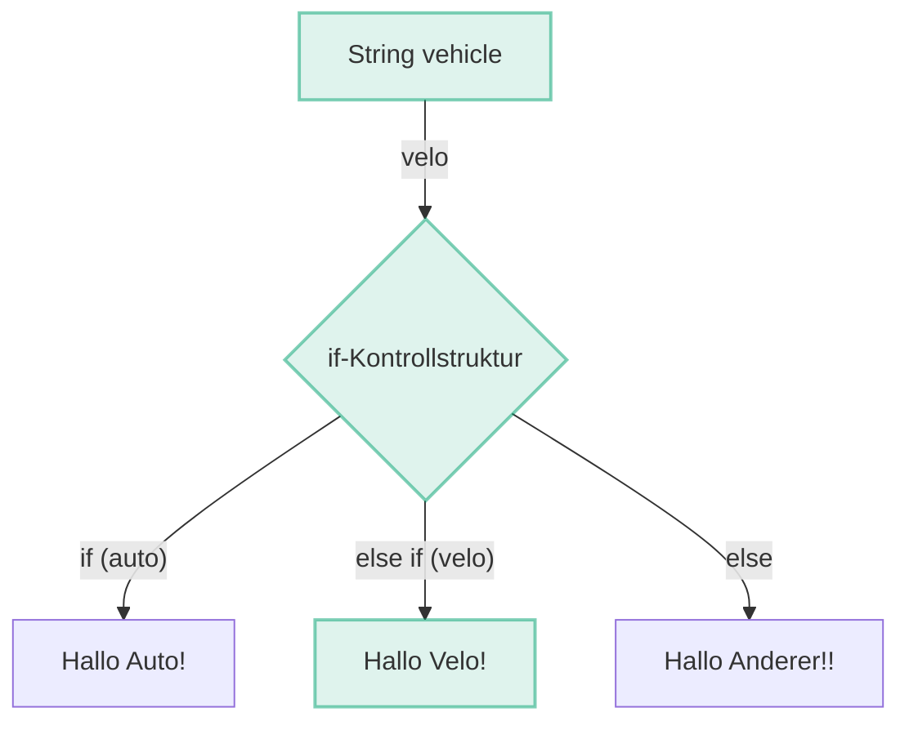

# 3a - Bedingungen: if / switch

Mit `if` und `switch` können Sie auf unterschiedliche Werte in Ihren Variablen unterschiedlich, **spezifisch reagieren**.

:::info Ziele

- Sie können die if Kontrollstruktur erklären und anwenden, indem Sie auch mit Operatoren und boolean-Werten umgehen können.
- Sie können die switch Kontrollstruktur nutzen, um effizienter auf eine kleinere Anzahl unterschiedlicher Werte reagieren zu können als mit einem if.

:::

## if - Kontrollstruktur

Mit dem Schlüsselwort **if** _(engl. falls)_ in Kombination mit dem **Datentyp boolean** können Programme erstellt werden, die abhängig von Benutzereingaben oder Variablenwerten unterschiedlich reagieren.

### Bedingungen (boolean)

Bedingungen sind Code-Ausdrücke, welche entweder wahr `true` oder falsch `false` sein können. Diese werden mit dem Datentyp `boolean` ausgedrückt. Diese sind elementar für die `if`-Kontrollstruktur um zu entscheiden, welcher Codeblock ausgeführt werden soll.

```java title="Beispiel Bedingungen"
// mit int
int age = 21;                // gegeben ist eine int Variable
boolean is21    = age == 21; // true
boolean isNot21 = age != 21; // false, oder !is21
boolean isAdult = age >= 18; // true
boolean isChild = age <= 18; // false

// mit String
String type = "auto";                 // gegeben ist eine String Variable
boolean isAuto = "auto".equals(type); // true
```

:::info
**String** Variablen **immer mit `.equals()`** vergleichen, <u>nie</u> mit `==`
:::

### `if`-Anatomie

Eine Kontrollstruktur mit einem `if` sieht so aus, wie im nächsten **Theoretischen Beispiel** dargestellt.

Es folgt ein **Praktisches Beispiel** um es zu veranschaulichen.

### Formelles Beispiel

:::note

Die Bezeichnungen `<Bedingung>` und `<Anweisung>` dienen als <u>Platzhalter</u> rsp. Pseudocode und sind <u>nicht korrekter Java-Code</u>. Im praktischen Beispiel werden diese mit korrektem Java-Code ersetzt.

:::

<div className="theme-code-block-highlighted-line">

1. Der erste Block `if (<Bedingung1>) { <Anweisung1> }`
   - ist zwingend
   - und zwar von `if` bis zur ersten schliessenden geschweiften Klammer.

</div>

<div className="code-block-green-line">

2. Der nächste Block `else if (<Bedingung2>) { <Anweisung2> }`
   - ist <u>optional</u>
   - kann auch noch mehrfach wiederholt folgen
   - kann nie alleine stehen _(nie ohne vorausgehender `if`-Block)_
   - wird ausgeführt, sofern die Bedingung vom vorausgehendem `if` oder `else if` Block **false** war

</div>

<div className="code-block-blue-line">

3. Der letzte Block `else { <Anweisung3> }`
   - ist <u>optional</u>
   - besitzt keine Bedingung
   - darf <u>nur ein Mal</u> vorkommen, und zwar <u>ganz am Schluss</u>
   - wird ausgeführt wenn kein anderer Block ausgeführt wurde

</div>


<div className="grid"><div>

```java title="if: Formelles Beispiel"
// highlight-start
if (<Bedingung1>) {
    <Anweisung1>
} 
// highlight-end
// highlight-green-start
else if (<Bedingung2>) { // Optionaler Block
    <Anweisung2>
} 
// highlight-green-end
// highlight-blue-start
else {                  // Optionaler Block
    <Anweisung3>
}
// highlight-blue-end
```

</div><div>



</div></div>

**Erläuterung**

1. Wenn die `<Bedingung1>` `wahr` ist, wird <u>nur</u> die `<Anweisung1>` ausgeführt.
2. Wenn die `<Bedingung1>` `falsch` <u>und</u> die `<Bedingung2>` `wahr` ist, wird <u>nur</u> die `<Anweisung2>` ausgeführt.
3. Wenn die `<Bedingung1>` `falsch` <u>und</u> die `<Bedingung2>` `falsch` ist, wird <u>nur</u> die `<Anweisung3>` ausgeführt.

:::tip

Es wird immer nur <u>ein Anweisungs-Block</u> pro `if`-Kontrollstruktur ausgeführt!

:::


### Praktisches Beispiel

<div className="grid"><div>

```java showLineNumbers
// highlight-green-next-line
String vehicle = "velo";

if ("auto".equals(vehicle)) {
    System.out.println("Hallo Auto!");
}
// highlight-green-start
else if ("velo".equals(vehicle)) {
    System.out.println("Hallo Velo!");
}
// highlight-green-end
else {
    System.out.println("Hallo Anderer!!");
}
```

:::tip

Die Variable `String type` könnte nun auch von der Konsole eingelesen werden und somit "dynamisch" sein. Dann macht die Kondition auch mehr Sinn!

:::

</div><div>



</div></div>

**Erläuterung**

1. Es existiert eine Variable _vehicle_ vom Typ `String` mit dem Wert `"velo"`
2. Die `if`-Block Bedingung _(Linie 3)_ wir ausgeführt
   - Da es sich bei der Variable _vehicle_ um einen `String` handelt, wird mit der Methode `equals()` auf Gelchheit geprüft
   - Die Bedingung prüft ob es sich um ein `"auto"` handelt
   - Da der Wert von _vehicle_ `"velo"` ist, ist der `boolean` der Prüfung `false`, also falsch
   - Der Code-Block **_(Linie 4)_ wird übersprungen**
3. Die `else if` Bedingung _(Linie 6)_ wird nun ausgeführt
   - Es wird geprüft ob der Wert `"velo"` ist.
   - Da der Wert `"velo"` ist, ist der `boolean` der **Prüfung `true`, also richtig**
   - Der **`else if`-Block _(Linie 7)_ wird ausgeführt**.
4. Da eine Bedingung `true` war, wird der **`else`-Block _(Linie 10)_ übersprungen!**
