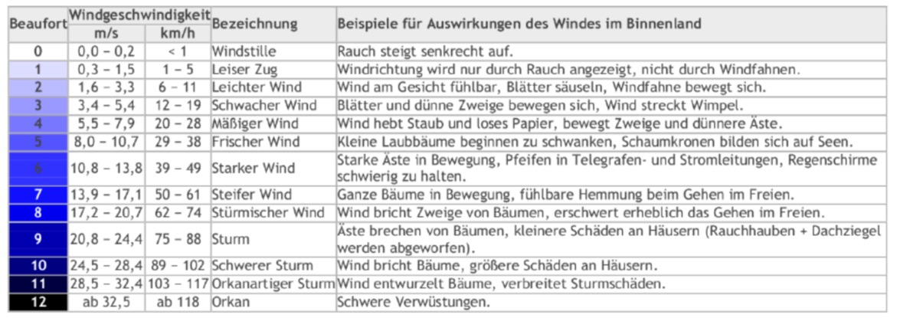

# Switch - Kontrollstruktur

Wir haben bereits die if-Verzweigung kennengelernt. Dort kann anhand einer Bedingung eine Wahl zwischen zwei Möglichkeiten getroffen werden. Das ist eine sehr gute Möglichkeit, ein Programm flexibel zu machen.

Aber manchmal gibt es Situationen, bei denen man zwischen **mehr als zwei Möglichkeiten** unterscheiden möchte. So eine Situation lässt sich lösen, indem man etliche ifs nacheinander hängt.

Hier ein Auszug aus einer Übungsaufgabe, in der ein Würfelspiel implementiert wurde:

```java
int number = rollDice();
if (number == 1) {
    countOne++;
} else if (number == 2) {
    countTwo++;
} else if (number == 3) {
    countThree++;
} else if (number == 4) {
    countFour++;
} else if (number == 5) {
    countFive++;
} else if (number == 6) {
    countSix++;
}
countAll++;
```

:::note

Das obere Beispiel ist nicht alleine lauffähig, dafür fehlt die Methode `rollDice()` sowie die Variable `countOne`.

:::

Für solche Mehrfachverzweigungen gibt es auch die Kontrollstruktur `switch`. Switch ermöglicht es, **auf genaue**, unterschiedliche Werte zu reagieren (`==`). Dabei können die Wert numerisch oder ein String sein. Das Muster sieht so aus:

```java
switch (<Ausdruck>) {
    case value:
        <Anweisung>;
        break;
    case value:
        <Anweisung>;
        break;
    default:
        <Anweisung>;
        break;
}
```

Nach dem Schlüsselwort steht in runden Klammern eine Variable, deren Werte in den anschliessenden case-Blöcken ausgewertet werden. Besteht für den aktuellen Wert der Variablen ein passender case-Block, springt das Programm dort hinein, führt die Anweisungen aus, und springt aufgrund der break-Anweisung aus dem switch heraus (ohne break würden alle nachfolgenden Blöcke auch durchlaufen). Das default am Schluss ermöglicht es, Anweisungen für alle anderen Fälle festzulegen, in denen kein exakter Wert in einem case steht.

Ein konkretes Beispiel sieht so aus:

```java
public class SwitchDemo {
    public static void main(String[] args) {
        int month = 8;
        String monthString;
        switch (month) {
            case 1:
                monthString = "January";
                break;
            case 2:
                monthString = "February";
                break;
            //... andere Fälle hier ausgelassen
            case 8:
                monthString = "August";
                break;
            //... andere Fälle hier ausgelassen
            default:
                monthString = "Invalid month";
                break;
        }
        System.out.println(monthString);
    }
}
```

:::tip

Häufig kann ein `switch` durch einen `array` elegant ersetzt werden:

```java
int month = 8;
int[] monthStrings = {
    "January", "February", "March", "April", "May", "June",
    "July", "August", "October", "November", "December"
}
if (month < monthStrings.length) { // prüft ob `month` gültig ist
    System.out.println(monthStrings[month - 1]);
} else {
    System.out.println("Invalid month");
}
```

:::

## :pencil: Auftrag 1

Erstellen Sie eine Klasse, welche für die Eingabe einer (vereinfachten, ganzen) Note die entsprechende textuelle Bewertung ausgibt resp. Fehlermeldung bei ungültiger Note:

- sehr gut
- gut
- genügend
- ungenügend
- schwach
- sehr schwach
- falsche Eingabe

<details><summary>Musterlösung</summary>

```java
import mytools.StdInput;

public class A1GradesToText {

	public static void main(String[] args) {

		System.out.print("Note eingeben: ");
		int grade = StdInput.readInt();
		String gradeText = "";

		switch (grade) {
		case 1:
			gradeText = "sehr schwach";
			break;
		case 2:
			gradeText = "schwach";
			break;
		case 3:
			gradeText = "ungenügend";
			break;
		case 4:
			gradeText = "genügend";
			break;
		case 5:
			gradeText = "gut";
			break;
		case 6:
			gradeText = "sehr gut";
			break;
		default:
			gradeText = "falsche Eingabe";
			break;
		}
		System.out.println(gradeText);
	}

}
```

</details>

## :pencil: Auftrag 2

Programmieren eines Rechners mit switch.

Erstellen Sie ein Programm, das zwei Zahlen plus einen Operator einliest. Berechnen Sie dann mittels des switch-Statements, welche Rechenart erforderlich ist, führen die Berechnung aus und geben das Ergebnis aus.

<details><summary>Musterlösung:</summary>

```java
import mytools.StdInput;

public class A2Calculator {

	public static void main(String[] args) {
		double firstNumber = StdInput.readDouble("Zahl 1 eingeben: ");
		double secondNumber = StdInput.readDouble("Zahl 2 eingeben: ");
		char operator = StdInput.readChar("Operator eingeben: ");
		double res = 0;
		
		switch(operator) {
            case '+':
                res = firstNumber + secondNumber;
                break;
            case '-':
                res = firstNumber - secondNumber;
                break;
            case '*':
                res = firstNumber * secondNumber;
                break;
            case '/':
                res = firstNumber / secondNumber;
                break;
		}
		
		System.out.println("Resultat: " + res);
	}
}
```

</details>

## :pencil: Auftrag 3

Die Beaufort-Skala wurde 1806 von dem englischen Admiral Sir Francis Beaufort (1774 – 1857) erarbeitet. Mit ihrer Hilfe kann anhand der Auswirkungen des Windes die Windstärke geschätzt werden. Sie reicht von Stärke 0 (Windstille) bis Stärke 12 (Orkan).

:::note nur zur Info

Die Aufgabe lässt sich ohne das genaue Studieren dieser Tabelle lösen ;)



:::

Es gelten die folgenden Annahmen:

- Beaufort 0 - 8: es besteht keine Gefahr
- Beaufort 9: es bestehen mögliche Gefahren
- Beaufort 10 - 12: es bestehen erhebliche Gefahren

Ein Benutzer will wissen, **ob für eine gewisse Windstärke eine Gefahr besteht**. Schreiben Sie ein kleines Programm dafür. Das Programm soll folgendes machen:

- Nach der Windstärke in Beaufort fragen und den Wert einlesen.
- Einen Gefahren-text ausgibt

<details><summary>Musterlösung</summary>

```java
import mytools.StdInput;

public class A3Beaufort {

	public static void main(String[] args) {
		System.out.print("Beaufort-Stufe: ");
		int level = StdInput.readInt();
		
		switch(level) {
			case 0: // wenn kein `brake` steht springt es zur nächsten Anweisung
			case 1: // wenn kein `brake` steht springt es zur nächsten Anweisung
			case 2: // wenn kein `brake` steht springt es zur nächsten Anweisung
			case 3: // wenn kein `brake` steht springt es zur nächsten Anweisung
			case 4: // wenn kein `brake` steht springt es zur nächsten Anweisung
			case 5: // wenn kein `brake` steht springt es zur nächsten Anweisung
			case 6: // wenn kein `brake` steht springt es zur nächsten Anweisung
			case 7: // wenn kein `brake` steht springt es zur nächsten Anweisung
			case 8: 
                // wird von 0-8 ausgeführt
				System.out.println("Es besteht keine Gefahr.");
				break;
			
			case 9:
				System.out.println("Es bestehen moegliche Gefahren.");
				break;
			
			case 10: // wenn kein `brake` steht springt es zur nächsten Anweisung
			case 11: // wenn kein `brake` steht springt es zur nächsten Anweisung
			case 12:
                // wird von 10-12 ausgeführt
				System.out.println("Es bestehen erhebliche Gefahren.");
				break;
			
			default:
				System.out.println("Ungueltige Eingabe");
		}
	}

}
```

Wie ich finde, ist auch hier `if` eleganter:

```java
import mytools.StdInput;

public class A3BeaufortIf {

	public static void main(String[] args) {
		System.out.print("Beaufort-Stufe: ");
		int level = StdInput.readInt();

        if (level <= 8) {
            System.out.println("Es besteht keine Gefahr.");
        } else if (level == 9) {
            System.out.println("Es bestehen moegliche Gefahren.");
        } else if (level <= 12) {
            System.out.println("Es bestehen erhebliche Gefahren.");
        } else {
            System.out.println("Ungueltige Eingabe");
        }
	}

}

```

</details>

## Extra: `switch` oder `if` ?

Sie werden nachvollziehen können oder bereits festgestellt haben, dass die `switch` Kontrollstruktur fast immer durch mehrfache `if-else` ersetzt werden könnte.

Die folgende Tabelle stellt Argumente gegenüber:

| Kontrollstruktur | Beschreibung                                                  | Begründung                                                                                |
| :--------------- | :------------------------------------------------------------ | :---------------------------------------------------------------------------------------- |
| if               | jedes Mal wird das Ergebnis eines boolean Ausdrucks berechnet | überschaubare Anzahl Fälle; alle Datentypen möglich                                       |
| switch           | definierte, einzelne Werte werden geprüft                     | etwas besser lesbar bei vielen Varianten; nur möglich mit Zeichen, Strings und Ganzzahlen |

:::info Herr Hodels Meinung

Grundsätzlich kann man auf Switch verzichten. Ist switch wirklich leserlicher? Vor allem das `break` nach jeder Anweisung macht es häufig komplexer.

Eigentlich macht switch nur dann Sinn, wenn mehrere `<Anweisungen>` bei spezifischen Werten ausgeführt werden sollen. Also dann, wenn man das `break` nicht schreiben müsste. Nun hat sich in der Praxis ergeben, dass dies fast nie der Fall ist.

:::
