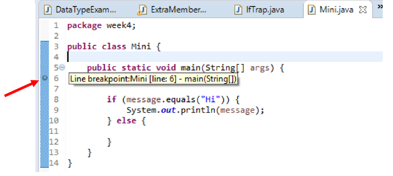
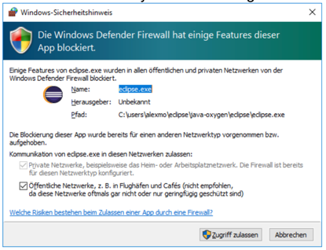
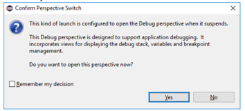
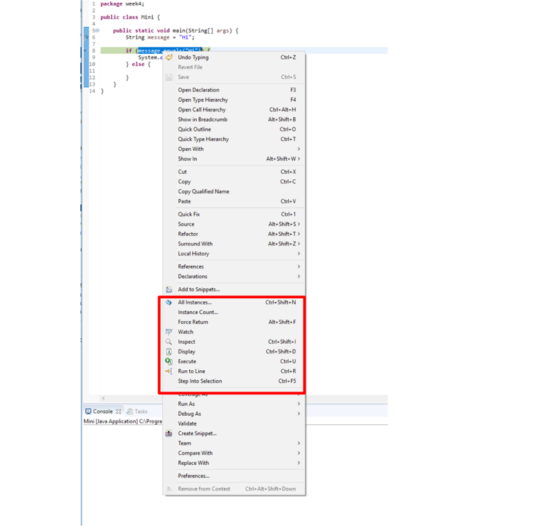
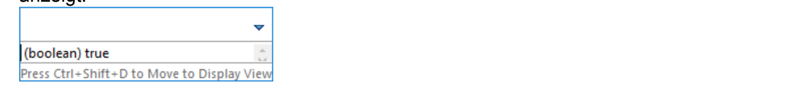

# 3b - Methode debuggen

Sie erhalten einen **ersten Einblick in Methoden**, die für grössere Programme
zur Strukturierung unerlässlich sind. Zusätzlich wird Ihnen das Verfahren des
Debuggings vorgestellt, da es besonders hilfreich sein kann, um Methoden besser
zu verstehen und Ihnen auch künftig hilft, Fehler zu finden.

:::info Ziele

- Sie können einfache Methoden erklären und anwenden.
- Sie können mittels Debugging Ihr Programm schrittweise durchlaufen, dabei die
  Werte von Variablen beobachten und so Abläufe verstehen und Fehlerquellen
  entdecken.

:::

## :teacher: Präsentation

<!-- [:computer: Open in Browser](pathname:///slides/operatoren) | [:floppy_disk: download PDF](pathname:///slides/operatoren.pdf) -->

<!-- <iframe src="/bbzbl-modul-319/slides/operatoren" width="100%" height="400px"></iframe> -->

## Einfache Methode `printCurrentDate`

Die bisher in diesem Modul entwickelten Programme sind alle mit der main-Methode
ausgekommen. In der Praxis sind Programme jedoch wesentlich komplexer. Daher
werden sie auf verschiedene Art strukturiert und aufgeteilt. Einen ersten
Ansatz, um Programme in diesem Sinne zu gliedern, stellen Methoden dar, die
bisher vereinfachend als Befehlsaufrufe bezeichnet wurden.

### Methodenaufruf

Das folgende Beispiel zeigt einen einfachen Methodenaufruf:

```java
import java.time.LocalDate ;

public class OutputMethodExample {
    public static void main(String[] args) {
        // highlight-next-line
        printCurrentDate();
    }

    // highlight-next-line
    public static void printCurrentDate() {
        System.out.println("Current date is: " + LocalDate.now());
    }
}
```

Die hervorgehobenen Linien zeigen den grundsätzlichen Ablauf dieses Programms.
Wie bisher bekannt, wird das Programm in der `main`-Methode ausgeführt, und die
Anweisung welche dort steht, ruft die Methode `printCurrentDate` auf, die ihre
Aufgabe, das aktuelle Datum auszugeben, ausführt.

### Verwendete Schlüsselwörter

#### `public`: Sichtbarkeit

An erster stelle wird die Sichtbarkeit definiert.

- `public` für alle sichtbar
- `private` nur für die entsprechende Klasse selbst sichtbar
- `protected` (oder leer gelassen!) im eigenen Modul sichtbar (**nie leer lassen
  bitte!**)

:::info

Vorderhand genügt es, wenn alle Methoden **public** sind.

:::

#### `static`: Art

An zweiter Stelle <u>kann</u> `static` stehen:

- Dieses Schlüsselwort kennzeichnet Variablen und Methoden, welche keine
  dynamischen Werte verwendet. Diese Methoden verhalten sich immer gleich!
- Will man aus einer statischen Methode (wie z.B. der `main`-Methode) eine
  andere Methode aufrufen, muss diese auch statisch sein.

#### `void`: Rückgabewert

An zweiter, oder dritter Stelle wir der Rückgabewert definiert:

- `void` bedeutet, dass die Methode keinen Rückgabewert besitzt
- Steht ein Datentyp wie z.B. `int`, `String`, muss die Methode diesen Datentyp
  durch das Schlüsselwort `return` zurückgeben.
- **Sie lernen Parameter und Rückgabewerte später im Detail**

## Debugging

Debugging ist eine Arbeitstechnik in der Programmierung, welche es erlaubt, den
Ablauf eines Programms besser nachzuvollziehen. Dabei kann das Programm in einem
speziellen Modus ausgeführt werden, der es erlaubt, das Programm auf jeder
beliebigen Codezeile anzuhalten, die in den Variablen gespeicherten Werte
einzusehen, zu ändern, etc.

### Eine Debugging-Session Schritt-für-Schritt

Folgende Schritte sind nötig, um eine Debugging-Session für folgenden
Programmcode durchzuführen:

```java title="Das verwendete Code-Beispiel"
public class Mini {
    public static void main(String[] args) {
        String message = "Hi";

        if (message.equals("Hi")) {
            System.out.println(message);
        } else {
            // nix tun
        }
    }
}
```

1. Einen (oder mehr) Breakpoint (Haltepunkt) setzen



:::info

Dazu auf das blaue Band links vom Code doppelklicken

:::

2. Das Debugging durch den „Käfer-Button“ starten

3. Auf Ebene Betriebssystem bei allfälliger Nachfrage „Zugriff zulassen“ wählen



4. In Eclipse den Wechsel in eine andere Perspektive („Ansichtsart“) bestätigen



5. Die Debugging-Perspektive analysieren


Was wird hier angezeigt?

- **(1)** Code-Fenster: die Zeile mit dem Breakpoint, grün unterlegt ist der
  Code, der beim nächsten Schritt ausgeführt wird
- **(2)** Buttons zur Steuerung:
  - **Resume**: Programm weiter laufen lassen, bis zum nächsten Breakpoint
  - Pause: Kann ignoriert werden
  - **Stop**: Debugging Session wird beendet
  - **Step-Into**: Springt zur **nächsten Linie welche ausgeführt wird**. Also
    auch weiter zu einer möglichen Methode. So kann manuell durch den gesamten
    Programmablauf navigiert werden.
  - **Step-Over**: Springt zur **nächsten Linie in der aktuellen Methode**.
    Überspringt also den Aufruf einer mögliche Methode auf der aktuellen Linie.
- **(3)** Variablen-Fenster: hier sind alle bereits initialisierten Variablen
  und deren Werte einsehbar (das Programm ist bereits einen Schritt weiter als
  der Breakpoint)
- **(4)** Debug-Fenster: alle laufenden Debug-Prozesse (mit Doppel-x am oberen
  Rand aufräumen)

6. Einzelne Ausdrücke genauer untersuchen (Rechtsklick auf Linie)



Als Beispiel wurde **Display** ausgewählt, welches den Ausdruck ausführt, und
das Ergebnis anzeigt:



Nun kann man **Anpassungen am Code vornehmen**, und sofort die **Folgen
beobachten**. Wenn man z.B. "Hi" nach "i" ändert, wird der Ausdruck `false`, da
`String message = "Hi"` ist und nicht "i"


7. Das Debugging wird über den Stopp-Button beendet. Anschliessend können Sie in
   der Entwicklungsumgebung oben rechts wieder zur Java-Perspektive zurück
   wechseln. Sobald Debugging einmal ausgeführt wurde, wird oben rechts
   einerseits ein Symbol für die Java-Perspektive (J), und andererseits ein
   Symbol für die Debugging-Perspektive (Käfer) angezeigt.

## :pencil: Aufgaben

### Auftrag 1

Kopieren Sie das Code-Beispiel und debuggen Sie ihn, wie in der
[**Schritt für Schritt Anleitung**](#eine-debugging-session-schritt-für-schritt)
gezeigt.

```java title="Das verwendete Code-Beispiel"
public class Mini {
    public static void main(String[] args) {
        String message = "Hi";

        if (message.equals("Hi")) {
            System.out.println(message);
        } else {
            // nix tun
        }
    }
}
```

### Auftrag 2

Kopieren Sie folgendes Beispiel mit einfachem Methodenaufruf in eine Klasse
OutputMethodExample in Eclipse:

```java showLineNumbers
import java.time.LocalDate;
public class OutputMethodExample {
    public static void main(String[] args) {
        printCurrentDate();
    }
    public static void printCurrentDate() {
        System.out.println("Current date is: " + LocalDate.now());
    }
}

```

- Untersuchen Sie den Ablauf mittels Debugging.
- Ein **Breakpoint** muss dabei <u>mindestens</u> auf die **Zeile 4**, mit dem
  Aufruf der Methode `printCurrentDate`, gesetzt werden.
- Sobald der Debugger dort anhält, muss:
  - **Step Into** gewählt werden, damit der Debugger in die Methode verzweigt.
  - Diese Debugging-Session soll aufzeigen, wie der Aufruf einer Methode
    erfolgt.
- Spielen Sie mit den Möglichkeiten

## :tv: Erklärvideos von Studyflix

- [Java Methoden einfach erklärt](https://studyflix.de/informatik/java-methoden-1901)
