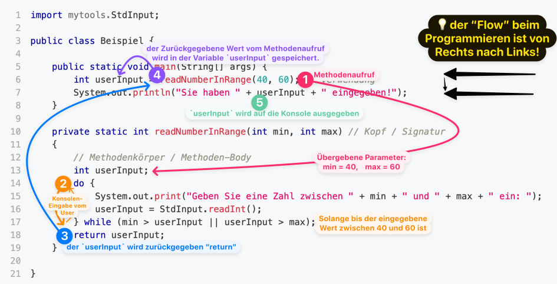

# Methoden Vertiefung

Jetzt lernen Sie, wie Sie Methoden erstellen können, **denen Sie bestimmte Werte
übermitteln** und die ein berechnetes **Ergebnis zurückgeben** können.
Zusätzlich werden verschiedene Ansätze betrachtet, wie man sonst noch mit
Fehlern umgehen kann.

## Anatomie einer Methode

### :dna: Signatur / Kopf `public ...`

Die unten hervorgehobene Zeile einer Methode, in der die Sichtbarkeit, Name,
Parameter und der Datentyp des Rückgabewertes deklariert werden, heisst **Kopf**
(oder auch **Signatur**) der Methode. In der Signatur wird definiert **wie** die
Methode aufgerufen werden muss. Nicht aber, was sie genau macht.

```java title="Signatur einer Methode"
// highlight-yellow-next-line
public static String methodenName(int parameter1, String parameter2) {
```

| Schlüsselwort                         | Beschreibung                                                                                                                                                                                                                                |
| ------------------------------------- | ------------------------------------------------------------------------------------------------------------------------------------------------------------------------------------------------------------------------------------------- |
| `public`                              | **Sichtbarkeit**: momentan immer `public`                                                                                                                                                                                                   |
| `static`                              | **Art**: momentan immer `static`                                                                                                                                                                                                            |
| `String`                              | **Datentyp vom Rückgabewert**: `void` oder beliebiger Datentyp <br/>- `void` besitzt keinen Rückgabewert und braucht kein `return` <br/>- Wenn ein Rückgabewert angegeben wird (z.B. `String`), ist ein `return` im Methodenkörper Pflicht! |
| `methodenName`                        | **Methodenname**: frei wählbar, sollte in **lowerCamelCase** geschrieben sein                                                                                                                                                                   |
| `(int parameter1, String parameter2)` | **Parameterliste**: Kommaseparierte Parameterliste in Klammern.<br/>- Jeder Parameter besteht aus: `Datentyp Variabelnamen`<br/>- Jeder Parameter ist im Methodenkörper als Variable verwendbar <br/>- Darf leer sein `()`                                             |

### :mechanical_arm: Methodenkörper `{ ... }`

Nach dem Kopf/Signatur folgt **zwischen geschweiften Klammern `{}`** der Körper
der Methode. Hier wird nun definiert, **was** gemacht werden soll, wenn die
Methode aufgerufen wird.

:bulb: Im Methodenkörper befindet sich somit **der ausführbare Code** in Java

```java title="Methodenkörper, ausführbarer Code" showLineNumbers
public static String methodenName(int parameter1, String parameter2) {
    // highlight-yellow-start
    int lokaleVariable = parameter1 + 2;
    return lokaleVariable + " " + parameter2;
    // highlight-yellow-end
}
```

:::info Rückgabe: `return`

Besitzt die Signatur einer Methode einen Datentyp (also z.B. `String` wie oben,
nicht aber `void`), muss die letzte Anweisung (Zeile) einer Methode `return`
sein! (wie in **Zeile 3**).

:::

### Beispiel Methode mit Parameter und Rückgabewert

Nun wollen wir an einem expliziten Beispiel eine Methode analysieren welche über
Parameter und Rückgabewert verfügt.

- Wir erstellen eine Methode mit dem Namen `readNumberInRange(int min, int max)`
  welche vom Benutzer eine Nummer erwartet.
- Die Nummer muss sich in einem gewählten Bereich befinden.
- Wenn eine Nummer eingegeben wird, welche nicht im Bereich ist, soll nochmals
  nachgefragt werden.
- Die korrekt eingegebene Nummer soll in der Konsole ausgegeben werden.

```java title="Explizites Beispiel" showLineNumbers
import mytools.StdInput;

public class Beispiel {

    public static void main(String[] args) {
        // highlight-yellow-next-line
        int userInput = readNumberInRange(40, 60); // Verwendung
        System.out.println("Sie haben " + userInput + " eingegeben!");
    }

    // highlight-blue-next-line
    private static int readNumberInRange(int min, int max) // Kopf / Signatur
    {
        // highlight-green-start
        // Methodenkörper / Methoden-Body
        int userInput;
        do {
            System.out.print("Geben Sie eine Zahl zwischen " + min + " und " + max + " ein: ");
            userInput = StdInput.readInt();
        } while (min > userInput || userInput > max);
        return userInput;
        // highlight-green-end
    }

}
```

<div class="grid three"><div>
<span class="code-block-yellow-line">

**:mechanic: Methoden Verwendung** <br/> gelb, Linie 6

</span>

Die Verwendung befindet sich **immer in einem Methoden-Body**. Dies ist
ausführbarer Code.

</div><div>

<span class="code-block-blue-line">

**:dna: Methoden Kopf / Signatur** <br/> blau auf Zeile 10

</span>

Es wird definiert **wie** eine Methode genau aufgerufen werden muss. Der
Methoden-Kopf ist nicht ausführbarer Code, sondern gehört zur Struktur.

</div><div>

<span class="code-block-green-line">

**:mechanical_arm: Methodenkörper** <br/> grün, Zeilen 12 - 18

</span>

Es wird definiert **was** genau geschehen soll, wenn die Methode aufgerufen
wird. Im Methoden-Body befindet sich der ausführbare Code.

</div></div>

#### Ablauf des Beispiels

Hier wird nochmals das selbe Programm dargestellt. Es wird nun aufgezeigt wie
das Program genau durchlaufen wird. In allen Programmiersprachen wird ein
Programm immer von **Rechts nach Links, nach Unten** :point_left: durchlaufen.



**Das Programm startet im Körper der Methode `main` auf Zeile 6**:

1. Da es von Rechts nach Links abläuft wird zuerst die Methode
   `readNumberInRange(40, 60)` auf **Zeile 6** ausgeführt. Die Methode
   `readNumberInRange` wird mit den **Parameter min=40 und max=60** ausgeführt.
2. Nun Springt das Programm in den Körper der Methode `readNumberInRange`.
   - Zuerst wird auf **Zeile 13** die lokale Variable `int userInput;`
     deklariert. Sie wird nicht initialisiert, da der Wert direkt vom Benutzer
     eingelesen wird.
   - dann wird in der `do..while` Schlaufe mit Hilfe von
     `mytools.StdInput.readInt()` auf **Zeile 16** ein Integer eingelesen und in
     der Variable `userInput` gespeichert.
   - Auf **Zeile 17** wird geprüft ob `userInput` zwischen `min` und `max`
     liegt. Hier also zwischen 40 und 60.
   - Wurde keine korrekte Zahl eingelesen Springt das Programm wieder zur
     **Zeile 15**
3. Wurde eine korrekte Zahl eingelesen, wird sie nun auf **Zeile 18**
   zurückgegeben.
4. Nun springt das Programm wieder zurück zur **Zeile 6**. Der zurückgegebene
   Wert wird nun durch den Zuweisungsoperator `=` in die lokale Variable
   `int userInput` der `main`-Methode gespeichert.
5. Als weiteres wird nun die Variable `userInput` auf **Zeile 7** mit einem
   String verknüpft und durch die Methode `System.out.println` auf die Konsole
   ausgegeben. Es wird bei einem Methodenaufruf also immer zuerst der Code
   innerhalb der Klammer `()` ausgeführt.

:::note Zeilen-Flow

6, 13, (14, 15, 16, 17), 18, 6, 7

- Wobei die Zeilen (14, 15, 16, 17) mehrmals ausgeführt werden können.
- Die Zeilen 1-5, 8-11, 19-21 werden nie ausgeführt. Sie beinhalten Struktur
  Informationen, nicht aber ausführbarer Code.

:::

:::tip Sortierung von Methoden in Klassen ist egal!

Die `main`-Methode ist im Beispiel vor der `readNumberInRange` Methode definiert
worden. Die Reihenfolge spielt keine Rolle. Diese könnte auch am Ende definiert
werden.

- Die Reihenfolge ist daher egal, da es sich hier um Struktur und nicht
  ausführbarem Code handelt.
- :fire: **Achtung!** die Reihenfolge vom ausführbarem Code im Methodenkörper
  spielt natürlich eine Rolle!

:::

## Geltungsbereich von lokalen Variablen

Lokale Variablen können nur im selben Code-Block (geschweifte Klammern `{ }`)
indem Sie auch deklariert wurden, verwendet werden.

Im oberen Beispiel wird die Variable `int userInput` zwei Mal deklariert.

- Einmal in der Methode `main` auf Zeile 6
- Einmal in der Methode `readNumberInRange`auf Zeile 13.

Auch wenn diese gleich heissen und vom gleichen Typ sind, sind es **zwei
eigenständige Variablen**. Sie könnten auch anders heissen.

:::info Lokale Variable?

Wenn eine Variable **innerhalb einer Methode** initialisiert wird, spricht man
von lokalen Variablen. Lokal, da sie nur innerhalb dieser Methode ab der
Initialisierung verwendet werden kann (gültig ist).

:superhero: Es gibt noch Instanz-Variablen, die innerhalb einer gesamten Klasse
sichtbar sind. Instanz-Variablen sind in diesem Modul noch nicht relevant!

:::

#### Explizites Beispiel

- Grün wird dargestellt wenn eine Variable sichtbar, also deklariert wird
- Gelb zeigt an wenn die Sichtbarkeit einer Variable endet
- Rot sind Fehlerbeispiele, an diesen Stellen wird versucht auf eine Variable
  zuzugreifen, welche an dem Punkt nicht sichtbar ist.

```java title="Geltungsbereich von lokalen Variablen" showLineNumbers
import mytools.StdInput;

public class Beispiel {

    public static void main(String[] args) {
        // highlight-red-next-line
        // ERROR: userInputMain wird erst auf Zeile 9 definiert
        // highlight-red-next-line
        System.out.println("Hier kann " + userInputMain + " noch nicht verwendet werden!");

        // highlight-green-next-line
        int userInputMain = readNumberInRange(40, 60); // ab hier ist userInputMain sichtbar

        // userInputMain ist sichtbar
        System.out.println("Sie haben " + userInputMain + " eingegeben!");

        // highlight-red-next-line
        // ERROR: userInputRange ist hier nicht sichtbar!
        // highlight-red-next-line
        System.out.println("Hier kann " + userInputRange + " nicht verwendet werden!");
        // highlight-yellow-next-line
        // hier endet die Sichtbarkeit von userInputMain
    }

    private static int readNumberInRange(int min, int max)
        // highlight-green-next-line
    {   // ab hier ist min und max sichtbar
        // highlight-green-next-line
        int userInputRange; // ab hier ist userInputRange sichtbar
        do {
            // highlight-green-next-line
            int userInputRangeNested; // ab hier ist userInputRangeNested sichtbar
            System.out.print("Geben Sie eine Zahl zwischen " + min + " und " + max + " ein: ");
            userInputRangeNested = StdInput.readInt(); // userInputRangeNested ist sichtbar
            userInputRange = userInputRangeNested; // userInputRange ist sichtbar
            // highlight-yellow-next-line
            // hier endet die Sichtbarkeit von userInputRangeNested
        } while (min > userInputRange || userInputRange > max);
        // highlight-red-next-line
        return userInputRangeNested; // ERROR: userInputRangeNested ist nicht sichtbar!
        return userInputRange; // userInputRange ist hier sichtbar
        // highlight-yellow-next-line
        // hier endet die Sichtbarkeit von userInputRange, min und max
    }

}
```

:::tip Geschweifte Klammern Zählen!

Beim Programmieren muss man immer ein gutes Auge auf die geschweiften Klammern
halten. Diese sind sehr oft das Problem wenn Eclipse errors anzeigt.

:superhero: Es ist guter Stil, wenn die Verschachtelung nicht mehr als 3
Klammern übersteigt.

:::

## :tv: Erklärvideos von Studyflix

- [Java Methoden einfach erklärt](https://studyflix.de/informatik/java-methoden-1901)
- [Parameter von Methoden einfach erklärt](https://studyflix.de/informatik/parameter-von-methoden-426)
