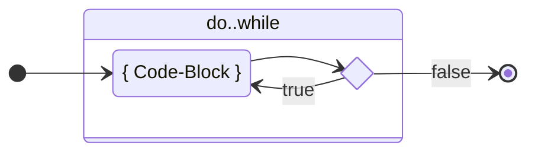

# `do { } while`

Zusätzlich existiert eine sogenannt "flussgesteuerte" Variante von `while`.
Diese Variante **beginnt mit dem Schlüsselwort `do`**, und das `while` rutscht
an den Schluss.

<div class="grid"><div>

```java title="do { } while Code-Beispiel"
int x = 10;
do {
    System.out.println("value of x: " + x);
    x = x-1;
} while(x > 0);
```

</div><div>

**Ablaufdiagram**



</div></div>

Der `do`-Block in den gescheiften Klammern `{}` wird **immer einmal
ausgeführt**, bevor die Bedingung überprüft wird.

Ist die Bedingung erfüllt, wird der do-Block erneut ausgeführt, solange bis die
Bedingung x > 0 nicht mehr erfüllt ist. Die `do..while` Schlaufe ist dadurch
unerscheidlich zur `while` Schlaufe, dass der Code-Block immer **mindestens ein
Mal ausgeführt wird**.

:::info do..while

- Der Code-Block wird **immer zuerst einmal ausgeführt**
- **_Solange-die-Bedingung-zutrifft_** wird der Code-Block wiederholt
  ausgeführt.

:::

## :pencil: Aufgaben

### Fahrenheit Umrechner

Schreiben Sie ein Programm, welches eine Auflistung der Celsiuswerte von -20 bis
100 Grad in 5er Schritten in Fahrenheit ausgibt.

```java title="Die Formel dazu lautet:"
fahrenheit = (9.0/5.0) * celsius + 32
```

#### Beispiel Werte zur Prüfung

|              | Celsius | Fahrenheit |
| ------------ | ------- | ---------- |
| Gefrierpunkt | 0       | 32         |
| Kochpunkt    | 100     | 212        |

<details><summary>Musterlösung:</summary>

```java title="ACFahrenheit.java"
public class ACFahrenheit {

	public static void main(String[] args) {
		double celsius = -20;
		double fahrenheit;

		do {
			fahrenheit = (9.0 / 5.0) * celsius + 32;
			System.out.println("celsius " + celsius + " = fahrenheit " + fahrenheit);
			celsius = celsius + 5;
		} while (celsius <= 100);
	}

}
```

</details>

### Guthaben aufbrauchen

Schreiben Sie ein Programm, welches zuerst ein Startguthaben von 100.00 Franken
in einer Variablen festlegt.

- Nun soll jeweils wiederholt der Benutzer über sein aktuelles Guthaben
  informiert und nach einem Betrag gefragt werden, den man abheben möchte.
- Dieser Betrag wird so lange abgezogen, bis das Guthaben 0 oder weniger
  beträgt.
- Am Schluss soll «Sorry, your balance now is zero or below» auf die Konsole
  ausgegeben werden.

<details><summary>Musterlösung:</summary>

```java title="AD1Balance.java"
import mytools.StdInput;

public class AD1Balance {
	public static void main(String[] args) {

		double balance = 100.0;

		do {
			System.out.println("Your credit is " + balance + ", please enter the amount to withdraw");
			double amount = StdInput.readDouble();
			balance = balance - amount;
		} while (balance > 0);

		System.out.println("Sorry, your balance now is zero or below");

	}
}
```

</details>

### Passwort-Prüfung

Erstellen Sie ein Programm, welches mittels `do..while` nach dem Passwort
"abrakadabra" fragt.

- Solange das Passwort falsch ist, soll die Anforderung wiederholt werden.
- Sobald das Passwort "abrakadabra" richtig eingegeben wurde, soll dem Benutzer
  die Bestätigung „Logged in!“ angezeigt werden.

:::info

Falls es nicht klappt ➔ if-Blatt lesen ➔ Regeln für String!

:::

<details><summary>Musterlösung:</summary>

```java title="AD2Password.java"
import mytools.StdInput;

public class AD2Password {

	public static void main(String[] args) {
		String password = "abrakadabra";
		String entry = "";

		do {

			System.out.print("Please enter the password: ");
			entry = StdInput.readString();
		} while (!password.equals(entry));

		System.out.println("Logged in!");
	}
}
```

</details>
