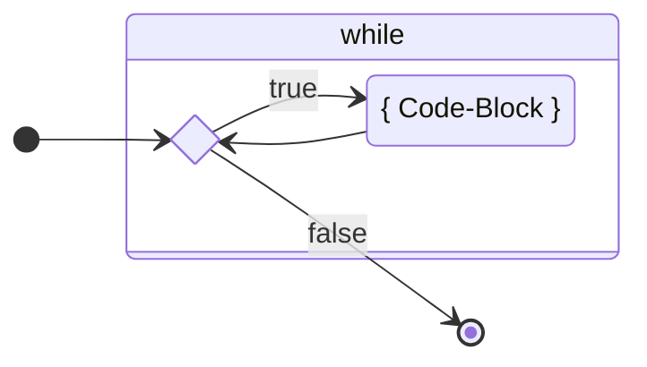

# `while`

Das `while` ist dem if ähnlich. Es hat auch eine Bedingung, aber nur einen
Code-Block, der solange ausgeführt wird, bis die Bedingung den boolean Wert
`false` ergibt.

Das `while` ermöglicht es nun grundsätzlich, dass Programme geschrieben werden
können, die nicht nur einmal durchlaufen, sondern Abschnitte resp. Blöcke
enthalten, die mehrfach ausgeführt werden können.

Beim `while` wird das Wissen über den boolean Datentyp, wie es beim `if`
angewandt wurde, ebenfalls benötigt. Zentral ist also wieder, dass eine
Bedingung formuliert werden kann.

Das grundsätzliche Muster der `while`-Kontrollstruktur sieht folgendermassen
aus:

<div class="grid"><div>

```java title="While Code-Beispiel" showLineNumbers
int i = 10;
while (i > 0) {
  System.out.println("value of i: " + i);
  i = i - 1;
}
```

</div><div>

**Ablaufdiagram**



</div></div>

Der Aufbau der Anweisung ist also so:

1. Es besteht ein Anfangsstatus.
   - Hier eine Variable `int i = 10;`.
2. Es folgt das Schlüsselwort `while` mit einer **booleschen Bedingung** im
   runden Klammerpaar `()`.
   - Hier `i` grösser als `0` also `(i > 0)`
3. dann folgt zwischen den beiden geschweiften Klammern `{}` der Code- Block,
   dessen Ausführung durch das `while` kontrolliert wird.
   - Er wird solange ausgeführt bis die Bedingung `false` ergibt.

**Und wie oft wird also obige Anweisung ausgeführt?**

- Beim ersten Durchlauf hat `i` den Wert 10 wie auf **Zeile 1** initialisiert.
- Dann wird dieser Wert auf **Zeile 4 um 1 verringert**
- Sobald `i` von 1 nach 0 verringert wird ist die Bedingung nicht mehr erfüllt,
  da die Bedingung verlangt, dass der Wert von i grösser als 0 sein muss.
- Die Schlaufe wird somit 10 Mal durchlaufen.

:::info while

- **_Solange-die-Bedingung-zutrifft_** wird ein Code-Block ausgeführt.
- Trifft die Bedingung von Anfang an nicht zu, wird der Code-Block auch nie
  ausgeführt.

:::

## :tv: Erklärvideos von Studyflix

- [while-Schleife einfach erklärt](https://studyflix.de/informatik/while-schleife-224)

## :pencil: Aufgaben

### Wiederholte Ausgabe

Schreiben Sie ein Programm, welches 10-mal „Hopp Schwiiz“ ausgibt.

- Schreiben Sie das Programm **zuerst als Sequenz von 10 Zeilen** mit
  `System.out.println`.
- Schreiben Sie dann das Programm kürzer und einfacher mit einer
  `while`-Schleife.

#### Zusatzaufgabe:

Schreiben Sie das Programm mit einer `while`-Schleife und einer Variablen,
welche diese steuert, wobei Sie die Variable wie folgt deklarieren:

```java
int zaehler = -5;
```

Bis zu welchem Wert muss diese Variable laufen?

<details><summary>Musterlösung:</summary>

```java title="AASwitzerland.java"
public class AASwitzerland {

	public static void main(String[] args) {
		// 10 mal die gleiche Zeile
		System.out.println("Hopp Schwiiz");
		System.out.println("Hopp Schwiiz");
		System.out.println("Hopp Schwiiz");
		System.out.println("Hopp Schwiiz");
		System.out.println("Hopp Schwiiz");
		System.out.println("Hopp Schwiiz");
		System.out.println("Hopp Schwiiz");
		System.out.println("Hopp Schwiiz");
		System.out.println("Hopp Schwiiz");
		System.out.println("Hopp Schwiiz");

		System.out.println("---------------------------------");

		// mit einer while-Schleife
		int x = 0;
		while (x < 10) {
			System.out.println(x + " Hopp Schwiiz");
			x = x + 1;	// ein kürzere Formulierung, um die Variable um eins zu erhöhen, wäre  x++;
		}

		System.out.println("---------------------------------");

		// mit einer while-Schleife, aber wir beginnen bei -5
		int i = -5;
		while (i < 5) {
			System.out.println(i + " Hopp Schwiiz");
			i = i + 1;
		}
	}
}
```

</details>

### Multiplikationstafel ausgeben

Schreiben Sie ein Programm, welches eine Multiplikationstafel ausgibt.

- Der Benutzer gibt an, für welche Zahl die Multiplikationstafel erstellt werden
  soll.

```bash title="Folgende Ausgabe ist erwünscht, falls der Benutzer z.B. 2 eingibt:"
1 x 2 = 2
2 X 2 = 4
3 X 2 = 6
4 x 2 = 8
5 x 2 = 10
6 x 2 = 12
7 x 2 = 14
8 x 2 = 16
9 x 2 = 18
10 x 2 = 20
```

<details><summary>Musterlösung:</summary>

```java title="ABMultiplication.java"
import mytools.StdInput;

public class ABMultiplication {

	public static void main(String[] args) {
		System.out.print("Zahl fuer die Multiplikationstabelle: ");
		int number = StdInput.readInt();

		int ergebnis;
		int i = 1;
		while(i <= 10) {
			ergebnis = i * number;
			System.out.println(i + " * " + number + " = " + ergebnis);
			i = i + 1;
		}
	}

}
```

</details>
