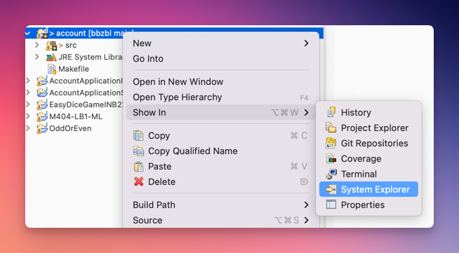

---
keywords:
  - pdf
---

# Vom Quellcode zum ausführbaren Programm

## 1. Sourcecode, Compiler, Interpreter

Programme entstehen aus Quelltext, hier Java, der durch einen Compiler entweder
in ein Maschinenprogramm oder in ein Zwischenformat übersetzt wird, und dann
direkt von einem Computer, einem Betriebssystem oder einer spezifischen
Laufzeitumgebung ausgeführt werden kann.

Java verfolgt einen zweistufigen Übersetzungsprozess. Der Programmcode in Java
wird nicht zu einem ausführbaren Programm, sondern in einen Zwischencode, den
sogenannten Bytecode, kompiliert. Dieser Code ist für alle Plattformen gleich
und kann mithilfe des entsprechenden plattformspezifischen Interpreters auf der
jeweiligen Plattform ausgeführt werden. Java-Interpreter werden auch virtuelle
Maschinen (JVM) genannt.

### Interpetationsversuch

Ihr versteht nur Bahnhof? Hier, ein Versuch das Obrige an einem Beispiel zu
erläutern:

| Reale-Welt                                                                                                                                                                                                                                                       | Java                                                                                                                                                                                                                 |
| ---------------------------------------------------------------------------------------------------------------------------------------------------------------------------------------------------------------------------------------------------------------- | -------------------------------------------------------------------------------------------------------------------------------------------------------------------------------------------------------------------- |
| Stellt euch vor Ihr seit die Chef:in eines Internationalen Unternehmens.                                                                                                                                                                                         | Viele Computer mit verschiedenen Betriebssystemen.                                                                                                                                                                   |
| Die Aufgaben und Befehle werden alle von Spezialisten in schweizerdeutsch erfasst.                                                                                                                                                                               | Java ist in diesem Falle Schweizerdeutsch                                                                                                                                                                            |
| Euer Unternehmen hat an jedem Standort lokale Arbeiter die nur die Landessprachen sprechen und dadurch auch nur in dieser Sprache Befehle ausführen können.                                                                                                      | Diese können mit den Betriebssystemen verglichen werden (MacOs, Windows, Linux). Jedes Betriebssystem hat eigene Codierungen! _(Deswegen funktionieren die meisten Games nur auf Windows)_                           |
| Da Schweizerdeutsch sehr ineffizient (besitzt viele Floskeln) und wenig verbreitet ist, wird vom einem Mitarbeiter alles Schweizerdeutsche ins Englische Übersetzt. Bei der Übersetzung ins Englische wird zudem darauf geachtet die **Aufgaben zu optimieren**. | **Das ist die Arbeit vom Compiler!** Java (Schweizerdeutsch) in Bytecode (Englisch). Es wird auch geschaut dass das Programm optimiert werden kann! _(Compiler Programmierer sind die wahren Helden)_                |
| An jedem Standort hat die Firma Personen angestellt die Englisch können und vom Englischen in die jeweilige Landessprache übersetzen kann. Damit die lokalen Arbeiter effizient ihre Aufgaben erledigen können.                                                  | Der Bytecode (Englisch), wird also bei jedem Betriebssystem lokal übersetzt rsp. interpretiert, damit es auf dem jeweiligen Betriebssystem ausgeführt werden kann. **Dies ist die Arbeit der Java Virtual Machine.** |

Nun nach dieser Tabelle, liest bitte nochmals
[von vorne](#1-sourcecode-compiler-interpreter)

:::tip Don't Panik!

- Man muss das oberige nicht zu 100% verstanden haben um ein guter Programmierer
  zu werden!
- Ein guter Rennfahrer muss auch nicht ein guter Mechaniker sein ;)

:::

## 2. Sourcecode in Form von Klassen

Java-Programme bestehen aus Klassen. Diese Klassen werden dann als Programme
ausgeführt.

Während ein Programm resp. Klassen **(3)** geschrieben werden, werden sie in
einem Verzeichnis namens src **(1)** gespeichert und haben eine
`.java`-Dateiendung **(2)**.

- Der Dateinamen ist immer gleich zum Klassennamen, inklusive Gross- und
  Kleinschreibung!
- Die Klasse `HelloWorld` befindet sich also in der Datei `HelloWorld.java`.
  Eclipse generiert einen Error, wenn dies nicht übereinstimmt.


Wenn die Klassen ausgeführt werden, erfolgt durch die Entwicklungsumgebung eine
Kompilierung im Hintergrund (durch den Compiler javac), und aus den
`.java`-Dateien werden `.class`-Dateien, die in einem Verzeichnis namens `bin`
(für binaries) abgelegt werden. Diese Klassen können dann durch das
Java-Dienstprogramm `java` ausgeführt werden.


Sie können sich diese auf der Harddisk ansehen, indem Sie z.B. auf dem
`src`-Ordner die rechte Maustaste betätigen und dann _Show in => System
Explorer_ wählen.



In der `.java`-Datei kann zuerst das `package` angegeben werden, in welchem sich
die aktuelle Klasse befindet.

- Wird kein `package` angegeben, wie beim HelloWorld programm der Fall, befindet
  sich die Datei direkt unter dem `src` Ordner, `src/HelloWorld.java`.
- Ist ein `package` angegeben, befindet sich die Klasse in einem Unterordner der
  gleich heisst wie das package. In folgenden Fall unter
  `src/helloworld/HelloWorld.java`

```java
// highlight-next-line
package helloworld;

public class HelloWorld {
	public static void main(String[] args) {
		System.out.println("Hello World");
	}
}
```

Dann folgen optional `import`-Anweisungen, die andere Java- und Programmteile im
eigenen Programm nutzbar machen.

```java
package helloworld;
// highlight-start
import some.other.package;
// highlight-end

public class HelloWorld {
	public static void main(String[] args) {
		System.out.println("Hello World");
	}
}
```

Die eigentliche Klasse beginnt mit der Anweisung `public class HelloWorld`, was
aussagt, dass es sich um eine öffentliche Klasse mit dem Namen HelloWorld
handelt. Nach dieser folgt eine öffnende geschweifte Klammer, die mit der
letzten schliessenden geschweiften Klammer zusammen den Klassenkörper bildet.

```java
// highlight-next-line
public class HelloWorld {
	public static void main(String[] args) {
		System.out.println("Hello World");
	}
// highlight-next-line
}
```

Dann folgt die main-Methode `public static void main(String[] args)`. Diese
Zeile wird auch als Methodensignatur bezeichnet. Im Detail wird die
Methodensignatur später angesehen. Die `main`-Methode ist eine ganz besondere,
**sie dient immer als Startort des Programms**. 

- :european_castle: Sie ist sozusagen die Pforte zum Schloss! :european_castle:

```java
public class HelloWorld {
// highlight-next-line
	public static void main(String[] args) {
		System.out.println("Hello World");
	}
}
```

Das nächste paar geschweifter Klammern bildet den Methodenkörper. Darin steht
das, was die eigentliche Leistung des Programms ausmacht. Über die Java-Klasse
System erfolgt die Ausgabe auf die Console (out), wo eine Zeile ausgegeben wird
(println).

```java
public class HelloWorld {
	public static void main(String[] args) {
        // highlight-next-line
		System.out.println("Hello World");
	}
}
```

## :pencil: Aufgabe: Visualisierung

Erstellen Sie eine eigene Visualisierung, welche für Ihr HelloWorld Programm
aufzeigt, wie der Sourcecode zu einem ausführbaren Programm überführt wird,
welcher von einem Interpreter ausgeführt werden kann.
