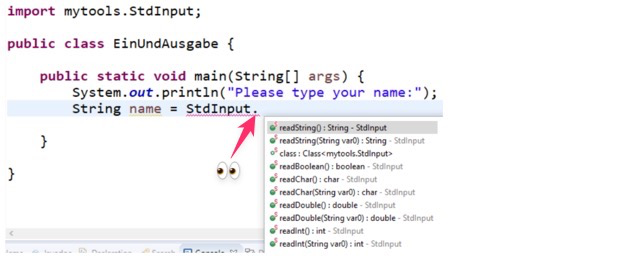

# Text mit `StdInput` einlesen

- Informieren Sie den Benutzer, dass er nun seinen Namen eintippen soll.
- Legen Sie eine String-Variable an, um die Antwort zu speichern.
- Die Funktion, um Daten eingeben zu können, ist in der Klasse mit dem Namen
  `StdInput` enthalten.

:::tip Automatische Vervollständigung

Fangen Sie an zu schreiben und nach «Std» drücken Sie _CTRL+LEERTASTE_, worauf
automatisch die Klasse vervollständigt wird und der korrekte Import für die
Klasse hinzugefügt wird.

:::

```java title="EinUndAusgabe.java"
// highlight-next-line
import mytools.StdInput;

public class EinUndAusgabe {
  public static void main (String[] args) {
    System.out.println("Please type your name:");
    // highlight-next-line
    String name = StdInput // hier fehlt noch was!
  }
}
```

Nun wurde Ihre Klasse gerade zu oberst mit folgender Zeile ergänzt, die dafür
sorgt, dass `StdInput` in Ihrer Klasse genutzt werden kann:
`import mytools.StdInput;`

Geben Sie direkt hinter `StdInput` **einen Punkt** ein. Nun erscheint folgender
Dialog, über welchen Sie die **Methoden der Klasse `StdInput` aufrufen** können:

<!-- TODO: schönes autocoplete Bild -->



:::info Methodenzugriff über Punkt

Auf statische **Methoden** einer statischen Klasse wird immer **über einen
Punkt** zugegriffen.

```java
KlassenName.methodenName([optionaleParemeter]);
//         ^
//   wichtiger Punkt!
```

:::

Da wir einen String-Wert einlesen wollen, wählen gleich den obersten Eintrag
`readString()` und schliessen die Zeile mit einem Semikolon `;` ab. Als nächstes
geben wir den eingegebenen Namen aus, wie in der Programmübersicht gezeigt:

```java title="EinUndAusgabe.java"
import mytools.StdInput;

public class EinUndAusgabe {
  public static void main (String[] args) {
    System.out.println("Please type your name:");
    // highlight-start
    String name = StdInput.readString();
    System.out.println("Your name is " + name);
    // highlight-end
  }
}
```

Führen Sie das Programm aus. Funktioniert es? Begrüsst Sie Ihr Programm mit dem
eingegebenen Namen?

:::tip Strings Zusammensetzen

- Mit einem `+` können Strings Zusammensetzen werden
- Der erste String sollte mit einem Leerzeichen Enden, wieso?

```java title="Strings zusammensetzen"
String name = "Herr Lehrer";
System.out.println("Your name is " + name);
//                              ^ Leerzeichen!
//                  Your name is Herr Lehrer

System.out.println("Your name is" + name);
//                  Your name isHerr Lehrer
```

:::

### Weitere Datentypen einlesen

Die Bibliothek unterstützt verschiedene Datentypen, wie aus der Tabelle der
Methoden ersichtlich ist. Anstelle von `readString()` rufen Sie demnach
lediglich eine andere `read...`-Methode auf.

| Datentyp | Methode                  |
| -------- | ------------------------ |
| int      | `StdInput.readInt()`     |
| char     | `StdInput.readChar()`    |
| String   | `StdInput.readString()`  |
| double   | `StdInput.readDouble()`  |
| boolean  | `StdInput.readBoolean()` |

:::info Datentypen einlesen

```java
int     ganzZahl       = StdInput.readInt();
char    character      = StdInput.readChar();
String  text           = StdInput.readString();
double  gleitKommaZahl = StdInput.readDouble();
boolean bool           = StdInput.readBoolean();
```

:::
