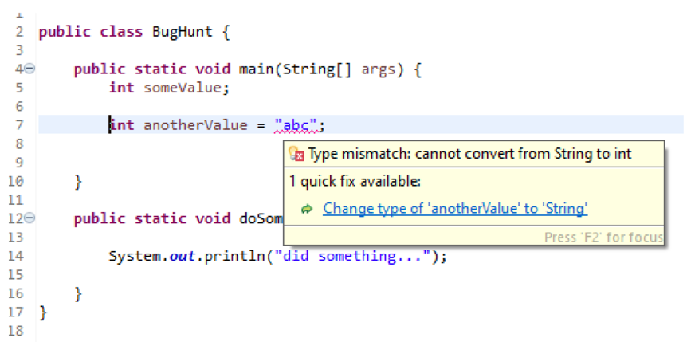
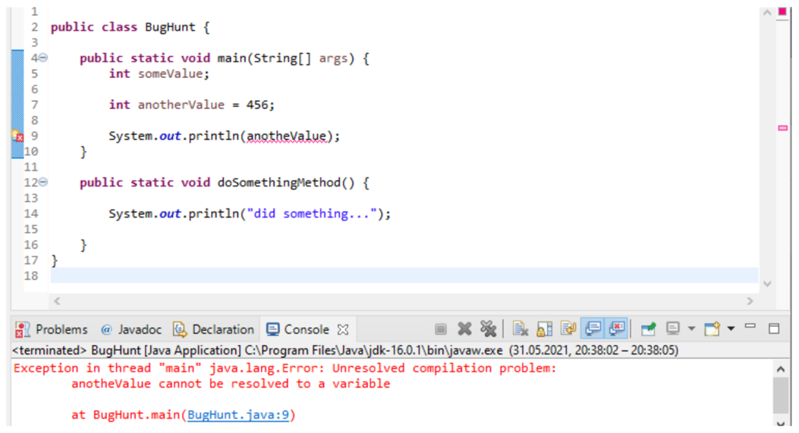

# Fehleranalyse und Fehlersuchen

Um Herausforderungen beim Programmieren zu lösen, müssen Sie erkennen können,
welche Meldungen von Eclipse nur Warnings sind, die Sie mindestens zuerst mal
nicht beachten müssen.

Dann bleiben **drei Fehlerarten**:

1. solche, die bereits beim eintippen angezeigt werden,
2. Fehler, die beim kompilieren angezeigt werden und anhand des angezeigten
   Fehlers analysiert werden können
3. Fehler die zur Laufzeit eine "Exception" ergeben, für die ein "Stacktrace"
   besteht, der einen Link zu einer möglichen Fehlerquelle enthält.

## Warnings (Gelb unterwellt)

Nicht alles was Eclipse anzeigt, sind Fehler. So zeigt Eclipse auch verschiedene
Warnings an. Dabei kann ein **gelbes Dreieck mit einem Ausrufezeichen** bei den
Zeilennummern angezeigt werden.

Meist ist dann ein Ausdruck mit einer **gelben Schlangenlinie unterstrichen**.
Wenn man mit der Maus darüberfährt, wird ein Dialog anzeigt, der es ermöglich,
die Ursache der Warnung zu entfernen.

## Direkt angezeigte Fehler

Bei verschiedenen Fehlern kann Eclipse direkt erkennen, dass ein Fehler
vorliegt. So wie hier im Beispiel, wo versucht wird, einen String-Wert in einer
int-Variablen zu speichern. Die Fehlerquelle ist mit einer **roten
Schlangenlinie** unterstrichen und rechts erscheint neben der Zeilennummer ein
**rotes Quadrat mit einem weissen x**. Ob die vorgeschlagene Lösung sinnvoll
ist, muss im Einzelfall geprüft werden.

## Kompilierfehler

Werden direkt angezeigte Fehler ignoriert und das Programm wird kompiliert,
zeigt Eclipse einen Kompilierfehler an. Die Fehlerursache kann im sogenannten
"Stacktrace", der Ausgabe der Fehlermeldung, analysiert werden.

Kompilierfehler sind meistens **Rechtschreibefehler**. Im Beispiel wurde die
Variable `anotherValue` falsch geschrieben `anotheValue`. Wird dieser Code nun
Kompiliert erscheint folgender Fehler.

- In der ersten Zeile steht «unresolved compilation problem».
- In der vierten Zeile ist die Fehlerquelle angegeben, der Klassenname und die
  Fehlerzeile.
- Diese Fehlerquelle kann man anklicken, dann springt der Cursor direkt an diese
  Position.
- Der Fehler wird ebenfalls direkt beim Code (Zeile 9) rot markiert.

## Fehler zur Laufzeit

Laufzeitfehler sind die gängigsten und auch die am schwierigsten zu finden!
Fehler zur Laufzeit sind **Inhaltsfehler**. Sie passieren, wenn die Eingabe vom
Benutzer nicht korrekt geprüft wurde. Der häufigste Laufzeitfehler ist die
`NullPointerException`. Dieser tritt auf, wenn ein Objekt noch nicht
initialisiert wurde und somit `null` ist. Wird dann versucht eine Methode auf
dem Objekt auszuführen gibt es einen Fehler.

Im Beispiel ist das Problem eine solche `NullPointerException`. Es wird versucht
auf Zeile 12 die Länge vom String-Objekt name herauszufinden. Nur wurde die
Variable "name" auf der Zeile 10 mit `null` überschrieben. Es wird also wieder
ein "Stacktrace" angezeigt die Hinweise zum Fehler ausgeben. Die letzte Zeile
der Meldung ist wiederum Klassenname und die Zeile. Es ist wieder ein Link, den
man anklicken kann, damit der Cursor direkt an der Fehlerquelle steht.

Diesmal wird jedoch kein Fehler direkt bei der Zeile 12 dargestellt. Eclipse
zeigt nur Rechtschreibefehler direkt bei der Zeile an. Inhaltsfehler werden
ausschliesslich durch den "Stacktrace" beschrieben.

