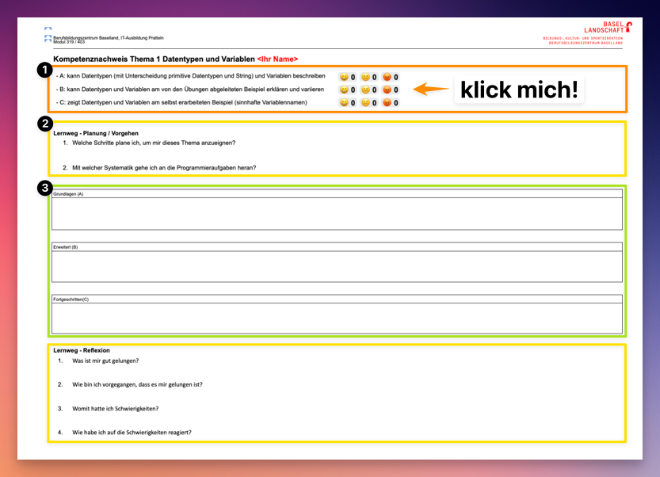

# LB1 - Beurteilungsraster (60%)

:::caution Notenabzug Fallstricke

- Wird ein Dokument **verspätet abgegeben** wird **pro Dokument `0.25` Punkte**
abgezogen
- Code Beispiele **müssen** der [:triangular_ruler: Konvention](/docs/woche01/aufgabe5-konventionen.md#konventionen) entsprechen. Es gibt **pro Konventionfehler `0.1` Notenpunkt Abzug**
- Für die Schwierigkeit "C" benötigen Sie **eigene Beispiele** mit **eigenen Ideen**

:::

## Google Classroom

Die Dokumente zum Beurteilungsraster befinden sich im
[Google Classroom](https://classroom.google.com). Diese können dort bearbeitet
und abgegeben werden.

:::info Kurscode:

- Für die Klasse INP23A: **lx4viyj**

:::

## Beurteilungsraster

Im Classroom findet Ihr den Link zum Ordner mit den Beurteilungsrastern. In
diesem befinden sich meine Beurteilungen welche von jedem für sich eingesehen
werden kann.

Es existiert pro Person eine Datei unter folgendem Namen.

- _Beurteilungsraster\_\{Name\}\_\{Vorname\}_

### Aufbau

Das Raster ist in **vier Teile Unterteilt**, wobei jeder Teil eine mögliche
Punktzahl besitzt.

1. **A (schriftlich)**: kann das Thema differenziert beschreiben
   (Grundanforderungen erfüllt)
1. **B (mündlich)**: kann am Beispiel eines vorgegebenen Auftrags erklären
   (erweiterte Anforderungen erfüllt)
1. **C (schriftlich)**: kann zu dem Thema ein eigenes Beispiel mit eigenen Ideen
   entwickeln und beschreiben (fortgeschrittene Anforderungen erfüllt)
1. **Lernweg (schriftlich)**: Die letzte Spalte des Rasters beurteilt Ihren
   Lernweg mit Planung sowie Reflexion je Thema.

:::caution Schreibt den "Teil C" nicht ab (und formuliert um)

Im mündlichen Gespräch (B), welches für jedes Thema geführt wird, finde ich sehr
schnell heraus ob ein eventueller fortgeschrittener Teil (C) überhaupt von einer
Person stammen kann oder nicht!

:scream: **Wird der mündliche Teil (B) nicht bestanden ist automatisch auch der
schriftliche Teil (C) nichtig.**

- PS: Das heisst nicht, dass Ihr euch nicht gegenseitig helfen dürft. Natürlich!
  verstehen solltet Ihr aber was Ihr abgebt ;)

:::

### Punktevergabe

- Es gibt vier Themen mit je vier Teilen. Das Bedeutet es gibt **16
  Teilpunkte**.
- Die Teilpunkte **entsprechen Notenpunkten**. Die Summe der Teilpunkte ergibt
  somit direkt die Note.
- Die Punkte pro Teil und Thema werden **entweder ganz oder garnicht** erreicht!
  Nur bei Ausnahmen werden Teilpunkte vergeben.

## Themendokumente

Im Classroom finden Sie **pro Thema ein GoogleDoc für Sie persönlich**, welches
Sie direkt bearbeiten und auch darüber abgeben können.

Es existiert für alle vier Themen eine Datei. Folgend sind die Titel der Dateien
und den zugehörigen Aufgabenseiten angegeben:

- **Thema 1 - Datentypen und Variablen**
  - :scroll: : [Variablen & Datentypen](/docs/woche02/2b-datentypen/index.md)

- **Thema 2 - Selektion und Operatoren**
  - :heavy_division_sign: : [Rechnen und Operatoren](/docs/woche02/operatoren.md)
  - :twisted_rightwards_arrows: : [Selektionen (if / switch)](/docs/woche03/3a-konditionen/index.md)
- **Thema 3 - Methoden**
  - :factory: [Methoden](/docs/woche04/4a-methoden-fehleranalyse/index.md)
- **Thema 4 - Debugging und Fehlersituationen**
  - :bug: [Debugging](/docs/woche03/debugging.md)
  - 🧐 [Fehleranalyse](/docs/woche04/fehleranalyse.md)

:::caution Vergesst nicht den LB2

Auch wenn das Beurteilungsraster nicht alle Themen abdeckt, bitte möglichst alle
Themen und Aufgaben bearbeiten. Es könnte ja sein dass z.B.
[Schleifen](/docs/woche05/5a-while/index.md) und [Arrays](/docs/woche07/7a-for-arrays/index.md)
[LB2](/docs/beurteilungen/LB2.md) relevant werden.

:::

### Aufbau

Jedes Dokument ist in drei Teile eingeteilt
([siehe Screenshot unten](#beispiel-themendokument-zur-beschreibung-teil-1)):

1. Am Anfang werden die **drei Schwierigkeitsstufen A,B und C beschrieben
   (orange)**.

   Rechts sind Gefühls-Indikatoren vorhanden, hier müsst Ihr mit einem Klick
   angeben wie ihr euch dabei Gefühlt habt.

2. Danach folgt der der **Lernweg (gelb)**, dieser ist in zwei Teile unterteilt:

   **Am Anfang** des Dokuments muss beschrieben werden wie man genau vorgehen
   möchte um das Thema sich selbständig anzueignen.

   **Am Ende** wird mit einer Reflexion beschrieben was gut gelungen ist, welche
   Schwierigkeiten aufgetreten sind und wie diese angegangen wurden.

3. Schlussendlich gibt es drei Boxen, zur Beschreibung der **drei
   Schwierigkeitsstufen (grün)**.

   Hier müsst Ihr für die Schwierigkeitsstufen A und C euer Beispiel-Code
   einfügen und dieser schriftlich beschreiben.

   Für die Schwierigkeit "Erweitert (B)" müsst Ihr nichts schreiben. Es
   empfiehlt sich jedoch zur Vorbereitung des mündlichen Gesprächs Notizen zu
   machen.

:::note komplexer Code?

Hat ein Beispiel zu viel Code, sodass es in der Box unübersichtlich wird, dürft
Ihr auch eine Datei mit dem Code in Classroom hochladen und **verlinken**.

- **Nur korrekt verlinkte Dateien werden akzeptiert!** (click darauf macht sie
  auf.)

:::

#### Beispiel Themendokument zur Beschreibung (Teil 1)

## Art der Leistungserbringung

- A: **schriftlich** in das GoogleDoc über Classroom
- B: **mündlich** bei der Lehrperson, dabei sind die Meilensteine einzuhalten
  (Die Lehrperson kann jederzeit Fragen zu Ihren Erklärungen stellen, Ihr
  Beispiel variieren oder Ihnen zu weiteren Erläuterungen andere Beipiele
  vorlegen.)
- C: **schriftlich** in das GoogleDoc über Classroom (ausser Thema 4, dies wird
  ebenfalls mündlich bei der Lehrperson vorgestellt)
- Lernweg: **schriftlich** in das GoogleDoc über Classroom

## Meilensteine

