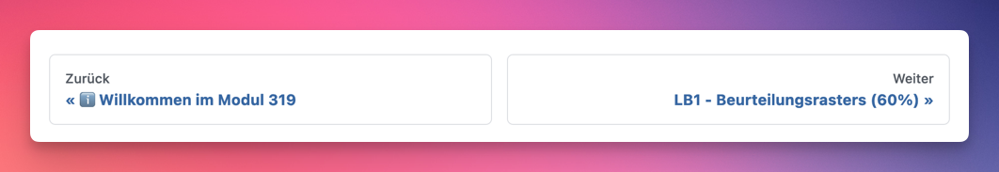
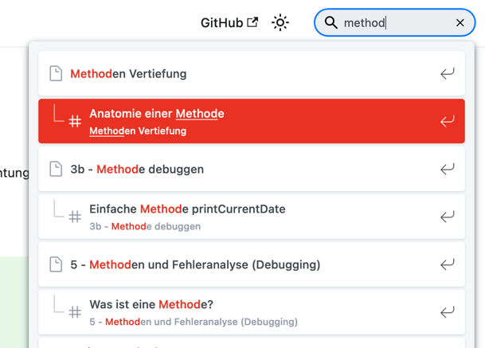

# ℹ️ Willkommen im Modul 319

Willkommen auf der Website, die Sie in das Programmieren einführt, und zwar je
nach EFZ-Fachrichtung mit den Modulen 319 und 403.

Hier finden Sie Informationen und Unterlagen zum Unterricht.

:::tip

- Ausserdem finden Sie auch weiterführende Links.
- Auf diese werden Sie im Unterricht nicht ausdrücklich hingewiesen.

:::

## Webseite

### Lektionen

Unter [Lektionen](./lektionen/index.md) finden Sie die Übersicht aller Lektionen
inklusive der Inhalte die pro Woche anstehen.

### Navigation

Links ist die Unternavigation sichtbar.

Die **Nummern pro Hauptthema entsprechen der Wochennummer** in welchem das Thema
besprochen wird.

- _**1a - Vom Algorithmus zum Programm**_ wird also in der **Woche 1** relevant
  sein.
- _**7 - Arrays und for(each)**_ erst in der **Woche 7**

Pro Seite wird unten einen "Zurück" und "Weiter" Link dargestellt. Ich könnt
also theoretisch alle Themen nacheinander durchgehen und die zugehörigen
Aufgaben machen.

### Musterlösungen

Musterlösungen befinden sich immer in einer ausklappbaren Box. Ihr könnt alle
Lösungen direkt auf der Webseite abrufen. Die Box ist eingeklappt, damit Ihr es
hoffentlich zuerst selber versucht!

Musterlösung:

Ich bin eine Musterlösung. Bitte zuerst selbst versuchen :smiley:

:::tip Programmieren braucht Übung!

Nur mit **Repetition und Übung** werdet Ihr Programmieren lernen.

Vergleicht es mit einem Sport! Es ist gut ein Buch über Skaten zu kaufen.
Natürlich helfen Tips es von Anfang an richtig zu machen.

**ABER:** Ohne selber zu üben schafft man keinen Olly (zumindest ich kann noch
keinen :D) und schon gar keinen 1080.

:::

### Suche

Die Webseite ist komplett durchsuchbar. Dies könnt Ihr machen, idem ich `ctrl-k`
drückt oder einfach oben rechts im Suchfeld nach Begriff sucht.

### Modul als PDF

Ich könnt den Inhalt der Webseite (Ohne Musterlösungen) als
[PDF downloaden](https://codingluke.github.io/bbzbl-modul-319/assets/pdf/bbzbl-modul-319.pdf).
Dies geht auch über den Button oben rechts.

So könnt Ihr mit einem beliebigen PDF viewer beliebige Kommentare und Notizen
machen. Auch ermöglicht es so die Archivierung für späteres Nachschlagen.

Dieses Feature ist momentan experimentiel! Erwartet nicht das eleganteste PDF.
Es wird mit der Zeit verbessert.

## Entwicklungsumgebung

An der Schule steht Ihnen grundsätzlich ein Rechner mit einer virtuellen Windows
10 Maschine zur Verfügung. Darauf sind alle nötigen Programme installiert.
Alternativ dürfen Sie natürlich die Programme auch auf Ihrem privaten Gerät
installieren und verwenden.

Zusätzlich stellen wir Ihnen eine virtuelle Maschine zur Verfügung, die Sie
verwenden dürfen. Diese haben Sie am besten auf einer externen Festplatte dabei.
So haben Sie an der Schule wie auch zu Hause immer die selbe Umgebung.

:::tip

- Link zu Classroom: [Google Classroom](https://classroom.google.com/)
- Dann oben rechts auf das + -> Für Kurs anmelden mit dem Kurscode: **v6charw**
- Unter Kursunterlagen finden Sie die virtuelle Maschine **bmWP3** (Standard-VM
  für Java Module)

:::

## Modulidentifikation

[:floppy_disk: PDF speichern](https://modulbaukasten.ch/Module/319_1_Applikationen%20entwerfen%20und%20implementieren.pdf)

<iframe src="https://modulbaukasten.ch/Module/319_1_Applikationen%20entwerfen%20und%20implementieren.pdf"></iframe>

## LBV

[:floppy_disk: PDF speichern](https://www.modulbaukasten.ch/Module/319_1_Applikationen%20entwerfen%20und%20implementieren.pdf)

<iframe src="https://www.modulbaukasten.ch/Module/319_1_Applikationen%20entwerfen%20und%20implementieren.pdf"></iframe>

## Quellen

- [Offizielle Webseite: Modulidentifikation](https://www.modulbaukasten.ch/module/319)
- [Offizielle Webseite: LBV](https://www.modulbaukasten.ch/module/319/2/de-DE?lbv=0)

## Historie

**Modul 403**

- [:paperclip: Alte Modulidentifikation](https://www.modulbaukasten.ch/module/403/1/de-DE)
- [:paperclip: ALTE LBV](https://www.modulbaukasten.ch/module/403/2/de-DE?lbv=0)
