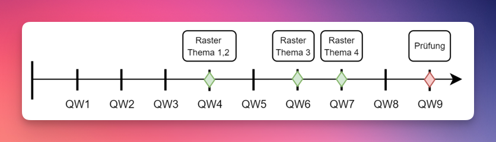

# 📅 Quartalsübersicht

|                    |         Woche          |     Datum      | Thema                                                                                                   | Leistungsbewertung       |
| ------------------ | :--------------------: | :------------: | :------------------------------------------------------------------------------------------------------ | :----------------------- |
|                    |   [Woche&nbsp;1][w1]   |   18.08.2023   | Algorithmus / Sequenz / Bedingung / Iteration   HelloWorld in Eclipse   CodeStyle / Conventions |                          |
|                    |   [Woche&nbsp;2][w2]   |   25.08.2023   | Datentypen / Ein und Ausgabe / `if` / Operatoren                                                        |                          |
|                    |   [Woche&nbsp;3][w3]   |   01.09.2023   | Selektion mit `if` und `switch` / Methoden / Debugging                                                  |                          |
|                    | [**Woche&nbsp;4**][w4] | **08.09.2023** | Methoden mit Parametern und Rückgabewert   Fehleranalyse                                            | **[LB1]: Thema 1 und 2** |
|                    |   [Woche&nbsp;5][w5]   |   15.09.2023   | `while` / Konstanten                                                                                    |                          |
|                    | [**Woche&nbsp;6**][w6] | **22.09.2023** | Ratespiel mit Repetition bisherige Themen                                                               | **[LB1]: Thema 3**       |
| :steam_locomotive: | [**Woche&nbsp;7**][w7] | **29.09.2023** | **Abschluss Beurteilungsraster**                                                                        | **[LB1]: Thema 4**       |
|                    |                        |                | :star: _Ferien_                                                                                         |                          |
|                    |   [Woche&nbsp;8][w8]   |   20.10.2023   | Array / `for`                                                                                           |                          |
|                    | [**Woche&nbsp;9**][w9] | **27.10.2023** | **Prüfung** / Repetition                                                                                | **[LB2]**                |

[w1]: ./woche-01.md
[w2]: ./woche-02.md
[w3]: ./woche-03.md
[w4]: ./woche-04.md
[w5]: ./woche-05.md
[w6]: ./woche-06.md
[w7]: ./woche-07.md
[w8]: #
[w9]: #
[lb1]: ../beurteilungen/LB1.md#themendokumente
[lb2]: ../beurteilungen/LB2.md

## Meilensteine

