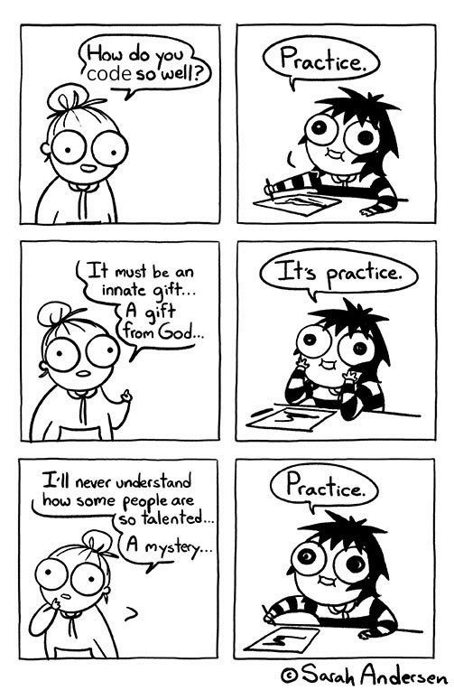

# Woche 8

## :school: Unterricht

Zentrale Themen heute sind **for-Schleifen** und **Arrays**. Sobald Sie sich da
durchgearbeitet haben, Übungen lösen konnten und alles verstanden haben, widmen
Sie sich der Repetition und Prüfungsvorbereitung für LB2.

### `for`-Schlaufen

- [:brain: Theorie](../5a-while/for.md)
- [:pencil: Aufgaben](../5a-while/for.md#-aufgaben)

### Arrays und `foreach`

- [:brain: Theorie](../7a-for-arrays/index.md)
- [:brain: foreach Theorie](../7a-for-arrays/foreach.md#-aufgaben)
- [:pencil: Array Aufgaben](../7a-for-arrays/arrays.md#-aufgaben)

### Repetition

- [8 - Repetition](../8a-repetition/index.md)

## :house: Hausaufgaben

:::danger [LB2](../beurteilungen/LB2.md) nächste Woche

Nächste Woche steht der [**LB2**](../beurteilungen/LB2.md) an!

### Hilfmittel

- Das :book:
  [**Faktenblatt zum Modul 403**](../beurteilungen/images/Formelsammlung-Faktenblatt.pdf).
  Audrucken und mitnehmen
- Eine **eigene Zusammenfassung**, welche Sie selbst während des Moduls erstellt
  haben, verwenden.

:::

## Vorbereitungs Aufgaben

- [Konntrollstrukturen](../3a-konditionen/uebungen.md)
- [Methoden](../4a-methoden-fehleranalyse/aufgaben.md)
- [`while`-Schleife](../5a-while/while.md#-aufgaben)
- [`do..while`-Schleife](../5a-while/dowhile.md#-aufgaben)
- [`for`-schleife](../5a-while/for.md#-aufgaben)
- [Arrays](../7a-for-arrays/arrays.md#-aufgaben)

Wenn ihr oben alles habe könnt ihr noch Repetieren! :muscle:

- [8 - Repetition](../8a-repetition/index.md)

:::tip Programmieren muss man üben!

Ein Spick hilft oft nicht viel, wenn man es nicht verstanden hat. Macht also
soviel wie möglich von den Aufgaben.

:::

## :compass: Ablauf

import Ablauf from "../../src/pages/woche-08.md"

<Ablauf />

**[:mag: Ablauf in Vollbild](pathname:///woche-08)**
