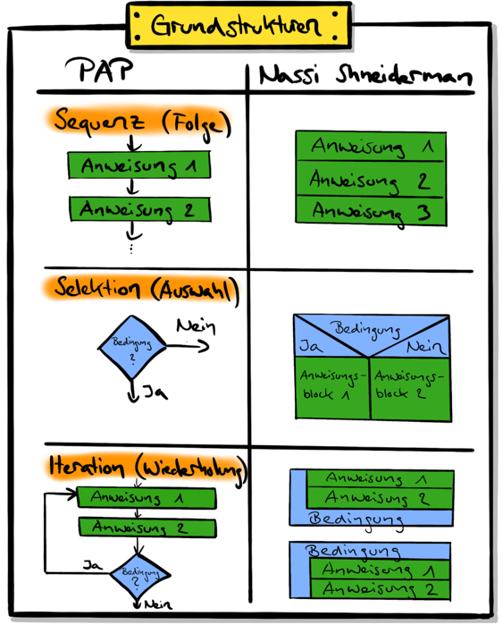

---
keywords:
  - pdf
---

# Vom Algorithmus zum Programm

Was sind überhaupt Programme? und was haben diese mit Algorithmen zu tun?

## :dart: Ziele

- Sie können erklären, was ein Algorithmus ist und welches die wichtigsten
  Kontrollstrukturen sind.

## :teacher: Präsentation

[:computer: Open in Browser](pathname:///slides/programmieren) |
[:floppy_disk: download PDF](pathname:///slides/programmieren.pdf)

<iframe src="/bbzbl-modul-319/slides/programmieren" width="100%" height="400px"></iframe>

## Code.org

<div class="grid"><div>

Einige Programmierer geben Einblick darein, was sie am programmieren
faszinierte. Bei welchen einfachen Aufgaben die Herausforderungen bestanden.
Welche Aufgaben sie zuerst lösen konnten. Und was sie über die Informatik und
Bedeutung von Programmen und Algorithmen denken.

> "Everybody in this country should learn how to programm a computer... because
> it teaches you how to think." _--&nbsp;Steve Jobs_

</div><div>

<YouTube id="nKIu9yen5nc" />

</div></div>

## :pencil: A1: Welche Tätigkeiten mit "Problemlösungsschritten" sind Ihnen bekannt?

Sie konnten im Unterricht diskutieren oder dies nun noch selbst als
Gedankenexperiment nachholen, welche Tätigkeiten Ihnen einfallen, bei denen Sie
Probleme analysiert, Lösungen gesucht und gefunden haben, und einen Bauplan
entwickelt haben, um eine Aufgabe oder ein Problem zu lösen.

<details><summary>Einige Beispiele: Bitte zuerst selbst denken!</summary>

Hier einige Beispiele von Tätigkeiten, die es erforderlich machen, Probleme
auseinanderzunehmen und in einzelnen Schritten zu lösen.

- Anleitung zum Aufbau einer kleinen LEGO-Welt
- Anleitung zum Aufbauen eines Schrankes
- Lösungsvorgehen für einfarbige Flächen beim Rubix-Cube
- Mise-en-place und die Umsetzung eines Kochrezeptes

</details>

## Die Grundformen der Programmierung

Die folgenden Grundbegriffe wurden im Unterricht definiert

<div class="grid"><div>

### Sequenz (Schritt für Schritt)
Unter Sequenz ist einen Ausführungsschritt gemeint. Beim Programmieren ist dies meistens eine Zeile.

### Selektion / Bedingung
Unter der Selektion fallen Kontrollstrukturen oder auch Bedingungen genannt.
Damit kann gesteuert werden ob einen Ausführungsschritt ausgeführt werden soll oder nicht.

Beispiele in Java: `if/else`, `switch/case`

### Iteration / Schlaufe
Eine Iteration ist eine Wiederholung. Damit kann definiert werden ob Ausführungsschritte mehrfach ausgeführt werden sollen.

Beispiele in Java: `while`, `do..while`, `for`

</div><div>



</div></div>

<div class="grid"><div>

## Algorithmus

Der Algorithmus ist nun deine spezifische Kombination von Sequenz, Bedingung und Iteration um ein bestimmtes Problem zu lösen.

Folgende Eigenschaften sind relevant:

- Eindeutigkeit
- Endlichkeit
- Allgemeingültigkeit

</div><div>


</div></div>

## :pencil: A2: Definition Algorithmus und Kontrollstrukturen

In diesem Auftrag geht es darum, zu verstehen was Algorithmen überhaupt sind und
welche grundlegenden Kontrollstrukturen sie mitdefinieren.

- :link:
  [**Aufgabenblatt**](https://drive.google.com/file/d/1ToXES69-oAbJMEc9H9H4NJ404kYyDtIe/view)

<details><summary>Musterlösung</summary>

:link:
[**Ausgefülltes Aufgabenblatt**](https://drive.google.com/file/d/1-j3JmnWYRX8tI3H8-T-2K5RE-FV5YWdO/view)

- Ein Algorithmus ist eine endliche Folge (Ablauf) aus eindeutigen und
  ausführbaren Anweisungen.
  - Eine eindeutige Handlungsvorschrift zur Lösung eines Problems oder einer
    Klasse von Problemen
- Ein Programm ist ein Algorithmus, der in einer formalisierten Sprache
  abgefasst ist und maschinell ausgeführt werden kann.
- Eine lineare Folge von Anweisungen nennt man Sequenz.
  - Ein Viereck zeichnen.
  - Die Wörter Hello, World hintereinander ausgeben.
  - ...
- Wenn eine Sequenz in zwei Sequenzen verzweigt, spricht man von
  Selektion/Bedingung.
- Die Wiederholung eines Abschnitts einer Sequenz wird als Iteration bezeichnet.

**Kein Algorithmus sind:**

- einschlafen
- aufstehen
- Emotionen
- Moral

</details>

## :pencil: A3: Geheimschrift

Sie tauschen häufiger Mitteilungen aus z.B. über das Handy. Leider können diese
kurzen Botschaften auch von anderen Familienmitgliedern oder Freunden gelesen
werden, wenn Sie gerade das Handy haben. Sie benutzen daher eine Geheimschrift.

Aus **"Dies ist ein Test!"** wird durch einen definierten Algorithmus **"Ejft
jtu fjo Uftu!"**.

- Erkennen Sie den Algorithmus?
- Versuchen Sie diesen mit Worten zu beschreiben, sodass ein Roboter auch in der
  Lage wäre, Texte zu ver- bzw. entschlüsseln.
- Den beschriebenen Algorithmus stellen Sie nachher der ganzen Klasse vor,
  zusammen mit diesem Text, den es zu verschlüsseln gilt: „Zaubern ist eine
  Kunst!“

<details><summary>Lösung: "Zaubern ist eine Kunst"</summary>

Abvcfso jtu fjof Lvotu!

</details>

## :pencil: A4: Grösster gemeinsamer Teiler (ggT)

**Grösster gemeinsamer Teiler**, der älteste Algorithmus der Welt! :scream:

Der euklidische Algorithmus ist ein Algorithmus aus dem mathematischen
Teilgebiet der Zahlentheorie. Mit ihm lässt sich der **grösste gemeinsame
Teiler** zweier natürlicher Zahlen berechnen.

<div class="grid"><div>

Berechnung des ggT aus `a = 28` und `b = 20`

- Finden Sie anhand der Vorgehenstabelle den Algorithmus heraus
- Beschreiben Sie ihn mit eigenen Worten

</div><div>

**Vorgehenstabelle:**

| Schritt | `a`   | `b`    | Gesuchte Berechnung pro Schritt        |
| :------ | :---- | :----- | :------------------------------------- |
| 1       | 28    | 20     | Start                                  |
| 2       | **8** | 20     | Warum `a`?<br/>Wie wird `a` zu **8**?  |
| 3       | 8     | **12** | Warum `b`?<br/>Wie wird `b` zu **12**? |
| 4       | 8     | **4**  | Warum `b`?<br/>Wie wird `b` zu **4**?  |
| 5       | **4** | 4      | Warum `a`<br/>Wie wird `a` zu **4**?   |

Der ggT ist **4**, wieso?

</div></div>

## :pencil: A5: Sprecher suchen

<div class="grid"><div>

Für eine große Gruppe von Leuten ist ein Sprecher zu benennen. Die Gruppe einigt
sich darauf, den Ältesten mit dieser Aufgabe zu betrauen.

- Erläutern Sie schriftlich das Vorgehen, wie Sie den ältesten Sprecher
  ermitteln.

</div><div>

**Geburtstage der Sprecher**

```
07.09.1982      02.03.1982

    23.12.1982       19.03.1981

12.05.1981  18.05.1981  18.04.1982

  21.11.1981  27.10.1981    03.09.1981

          24.11.1982      06.06.1981
```

</div></div>

## :pencil: A6: Wörter suchen

In solchen Rätseln sind in einem oft quadratischen Feld Wörter versteckt, die
horizontal, vertikal oder diagonal (auch rückwärts) geschrieben sind. In einem
kleinen Feld lassen sich gesuchte Wörter noch schnell selbst finden. Schon bei
50x20 Zeichen ist es aber sehr ermüdend.

<div class="grid"><div>

Erläutern Sie präzise, wie Sie einen Suchknecht instruieren könnten, damit er
alle versteckten Wörter findet.

Versteckt wurden folgende vier Wörter potentiell in alle Richtungen:

- LEIM
- INFORMATIK
- KURS
- EIMER

</div><div>

**Buchstabenquadrat**

```
ASDFERFGTHZJUKIJERTX
TIERNKMENOAERSOIMMEL
KJHZRUINNVHMGSHEBOLE
OKDFJRUEHZCCRBOHDARI
IRGENSJISEREMIELIERN
LPOUJNASHZRTEUFIFNEF
EHSZEURKITAMROFNIASF
AGREHZTUECINBHEEIOWU
```

</div></div>
