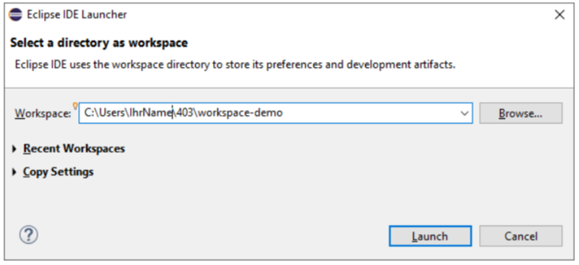

---
keywords:
  - pdf
---
# 🖊 A1: Eclispe installieren

In dieser Aufgabe lernen Sie wie, Sie die Entwicklungsumgebung _Eclipse_
aufsetzen, damit Sie Java Programme erstellen und ausführen können.

## 1. Eclipse herunterladen und installieren

Falls Sie mit Ihrem **eigenen Computer** arbeiten, müssen Sie zuerst
[Eclipse](https://www.eclipseide.org) herunterladen und installieren. Eclipse
installiert automatisch die aktuelle Java version.

- :link: [Eclipse Download](https://www.eclipseide.org)

:::note Wenn Sie auf einem Schulcomputer oder der Windows VM arbeiten, können
sie diesen Schritt überspringen.

:::

## 2. Eclipse starten und einen Workspace wählen

- Starten Sie nun Eclipse auf Ihrem Computer.
- Als erstes müssen Sie nun den Speicherort für einen sogenannten Workspace
  wählen.
  - Der Workspace ist das Arbeitsverzeichnis von Eclipse. Darin können mehrere
    Projekte erstellt werden
  - Am Schulcomputer wählen Sie die **angelegte Modulstruktur in Ihrem
    Netzwerk-Verzeichnis**, damit Ihnen diese von Woche zu Woche zur Verfügung
    steht.
  - Abschliessend betätigen Sie «Launch».
  
- Nun sollte Eclipse starten, und Sie sind parat für ihr erstes "Hello World"
  :superhero:

:::tip

- Falls Sie zuhause daran arbeiten möchten, können Sie den **Workspace
  entsprechend nach dem Unterricht kopieren**.
- :superhero: Wenn Sie **einen Laptop** besitzen, arbeiten Sie lieber damit.

:::

:::danger Vermeiden Sie Datenverlust!

- Wenn Sie am Schulcomputer nicht ihr Netzwerk-Verzeichnis wählen verlieren Sie
  ihre Arbeit!
- Wenn Sie mit ihrem Laptop arbeiten, kopiert den Workspace nach jedem
  Unterricht auch auf Ihr Netzwerk-Verzeichnis.
- Sie sind eigenverantwortlich über Ihre Daten
- Wer [Git](https://git-scm.com/) rsp. [Github](https://www.github.com) /
  [Gitlab](https://www.gitlab.com) kennt, darf dies gerne verwenden (in einem
  privaten repo)

:::
