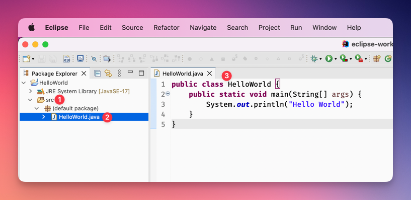

---
keywords:
  - pdf
---

# Analyse des Programms

Nun haben wir schon ein ausführbares Programm. Hier wird nun analysiert wie es
genau aufgebaut ist. 

- Wie ist die Struktur?
- Wo liegen die Dateien?

## Von Klammerpaaren und Blöcken

Klammerpaare dienen in Java zum Gruppieren von zusammengehörigem Code. Diese
Gruppen werden auch Blöcke genannt.

Es ist nun wichtig, dass Sie bei allen Klammern immer daran denken, dass diese
**paarweise eingesetzt werden**. Sie müssen also geschlossen werden. Nur so
können Sie Code Gruppieren. Wird eine Klammer nicht geschlossen, gibt es keine
klare Abgrenzung (ähnlich wie bei normalem Text... Da fehlt wohl eine Klammer!

In Java werden folgende Klammertypen verwendet:

- `{ }` Geschweifte Klammern für **Codeblock**
- `( )` Runde Klammern für **Methoden/Funktions Signatur** (meistens gefolgt von
  einem Codeblock)
- `[ ]` Eckige Klammern für Auflistungen, auch **Arrays** genannt

Als eine Besonderheit kennzeichnet dieses Klammerpaar `{ }` sogenannte Blöcke,
die man auch als Programmabschnitte bezeichnen kann.

:::tip Fabrik

Stellt euch eine Fabrik vor. Diese ist auch in verschiedene Räume unterteilt,
wobei jeder Raum eine eigene Funktion hat. Das Büro, die Werkstatt, die
Fertigungsstrasse.

:::

:::info

- Nach einem Codeblock `}` folgt **kein** Semikolon
- Nach einer Schliessenden normalen Klammer `)` folgt in der Regel eine
  geschweifte Klammer `{`
- Jeder Befehl endet mit einem Semikolon `;`
  - Nach jedem Semikolon sollte eine neue Zeile beginnen, muss aber nicht!
  - Dies nicht zu machen ist **schlechter Stil und gibt Abzug**!

:::

### :pen: A3: Blöcke finden

Wenden Sie nun das im oberen Abschnitt vorgestellte Konzept der Blöcke an.
Bisher haben wir die Klassen und `main`-Methode von Java kennen gelernt.

- Tragen Sie im folgenden HelloWorld-Programm die **vorhandenen Blöcke** ein.
- Zeichnen Sie ein, welche anderen Klammern Paare bilden.

```java title="HalloWorld.java"
public class HelloWorld {
  public static void main(String[] args) {
    System.out.println("Hello World");
  }
}
```

:::tip

- Sie können in Eclipse mit `// Kommentaren` die Blöcke benennen
- Oder Sie können den Block auch mit dem Snipping-Tool **"screenshoten"** und in
  einem Programm Ihrer Wahl, mit dem **Markertool** durchführen. (Paint / ...)
- Order, wenn Sie diese Seite **ausdrucken**, können Sie die Aufgabe mit einem
  konventionellen Marker von Hand durchführen.

:::

## Struktur der Klasse "HelloWorld"

Java-Programme bestehen aus Klassen. Diese Klassen werden dann als Programme
ausgeführt.

Java-Klassen **(3)** befinden sich in Eclipse in einem Verzeichnis namens `src`
**(1)** und haben eine `.java`-Dateiendung **(2)**.

- Der **Dateinamen ist immer gleich zum Klassennamen**, inklusive Gross- und
  Kleinschreibung!
- Die Klasse `HelloWorld` befindet sich also in der Datei `HelloWorld.java`.
- Eclipse generiert einen Error, wenn dies nicht übereinstimmt.



### :pen: A4: Klasse Umbenennen

- Nennen Sie die Klasse (Nicht Datei) `HelloWorld` in `HoiWelt` um.
  - Sehen Sie den Fehler?
- Nennen Sie die Klasse wieder `HelloWorld`. Dann sollte der Fehler wieder weg
  sein

### Die Klassendefinition

Die Java-Klasse `HelloWorld` beginnt mit der Anweisung
`public class HelloWorld`, was aussagt, dass es sich um eine öffentliche Klasse
mit dem Namen HelloWorld handelt. Nach dieser folgt eine öffnende geschweifte
Klammer `{`, die mit der letzten schliessenden geschweiften Klammer `}` zusammen
den Klassenkörper bildet.

```java
// highlight-yellow-next-line
public class HelloWorld {
	public static void main(String[] args) {
		System.out.println("Hello World");
	}
// highlight-yellow-next-line
}
```

### Die Methode `main`

Im Klassenkörper befindet sich die `main`-Methode
`public static void main(String[] args)`. Die `main`-Methode ist eine ganz
besondere, **sie dient immer als Startort des Programms**.

- :european_castle: Sie ist sozusagen die Pforte zum Schloss! :european_castle:

```java
public class HelloWorld {
  // highlight-yellow-next-line
	public static void main(String[] args) {
		System.out.println("Hello World");
	}
}
```

Diese Zeile wird auch als Methodensignatur bezeichnet. Im Detail wird die
Methodensignatur später angesehen.

### Der Methodenkörper

Das nächste paar geschweifter Klammern bildet den Methodenkörper. Darin steht
das, was die eigentliche Leistung des Programms ausmacht. Über die Java-Klasse
System erfolgt die Ausgabe auf die Console (out), wo eine Zeile ausgegeben wird
(println).

```java
public class HelloWorld {
	public static void main(String[] args) {
    // highlight-yellow-next-line
		System.out.println("Hello World");
	}
}
```

### Package (optional)

In der `.java`-Datei kann zuerst das `package` angegeben werden, in welchem sich
die aktuelle Klasse befindet.

- Wird kein `package` angegeben, wie beim `HelloWorld` Programm der Fall,
  befindet sich die Datei direkt unter dem `src` Ordner, `src/HelloWorld.java`.
  Eclipse zeigt dann ein `(default package)`
- Ist ein `package` angegeben, befindet sich die Klasse in einem Unterordner der
  gleich heisst wie das package. In folgenden Fall unter
  `src/helloworld/HelloWorld.java`

```java
// highlight-next-line
package helloworld;

public class HelloWorld {
	public static void main(String[] args) {
		System.out.println("Hello World");
	}
}
```

### Import (optional)

Dann folgen optional `import`-Anweisungen, die andere Java- und Programmteile im
eigenen Programm nutzbar machen.

```java
package helloworld;
// highlight-start
import some.other.package;
// highlight-end

public class HelloWorld {
	public static void main(String[] args) {
		System.out.println("Hello World");
	}
}
```

## Dateienstruktur

Wenn Ihr in Eclipse Dateien erstellt, werden automatisch auch Dateien auf dem
Dateisystem angelegt. Die Struktur ist meistens gleich zum Project-Explorer von
Eclipse.

### :pen: A5: _HelloWorld.java_ Datei finden

Und wo liegt nun die _HelloWorld.java_ Datei?

- Klicken Sie _in Eclipse_ mit der rechten Maustaste auf die Klasse `HelloWorld`
  und wählen Sie _«Show in»_, dann _«System Explorer»_.
- Anschliessende sehen Sie die Klasse im Windows Explorer rsp. Finder.

