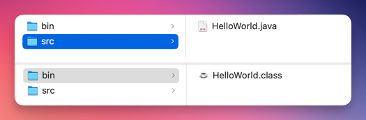
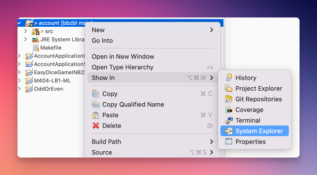

---
keywords:
  - pdf
---

# Java Kompilierung

Wenn die Klassen ausgeführt werden, erfolgt durch die Entwicklungsumgebung eine
Umwandlung im Hintergrund, und aus den `.java`-Dateien werden `.class`-Dateien,
die in einem Verzeichnis namens `bin` abgelegt werden. Erst die `.class`-Dateien
können ausgeführt werden.

## :pen: A6: Das `bin`-Verzeichnis und `.class`-Dateien suchen

1. auf dem `src`-Ordner die rechte Maustaste betätigen und dann _Show in =>
   System Explorer_ wählen. 

2. Suchen Sie von hier aus auch das `bin`-Verzeichnis. Sie sollten darin die
   `class`-Dateien sehen. Diese werden jeweils bei jeglicher Veränderung durch
   Eclipse neu an dieser Stelle erzeugt.
3. Öffnen sie die `HelloWorld.class` Datei mit dem Microsoft Editor. Oder auf
   Mac mit dem `TextEdit`

## Quellcode, Compiler, Interpreter

Programme entstehen aus Quelltext, hier Java, der durch einen Compiler entweder
in ein Maschinenprogramm oder in ein Zwischenformat übersetzt wird, und dann
direkt vom Computer ausgeführt werden kann.

Java verfolgt einen zweistufigen Übersetzungsprozess. Der Programmcode in Java
wird nicht zu einem ausführbaren Programm, sondern in einen Zwischencode, den
sogenannten Bytecode, kompiliert. Dieser Code ist für alle Plattformen gleich
und kann mithilfe des entsprechenden plattformspezifischen Interpreters auf der
jeweiligen Plattform ausgeführt werden. Java-Interpreter werden auch virtuelle
Maschinen (JVM) genannt.

### Interpetationsversuch

Ihr versteht nur Bahnhof? Hier, ein Versuch das obige an einem Beispiel zu
erläutern:

| Reale-Welt                                                                                                                                                                                                                                                       | Java                                                                                                                                                                                                                 |
| ---------------------------------------------------------------------------------------------------------------------------------------------------------------------------------------------------------------------------------------------------------------- | -------------------------------------------------------------------------------------------------------------------------------------------------------------------------------------------------------------------- |
| Stellt euch vor Ihr seit die Chef:in eines Internationalen Unternehmens.                                                                                                                                                                                         | Viele Computer mit verschiedenen Betriebssystemen.                                                                                                                                                                   |
| Die Aufgaben und Befehle werden alle von Spezialisten in schweizerdeutsch erfasst.                                                                                                                                                                               | Java ist in diesem Falle Schweizerdeutsch                                                                                                                                                                            |
| Euer Unternehmen hat an jedem Standort lokale Arbeiter die nur die Landessprachen sprechen und dadurch auch nur in dieser Sprache Befehle ausführen können.                                                                                                      | Diese können mit den Betriebssystemen verglichen werden (MacOs, Windows, Linux). Jedes Betriebssystem hat eigene Codierungen! _(Deswegen funktionieren die meisten Games nur auf Windows)_                           |
| Da Schweizerdeutsch sehr ineffizient (besitzt viele Floskeln) und wenig verbreitet ist, wird vom einem Mitarbeiter alles Schweizerdeutsche ins Englische Übersetzt. Bei der Übersetzung ins Englische wird zudem darauf geachtet die **Aufgaben zu optimieren**. | **Das ist die Arbeit vom Compiler!** Java (Schweizerdeutsch) in Bytecode (Englisch). Es wird auch geschaut dass das Programm optimiert werden kann! _(Compiler Programmierer sind die wahren Helden)_                |
| An jedem Standort hat die Firma Personen angestellt die Englisch können und vom Englischen in die jeweilige Landessprache übersetzen kann. Damit die lokalen Arbeiter effizient ihre Aufgaben erledigen können.                                                  | Der Bytecode (Englisch), wird also bei jedem Betriebssystem lokal übersetzt rsp. interpretiert, damit es auf dem jeweiligen Betriebssystem ausgeführt werden kann. **Dies ist die Arbeit der Java Virtual Machine.** |

Nun nach dieser Tabelle, liest bitte nochmals
[von vorne](#quellcode-compiler-interpreter)

:::tip Don't Panik!

- Man muss das obige nicht zu 100% verstanden haben um ein guter Programmierer
  zu werden!
- Ein guter Rennfahrer muss auch nicht ein guter Mechaniker sein ;)

:::

## :pen: A7: Umwandlung Visualisieren

Erstellen Sie eine eigene Visualisierung, welche für Ihr HelloWorld Programm
aufzeigt, wie der Sourcecode zu einem ausführbaren Programm überführt wird,
welcher von einem Interpreter ausgeführt werden kann.
