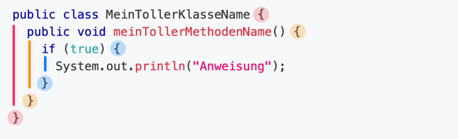

---
keywords:
  - pdf
---

# 📐 Konventionen / Kommentare

Jeder der Programmiert hat meistens seinen eigenen Stil und Vorlieben. Dies ist
auch gut so. Wenn nun aber zusammen programmiert wird, muss man sich auf
Konventionen einigen, damit das Gesamtbild stimmig ist. So ist es für den
einzelnen einfacher sich im Code einzufinden. Es schafft eine Übersichtlichkeit.

Je nach Betrieb können die sich erheblich unterscheiden. Wir stellen hier einige
wichtige Konventionen vor.

## :dart: Ziele

- Sie können die grundlegenden Konventionen und Kommentare anwenden.

## Konventionen

### :pen: A1: Konventionen in der `HelloWolrd` Klasse

- Öffnen Sie die `HelloWorld.java` Datei und lesen die unten stehenden
  Konventionen.
- Prüfen Sie ob das `HelloWorld.java` Programm den Konventionen entspricht.

### **Keine Umlaute** im Code

Programmcode ist wenn möglich in englisch gehalten. Umlaute können auf
verschiedenen Systeme zu Fehlern führen und sind nicht international
verständlich. Desswegen sollen Umlaute beim Programmieren vermieden werden!

### Klassennamen

Jede **Klasse**

- beginnt mit einem **Grossbuchstaben**
- hat einen `AusdrucksstarkenNamen` in :camel:
  [`UpperCamelCase`](http://wiki.c2.com/?UpperCamelCase)

```java
public class MeinTollerKlasseName {

}
```

### Methodennamen

Jede **Methode**

- beginnt mit einem **Kleinbuchstaben**
- hat einen `ausdrucksstarkenNamen` in :camel:
  [`lowerCamelCase`](http://wiki.c2.com/?LowerCamelCase)

```java
public class MeinTollerKlasseName {
  public void meinTollerMethodenName() {

  }
}
```

### Codeblöcke einrücken

- Blöcke `{ }` werden **eingerückt**
  - :keyboard: Ctrl-Shift-F
  - :apple: Command-Shift-F



<!-- ```java -->
<!-- public class MeinTollerKlasseName { -->
<!--   public void meinTollerMethodenName() { -->
<!--     if (true) { -->
<!--       System.out.println("Anweisung"); -->
<!--     } -->
<!--   } -->
<!-- } -->
<!-- ``` -->

- Achtet auf die Klammerpaare. Die sind im Bild oben farbig eingezeichnet.
- Anweisungen zwischen zwei Klammerpaare werden eingerückt.

### UTF-8 als Standard-Encoding

Wenn UTF-8 verwendet wird, sollten theoretisch auch Umlaute auf allen Systemen
funktionieren. Diese werden jedoch trotzdem vermieden ;) Sie gelten als
schlechter Stil und geben Abzug!

- Standard-Encoding `UTF-8`
- `Preferences > General > Workspace` -> `UTF-8`

## Kommentare

Es gibt gute Gründe für Kommentare:

- eine Methode für JavaDoc kurz Beschreiben
- erläutern **warum** eine Entscheidung getroffen wurde
- "TODO oder FIXME-Kommentare" für Infos was man in Zukunft verbessern sollte

### :pen: A2: Kommentieren Sie Ihr «HelloWorld» Programm

Machen Sie sich m it dem "Einzeiligem Kommentar" vertraut und beschreiben Sie
mit Kommentaren Ihr «HelloWorld»-Programm, so dass Sie sich später wieder an
alle Schritte der Erstellung erinnern.

### Einzeiliger Kommentar

```java
// Ich bin ein einzeiliger Kommentar
```

- Kommentare beginnen mit Zwei Fronslashes `//` und gelten für die ganze Zeile
  danach
- Man kann also nach einem `//` kein ausführbaren code mehr schreiben

### Mehrzeiliger Kommentar

```java
/*
  Ich bin ein
  Mehrzeiliger
  Kommentar
*/
```

- Mehrzeilige Kommentare beginnen mit `/*` und enden mit `*/`
- Jeglicher Code dazwischen wird nie ausgeführt!

### JavaDoc Kommentare

```java
/*
 * Ein JavaDoc Klassen Kommentar wird angezeigt,
 * wenn die Methode von Eclipse vorgeschlagen wird.
 * Er steht immer direkt vor der Klasse.
 *
 * @author HerrLehrer
 * @version 1.0.0
 */
public class MeinTollerKlasseName {

  /*
   * Die diese Methode wird ganz tolle Sachen machen
   * die man dann irgend wann auch verwenden kann.
   *
   * @param einParameter Parameter können so beschrieben werden
   * @return es wird einfach nur der "einParameter" zurückgegeben
   */
  public String meinTollerMethodenName(String einParameter) {
    // TODO: Hier wird noch was tolles programmiert
    return einParameter;
  }

}
```

- JavaDoc Methodenkommentare beschreiben Methoden so, dass direkt eine
  Dokumentation daraus generiert werden kann.
- [:link: JavaDoc Beschreibung auf Wikipedia](https://de.wikipedia.org/wiki/Javadoc)

:::caution Es gibt aber auch schlechte Kommentare!

Kommentare **sollten nicht beschreiben was der Programmcode im Detail macht**!
Das steht im Code. Wenn dafür Kommentare nötig sind, sollte der Code überdacht
werden:

- Kleinere Methoden wo der Namen bereits beschreibt was gemacht wird
- Komplexe Abhängigkeiten entkoppeln / auseinandernehmen

:scream: Kommentare **veralten schnell!** Nichts ist schlimmer als ein Kommentar
der nicht mehr stimmt!

:::
