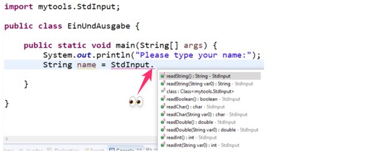

# Bibliothek `MyTools`

Die Bibliothek `MyTools` wurde von der Schule entwickelt. Diese ermöglicht
einfache Texteingaben durch die Console vom Benutzer.

Die Klasse mit der wir ab jetzt arbeiten werden lautet `StdInput`.

## Die Klasse `StdInput`

Die Bibliothek beinhaltet die Klasse `StdInput`. Mit dieser können verschiedene
Datentypen vom Terminal aus eingelesen werden.


```java title="Datentypen einlesen"
String  text           = StdInput.readString();
boolean bool           = StdInput.readBoolean();
char    character      = StdInput.readChar();
double  gleitKommaZahl = StdInput.readDouble();
int     ganzZahl       = StdInput.readInt();
```

:::info

- Falls Sie also z.B. eine Ganzzahl einlesen wollen wäre dies:
  `int number = StdInput.readInt();`
- Falls Sie ein String einlesen wollen wäre dies:
  `String textEntry = StdInput.readString();`

:::

## :pen: A1: `MyTools.jar` einbinden

### 1. Neues Projekt erstellen

:::info

Wenn Sie in dem bereit bestehenden Projekt arbeiten wollen, können Sie diesen
Schritt überspringen.

:::

- Erstellen Sie neues Java-Projekt mit einem Nahmen Ihrer Wahl an (z.B. "EVA")

### 2. Eclipse für die Bibliothek einrichten

1. Legen Sie im Projekt ein Verzeichnis «lib» an
   - Rechtsklick auf das **_Projekt -> New -> Folder_**
2. Laden Sie die Bibliotheks-Datei
   [MyTools.jar](../../../static/files/MyTools.jar) herunter.
3. Kopieren Sie die Datei in das erstellte lib-Verzeichnis
   - Falls Sie die Datei auf Filesystem Ebene kopiert haben, muss allenfalls die
     **Ansicht in Eclipse aktualisiert** werden
   - Rechtsklick auf das **_Projekt -> Refresh_**
4. Klicken Sie nochmals mit der rechten Maustaste auf den Projekteintrag im
   Package Explorer.
   - Wählen Sie diesmal «Build Path», dann «Configure Build Path».
   - Wählen Sie das Register Libraries, dann den Eintrag Classpath.
   - Klicken Sie auf «Add JARs...». Öffnen Sie das Projekt und das
     lib-Verzeichnis, und wählen MyTools.jar.
   - Klicken Sie auf «Apply and Close».

:::note MyTools.jar Download

- Die Datei [:paperclip: `MyTools.jar`](../../../static/files/MyTools.jar)

:::

## :pen: A2: Text mit `StdInput` einlesen

Nun wollen wir die Bibliothek `MyTools` verwenden. Genau, werden wir folgende
Schritte tun:

- Den Benutzer informieren, dass er nun seinen Namen eintippen soll.
- Eine String-Variable anlegen, um die Antwort darin zu speichern.
- Die String-Variable vorgesetzt mit "Your name is " ausgeben.

Folgen Sie nun den Anweisungen:

1.  Als erstes erstellen Sie nun eine neue Klasse namens `EinUndAusgabe` und
    ersetzen Sie alles mit folgendem Code. (Shortcuts `ctrl-a`, `ctrl-v`)

        ```java title="EinUndAusgabe.java" showLineNumbers
        // highlight-next-line
        import mytools.StdInput; // Importier aus dem package myTools die Klasse StdInput

        public class EinUndAusgabe {
          public static void main (String[] args) {
            System.out.println("Please type your name:");
            // highlight-next-line
            String name = StdInput // hier fehlt noch was!
          }
        }
        ```

        Sie sehen die Zeilen 1 und 6 sind hervorgehoben.

        - In der Zeile 1 wird die Klasse `StdInput` aus dem Package `myTools` importiert.
        - In der Zeile 6 wird nun die Klasse `StdInput` verwendet. Es fehlt jedoch noch was.

2.  Eingabe: Geben Sie nun direkt hinter `StdInput` **einen Punkt** ein. Nun
    erscheint folgender Dialog, über welchen Sie die **Methoden der Klasse
    `StdInput` aufrufen** können:

        

        Da wir einen String-Wert einlesen wollen, wählen gleich den obersten Eintrag
        `readString()` und schliessen die Zeile mit einem Semikolon `;` ab.

3.  Ausgabe: Als letztes geben wir den eingegebenen Namen aus, wie in der
    Programmübersicht gezeigt:

    - Bitte schreiben Sie doch den zusätzlichen, hervorgehobenen Code, von unten
      ab und kopieren Sie Ihn nicht einfach.

    ```java title="EinUndAusgabe.java"
    import mytools.StdInput;

    public class EinUndAusgabe {
      public static void main (String[] args) {
        System.out.println("Please type your name:");
        // highlight-start
        String name = StdInput.readString();
        System.out.println("Your name is " + name);
        // highlight-end
      }
    }
    ```

    Führen Sie das Programm aus. Funktioniert es? Begrüsst Sie Ihr Programm mit
    dem eingegebenen Namen?

:::tip Automatische Vervollständigung

Fangen Sie an zu schreiben und nach «Std» drücken Sie in Windows
`ctrl+Leertaste` (:apple: `ctrl+option+.`), worauf automatisch die Klasse
vervollständigt wird und der korrekte Import für die Klasse hinzugefügt wird.

:::

:::info Methodenzugriff über Punkt

Auf **Methoden** einer Klasse wird immer **über einen Punkt** zugegriffen.

```java
KlassenName.methodenName([optionaleParemeter]);
//         ^
//   wichtiger Punkt!
```

:::
