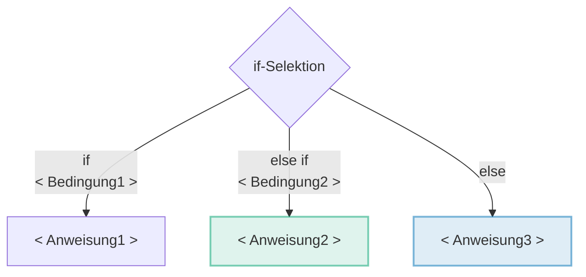
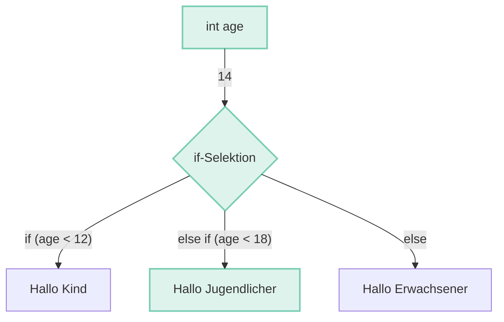

# if - Selektion

Mit dem Schlüsselwort **if** _(engl. falls)_ in Kombination mit dem **Datentyp
boolean** können Programme erstellt werden, die abhängig von Benutzereingaben
oder Variablenwerten unterschiedlich reagieren.

## Anatomie

Eine Selektion mit einem `if` sieht so aus, wie im folgend dargestellt.
Ein **praktisches Beispiel** zur Veranschaulichung kann ausgeklappt werden.

Hier ist nun eine `if-Selektion` mit drei möglichen Codeblock Anweisungen
dargestellt. Im laufenden Programm wird immer nur eine der Anweisungen
ausgeführt. Dies ermöglicht es dynamisch auf die Benutzereingabe zu reagieren
indem je nach Eingabe einen anderen Code ausgeführt wird.

Die Bezeichnungen `<Bedingung>` und `<Anweisung>` dienen als **Platzhalter**.
Sie sind sogenannter Pseudocode und somit **nicht korrekter Java-Code**. Im
späteren praktischen Beispiel werden diese mit korrektem Java-Code ersetzt.

<div className="grid"><div>

**Aufbau einer if-Selektion**

```java
// highlight-start
if (<Bedingung1>) {
    <Anweisung1>
}
// highlight-end
// highlight-green-start
else if (<Bedingung2>) { // Optionaler Block
    <Anweisung2>
}
// highlight-green-end
// highlight-blue-start
else {                  // Optionaler Block
    <Anweisung3>
}
// highlight-blue-end
```

</div><div>

**Flow Diagram einer if-Selektion**



</div></div>

<div className="theme-code-block-highlighted-line">

1. Der erste Block `if (<Bedingung1>) { <Anweisung1> }`
   - ist zwingend
   - und zwar von `if` bis zur ersten schliessenden geschweiften Klammer.
   - Wenn die `<Bedingung1>` `wahr` ist, wird nur die `<Anweisung1>` ausgeführt.

</div>

<div className="code-block-green-line">

2. Der nächste Block `else if (<Bedingung2>) { <Anweisung2> }`
   - Wenn die `<Bedingung1>` `falsch` und die `<Bedingung2>` `wahr` ist, wird
     nur die `<Anweisung2>` ausgeführt.
   - ist optional
   - kann auch noch mehrfach wiederholt folgen
   - kann nie alleine stehen _(nie ohne vorausgehender `if`-Block)_
   - wird ausgeführt, sofern die Bedingung vom vorausgehendem `if` oder
     `else if` Block **false** war

</div>

<div className="code-block-blue-line">

3. Der letzte Block `else { <Anweisung3> }`
   - ist optional
   - besitzt keine Bedingung
   - darf nur ein Mal vorkommen, und zwar ganz am Schluss
   - wird ausgeführt wenn kein anderer Block ausgeführt wurde
   - Wenn die `<Bedingung1>` `falsch` und die `<Bedingung2>` `falsch` ist, wird
     nur die `<Anweisung3>` ausgeführt.

</div>

<details>
<summary>Praktisches Beispiel</summary>

Im praktischen Beispiel wollen wir herausfinden ob es sich um ein Kind,
Jugendlicher oder Erwachsener handelt. Dazu existiert eine Variable `int age` in
der das Alter gespeichert ist. In der if-Selektion wird nun das Alter
geprüft und je nach Situation in die Console geschrieben ob es sich um ein Kind,
Jugendlicher oder Erwachsener handelt.

<div className="grid"><div>

**Programmcode**

```java showLineNumbers
// highlight-green-next-line
int age = 14;

if (age < 12) {
    System.out.println("Hallo Kind");
}
// highlight-green-start
else if (age < 18) {
    System.out.println("Hallo Jugendlicher");
}
// highlight-green-end
else {
    System.out.println("Hallo Erwachsener");
}
```

:::tip

Die Variable `int age` könnte nun auch von der Konsole eingelesen werden und
somit "dynamisch" sein. Dann macht die Kondition auch mehr Sinn!

:::

</div><div>

**Flussdiagramm**



</div></div>

**Erläuterung**

1. Es existiert eine Variable _age_ vom Typ `int` mit dem Wert `14`
2. Die `if`-Block Bedingung **_(Linie 3)_ wir ausgeführt**
   - Die Bedingung prüft ob es sich um ein Kind handelt, also kleiner als 12 ist
   - Da der Wert von _age_ `14` ist, ist der `boolean` der Prüfung `false`, also
     falsch
   - Der Code-Block **_(Linie 4)_ wird übersprungen**
3. Die `else if` Bedingung _(Linie 6)_ wird nun ausgeführt
   - Es wird geprüft ob der Wert von `age` kleiner als 18 ist.
   - Da der Wert 14 kleiner als 18 ist, ist der `boolean` der **Prüfung `true`,
     also richtig**
   - Der **`else if`-Block _(Linie 7)_ wird ausgeführt**.
4. Da eine Bedingung `true` war, wird der **`else`-Block _(Linie 10)_
   übersprungen!**

</details>

## :pen: A1: Rabattermittlung

Erstellen Sie ein Programm, welches:

- einen Kaufbetrag entgegen nimmt
  _([siehe Eingabe einlesen](/docs/woche02/2a-eva/aufgabe1-bibliothek-einbinden.md#pen-a2-text-mit-stdinput-einlesen))_
- bei Einkäufen über CHF 100 einen Rabatt von 15% gewährt

<details>
<summary>Musterlösung:</summary>

```java
import mytools.StdInput;

public class A1DiscountEvaluation {

	public static void main(String[] args) {
		double price = StdInput.readDouble();
		if(price > 100) {
			price = price * 0.85d;
		}
		System.out.println("Your price is: " + price);
	}
}

```

</details>

## :pen: A2: Paketpreise ermitteln

Erstellen Sie Programm, welches:

- Gewichtsangaben entgegen nimmt
  _([siehe Eingabe einlesen](/docs/woche02/2a-eva/aufgabe1-bibliothek-einbinden.md#pen-a2-text-mit-stdinput-einlesen))_
- Bis und mit 5kg CHF 2 für Kleinpakete verrechnet
- Zwischen 5kg und 10kg CHF 5 für Mittelpakete verrechnet
- Ab 10kg für Grosspakete CHF 10 verrechnet
- Für Pakete >= 15kg (ab 15kg) wird auf die Spedition verwiesen. Diese können
  nicht versendet werden.

<details>
<summary>Musterlösung</summary>

```java
import mytools.StdInput;

public class A2ParcelPrice {

	public static void main(String[] args) {
		System.out.println("Hi, this is the parcel app");
		System.out.println("Plese tipe in the weight: ");
		double weight = StdInput.readDouble();
		double price;

		if (weight <= 5) {
			price = 2;
			System.out.println("Your price: " + price);
		} else if(weight > 5 && weight < 10) {
			price = 5;
			System.out.println("Your price: " + price);
		} else if(weight >= 10 && weight < 15) {
			price = 10;
			System.out.println("Your price: " + price);
		} else if(weight >= 15) {
			price = 0;
			System.out.println("Please call a carrier");
		}
	}

}

```

</details>

## :pen: A3: Fehlersuche

Bauen Sie folgenden Abschnitt in ein Programm ein und untersuchen Sie, warum die
Ausgabe des Programms falsch ist. Warum ist dieser Fehler so schwer zu
entdecken?

```java
int value = 50;
if (value > 100) ; {
    System.out.println("The value is larger than 100");
}
```

<details>
<summary>Musterlösung</summary>

Das Semikolon `;` nach der `if (value > 100)` Anweisung is zu viel. Es ist
jedoch **syntaktisch korrekt** und ergibt keinen Error in Eclipse! Nur macht es
keinen Sinn.

Man könnte es auch so schreiben:

```java
int value = 50;
if (value > 100); // Dieser Ausdruck macht nix! NIE!

// Ein Block ohne Bedingung wird immer ausgeführt
// Er ist wegen dem Semikolon nicht an das if gebunden.
{
    System.out.println("The value is larger than 100");
}
```

</details>

## :pen: A4: Reflexion

### Einleitung

Inzwischen haben Sie eine Vorstellung, was Syntax in Java bedeutet. Sie haben
inzwischen auch das eine oder andere Programm erstellt. Vermutlich waren einige
dieser ersten Aufgaben nicht einfach lösbar, nur schon das Beachten der
Klammern, deren Paare, und auch die Datentypen, wie man Werte in diesen
speichert.

Darum kehren wir das Vorgehen nochmals um:

- Wie können Aufgaben in der Programmierung lösbarer werden?
- Was denkt man am besten, in welcher Reihenfolge?
  - Fangen Sie bei den geschweiften Klammern an?

Folgende Bausteine könnten Sie in der Vorarbeit zu einer Aufgabe unterstützen:

- Eigene Problembeschreibung (Ziel des Programms)
- In welcher Abfolge soll das Programm erstellt werden (damit möglichst einfach)
- Welche Daten sind zu bearbeiten und mit welchen Datentypen?
- Welche Selektionen sind zu welchem Zweck zu verwenden?

### Auftrag

Beschreiben Sie nun schriftlich, aus Ihrer Sicht als Programmiererin oder
Programmierer, **wie** man eine der vorherigen Aufgaben angeht und löst.
Probieren Sie möglichst, praktisch jedes Detail zu beschreiben und ohne Aussagen
"ja, das weiss ich einfach" auszukommen.

:::tip Üben, üben, üben

Einer der wichtigsten Punkte beim Programmieren ist das Üben. Das oberhalb
beschriebene Vorgehen kann dabei helfen, mit dem Lösen solcher Aufgaben
vertrauter zu werden. Probieren Sie hin und wieder, besonders bei
anspruchsvollen Aufgaben, sich den idealen Denk- und Arbeitsplan für die
Programmierung einer Lösung bewusst zu machen und schriftlich zu dokumentieren.

:::
