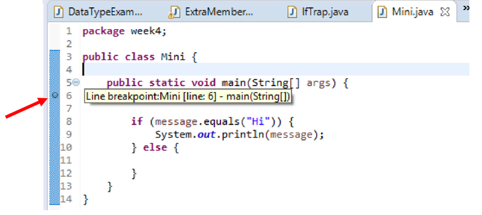
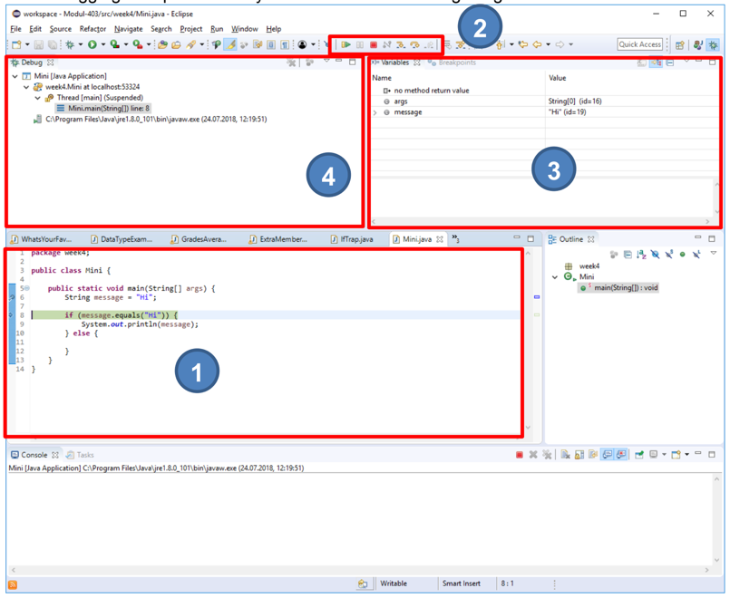
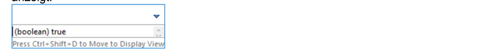
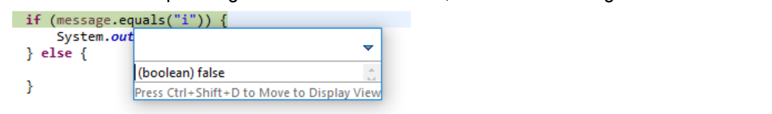

# 🐛 Debugging / Fehleranalyse

Debugging ist eine Arbeitstechnik in der Programmierung, welche es erlaubt, den
Ablauf eines Programms besser nachzuvollziehen. Dabei kann das Programm in einem
speziellen Modus ausgeführt werden, der es erlaubt, das Programm auf jeder
beliebigen Codezeile anzuhalten, die in den Variablen gespeicherten Werte
einzusehen, zu ändern, etc.
## :dart: Ziele

- Sie können mittels Debugging Ihr Programm schrittweise durchlaufen, dabei die
  Werte von Variablen beobachten und so Abläufe verstehen und Fehlerquellen
  entdecken.

## :pen: Eine Debugging-Session Schritt-für-Schritt

Folgende Schritte sind nötig, um eine Debugging-Session für folgenden
Programmcode durchzuführen.

Erstellen Sie in Eclipse eine neue Klasse mit dem Namen Mini und kopiert das
folgende Code-Beispiel in die Datei. Dann können Sie direkt die
Schritt-für-Schritt Session nachvollziehen.

```java title="Das verwendete Code-Beispiel"
public class Mini {
    public static void main(String[] args) {
        String message = "Hi";

        if (message.equals("Hi")) {
            System.out.println(message);
        } else {
            // nix tun
        }
    }
}
```

1. Einen (oder mehr) Breakpoint (Haltepunkt) setzen



:::info Dazu auf das blaue Band links vom Code doppelklicken

:::

2. Das Debugging durch den „Käfer-Button“ starten

3. Auf Ebene Betriebssystem bei allfälliger Nachfrage „Zugriff zulassen“ wählen


4. In Eclipse den Wechsel in eine andere Perspektive („Ansichtsart“) bestätigen


5. Die Debugging-Perspektive analysieren



Was wird hier angezeigt?

- **(1)** Code-Fenster: die Zeile mit dem Breakpoint, grün unterlegt ist der
  Code, der beim nächsten Schritt ausgeführt wird
- **(2)** Buttons zur Steuerung:
  - **Resume**: Programm weiter laufen lassen, bis zum nächsten Breakpoint
  - Pause: Kann ignoriert werden
  - **Stop**: Debugging Session wird beendet
  - **Step-Into**: Springt zur **nächsten Linie welche ausgeführt wird**. Also
    auch weiter zu einer möglichen Methode. So kann manuell durch den gesamten
    Programmablauf navigiert werden.
  - **Step-Over**: Springt zur **nächsten Linie in der aktuellen Methode**.
    Überspringt also den Aufruf einer mögliche Methode auf der aktuellen Linie.
- **(3)** Variablen-Fenster: hier sind alle bereits initialisierten Variablen
  und deren Werte einsehbar (das Programm ist bereits einen Schritt weiter als
  der Breakpoint)
- **(4)** Debug-Fenster: alle laufenden Debug-Prozesse (mit Doppel-x am oberen
  Rand aufräumen)

6. Einzelne Ausdrücke genauer untersuchen (Rechtsklick auf Linie)


Als Beispiel wurde **Display** ausgewählt, welches den Ausdruck ausführt, und
das Ergebnis anzeigt:



Nun kann man **Anpassungen am Code vornehmen**, und sofort die **Folgen
beobachten**. Wenn man z.B. "Hi" nach "i" ändert, wird der Ausdruck `false`, da
`String message = "Hi"` ist und nicht "i"



7. Das Debugging wird über den Stopp-Button beendet. Anschliessend können Sie in
   der Entwicklungsumgebung oben rechts wieder zur Java-Perspektive zurück
   wechseln. Sobald Debugging einmal ausgeführt wurde, wird oben rechts
   einerseits ein Symbol für die Java-Perspektive (J), und andererseits ein
   Symbol für die Debugging-Perspektive (Käfer) angezeigt.

## :pen: Debuggen der Methode `printCurrentDate()` 


Wir Untersuchen den Ablauf der Methode `printCurrentDate()` vom Abschnitt
[Einfacher Methodenaufruf](./einfache-methode.md)

Erstellen Sie dafür in Eclipse eine neue Klasse "OutputMethodExample" und kopieren Sie
folgendes Beispiel in die neue Datei.

```java showLineNumbers
import java.time.LocalDate;
public class OutputMethodExample {
    public static void main(String[] args) {
        printCurrentDate();
    }
    public static void printCurrentDate() {
        System.out.println("Current date is: " + LocalDate.now());
    }
}

```

- Ein **Breakpoint** muss dabei <u>mindestens</u> auf die **Zeile 4**, mit dem
  Aufruf der Methode `printCurrentDate`, gesetzt werden.
- Sobald der Debugger dort anhält, muss:
  - **Step Into** gewählt werden, damit der Debugger in die Methode verzweigt.
  - Diese Debugging-Session soll aufzeigen, wie der Aufruf einer Methode
    erfolgt.
- Spielen Sie mit den Möglichkeiten
