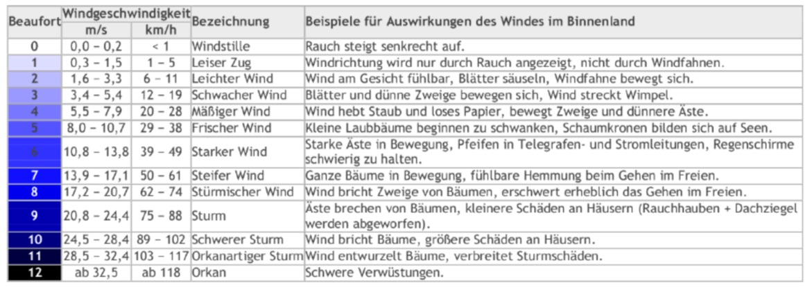

# 🖊️ Selektion Aufgaben

:::tip Praxis

- Es ist wichtig dass Sie viel selbst ausprobieren
- Lieber früher mit den Aufgaben starten als zuerst die Theorie zu lesen
- Die
  [:man_teacher: Präsentation](/docs/woche03/selektion/index.md#man_teacher-präsentationen)
  sollte alle wichtigen Themen abdecken
- Bei Unklarheiten stehen Ihnen die Theorieseiten
  [:books: if - Selektion](/docs/woche03/selektion/if-selektion.md) und 
  [:books: switch - Selektion](/docs/woche03/selektion/switch-selektion.md) zur Verfügung.

:::

## if - Selektion

### :pen: A1: Rabattermittlung

Erstellen Sie ein Programm, welches:

- einen Kaufbetrag entgegen nimmt
  _([siehe Eingabe einlesen](/docs/woche02/2a-eva/aufgabe1-bibliothek-einbinden.md#pen-a2-text-mit-stdinput-einlesen))_
- bei Einkäufen über CHF 100 einen Rabatt von 15% gewährt

<details>
<summary>Musterlösung:</summary>

```java
import mytools.StdInput;

public class A1DiscountEvaluation {

  public static void main(String[] args) {
    double price = StdInput.readDouble();
    if (price > 100) {
      price = price * 0.85d;
    }
    System.out.println("Your price is: " + price);
  }
}
```

</details>

### :pen: A2: Paketpreise ermitteln

Erstellen Sie Programm, welches:

- Gewichtsangaben entgegen nimmt
  _([siehe Eingabe einlesen](/docs/woche02/2a-eva/aufgabe1-bibliothek-einbinden.md#pen-a2-text-mit-stdinput-einlesen))_
- Bis und mit 5kg CHF 2 für Kleinpakete verrechnet
- Zwischen 5kg und 10kg CHF 5 für Mittelpakete verrechnet
- Ab 10kg für Grosspakete CHF 10 verrechnet
- Für Pakete >= 15kg (ab 15kg) wird auf die Spedition verwiesen. Diese können
  nicht versendet werden.

<details>
<summary>Musterlösung</summary>

```java
import mytools.StdInput;

public class A2ParcelPrice {

  public static void main(String[] args) {
    System.out.println("Hi, this is the parcel app");
    System.out.println("Plese tipe in the weight: ");
    double weight = StdInput.readDouble();
    double price;

    if (weight <= 5) {
      price = 2;
      System.out.println("Your price: " + price);
    } else if (weight > 5 && weight < 10) {
      price = 5;
      System.out.println("Your price: " + price);
    } else if (weight >= 10 && weight < 15) {
      price = 10;
      System.out.println("Your price: " + price);
    } else if (weight >= 15) {
      price = 0;
      System.out.println("Please call a carrier");
    }
  }
}
```

</details>

### :pen: A3: Fehlersuche

Bauen Sie folgenden Abschnitt in ein Programm ein und untersuchen Sie, warum die
Ausgabe des Programms falsch ist. Warum ist dieser Fehler so schwer zu
entdecken?

```java
int value = 50;
if (value > 100) ; {
    System.out.println("The value is larger than 100");
}
```

<details>
<summary>Musterlösung</summary>

Das Semikolon `;` nach der `if (value > 100)` Anweisung is zu viel. Es ist
jedoch **syntaktisch korrekt** und ergibt keinen Error in Eclipse! Nur macht es
keinen Sinn.

Man könnte es auch so schreiben:

```java
int value = 50;
if (value > 100); // Dieser Ausdruck macht nix! NIE!

// Ein Block ohne Bedingung wird immer ausgeführt
// Er ist wegen dem Semikolon nicht an das if gebunden.
{
    System.out.println("The value is larger than 100");
}
```

</details>

### :pen: A4: Reflexion

Inzwischen haben Sie eine Vorstellung, was Syntax in Java bedeutet. Sie haben
inzwischen auch das eine oder andere Programm erstellt. Vermutlich waren einige
dieser ersten Aufgaben nicht einfach lösbar, nur schon das Beachten der
Klammern, deren Paare, und auch die Datentypen, wie man Werte in diesen
speichert.

Darum kehren wir das Vorgehen nochmals um:

- Wie können Aufgaben in der Programmierung lösbarer werden?
- Was denkt man am besten, in welcher Reihenfolge?
  - Fangen Sie bei den geschweiften Klammern an?

Folgende Bausteine könnten Sie in der Vorarbeit zu einer Aufgabe unterstützen:

- Eigene Problembeschreibung (Ziel des Programms)
- In welcher Abfolge soll das Programm erstellt werden (damit möglichst einfach)
- Welche Daten sind zu bearbeiten und mit welchen Datentypen?
- Welche Selektionen sind zu welchem Zweck zu verwenden?

**Auftrag**

Beschreiben Sie nun schriftlich, aus Ihrer Sicht als Programmiererin oder
Programmierer, **wie** man eine der vorherigen Aufgaben angeht und löst.
Probieren Sie möglichst, praktisch jedes Detail zu beschreiben und ohne Aussagen
"ja, das weiss ich einfach" auszukommen.

:::note Üben, üben, üben

Einer der wichtigsten Punkte beim Programmieren ist das Üben. Das oberhalb
beschriebene Vorgehen kann dabei helfen, mit dem Lösen solcher Aufgaben
vertrauter zu werden. Probieren Sie hin und wieder, besonders bei
anspruchsvollen Aufgaben, sich den idealen Denk- und Arbeitsplan für die
Programmierung einer Lösung bewusst zu machen und schriftlich zu dokumentieren.

:::

## switch - Selektion

:::tip Praxis

- Es ist wichtig dass Sie viel selbst ausprobieren
- Lieber früher mit den Aufgaben starten als zuerst die Theorie zu lesen
- Wenn es Unklarheiten gibt versuchen Sie zuerst auf der
  [:books: Theorie Seite zu switch](/docs/woche03/selektion/switch-selektion.md)
  eine Antwort zu finden.

:::

### :pen: A5: Note zu Text

Erstellen Sie eine Klasse, welche für die Eingabe einer (vereinfachten, ganzen)
Note die entsprechende textuelle Bewertung ausgibt resp. Fehlermeldung bei
ungültiger Note:

- sehr gut
- gut
- genügend
- ungenügend
- schwach
- sehr schwach
- falsche Eingabe

<details>
<summary>Musterlösung</summary>

```java
import mytools.StdInput;

public class A5GradesToText {

  public static void main(String[] args) {

    System.out.print("Note eingeben: ");
    int grade = StdInput.readInt();
    String gradeText = "";

    switch (grade) {
      case 1:
        gradeText = "sehr schwach";
        break;
      case 2:
        gradeText = "schwach";
        break;
      case 3:
        gradeText = "ungenügend";
        break;
      case 4:
        gradeText = "genügend";
        break;
      case 5:
        gradeText = "gut";
        break;
      case 6:
        gradeText = "sehr gut";
        break;
      default:
        gradeText = "falsche Eingabe";
        break;
    }
    System.out.println(gradeText);
  }
}
```

</details>

### :pen: A6: Rechner

Programmieren eines Rechners mit switch.

Erstellen Sie ein Programm, das zwei Zahlen plus einen Operator einliest.
Berechnen Sie dann mittels des switch-Statements, welche Rechenart erforderlich
ist, führen die Berechnung aus und geben das Ergebnis aus.

<details>
<summary>Musterlösung:</summary>

```java
import mytools.StdInput;

public class A6Calculator {

  public static void main(String[] args) {
    double firstNumber = StdInput.readDouble("Zahl 1 eingeben: ");
    double secondNumber = StdInput.readDouble("Zahl 2 eingeben: ");
    char operator = StdInput.readChar("Operator eingeben: ");
    double res = 0;

    switch (operator) {
      case '+':
        res = firstNumber + secondNumber;
        break;
      case '-':
        res = firstNumber - secondNumber;
        break;
      case '*':
        res = firstNumber * secondNumber;
        break;
      case '/':
        res = firstNumber / secondNumber;
        break;
    }

    System.out.println("Resultat: " + res);
  }
}
```

</details>

### :pen: A7: Beaufort Skala

Die Beaufort-Skala wurde 1806 von dem englischen Admiral Sir Francis Beaufort
(1774 – 1857) erarbeitet. Mit ihrer Hilfe kann anhand der Auswirkungen des
Windes die Windstärke geschätzt werden. Sie reicht von Stärke 0 (Windstille) bis
Stärke 12 (Orkan).

:::note nur zur Info

Die Aufgabe lässt sich ohne das genaue Studieren dieser Tabelle lösen ;)



:::

Es gelten die folgenden Annahmen:

- Beaufort 0 - 8: es besteht keine Gefahr
- Beaufort 9: es bestehen mögliche Gefahren
- Beaufort 10 - 12: es bestehen erhebliche Gefahren

Ein Benutzer will wissen, **ob für eine gewisse Windstärke eine Gefahr
besteht**. Schreiben Sie ein kleines Programm dafür. Das Programm soll folgendes
machen:

- Nach der Windstärke in Beaufort fragen und den Wert einlesen.
- Einen Gefahren-text ausgibt

<details>
<summary>Musterlösung</summary>

```java
import mytools.StdInput;

public class A7Beaufort {

  public static void main(String[] args) {
    System.out.print("Beaufort-Stufe: ");
    int level = StdInput.readInt();

    switch (level) {
      case 0: // wenn kein `brake` steht springt es zur nächsten Anweisung
      case 1: // wenn kein `brake` steht springt es zur nächsten Anweisung
      case 2: // wenn kein `brake` steht springt es zur nächsten Anweisung
      case 3: // wenn kein `brake` steht springt es zur nächsten Anweisung
      case 4: // wenn kein `brake` steht springt es zur nächsten Anweisung
      case 5: // wenn kein `brake` steht springt es zur nächsten Anweisung
      case 6: // wenn kein `brake` steht springt es zur nächsten Anweisung
      case 7: // wenn kein `brake` steht springt es zur nächsten Anweisung
      case 8:
        // wird von 0-8 ausgeführt
        System.out.println("Es besteht keine Gefahr.");
        break;

      case 9:
        System.out.println("Es bestehen moegliche Gefahren.");
        break;

      case 10: // wenn kein `brake` steht springt es zur nächsten Anweisung
      case 11: // wenn kein `brake` steht springt es zur nächsten Anweisung
      case 12:
        // wird von 10-12 ausgeführt
        System.out.println("Es bestehen erhebliche Gefahren.");
        break;

      default:
        System.out.println("Ungueltige Eingabe");
    }
  }
}
```

Wie ich finde, ist auch hier `if` eleganter:

```java
import mytools.StdInput;

public class A7BeaufortIf {

  public static void main(String[] args) {
    System.out.print("Beaufort-Stufe: ");
    int level = StdInput.readInt();
    if (level <= 8) {
      System.out.println("Es besteht keine Gefahr.");
    } else if (level == 9) {
      System.out.println("Es bestehen moegliche Gefahren.");
    } else if (level <= 12) {
      System.out.println("Es bestehen erhebliche Gefahren.");
    } else {
      System.out.println("Ungueltige Eingabe");
    }
  }
}
```

</details>

## Extra: `switch` oder `if` ?

Sie werden nachvollziehen können oder bereits festgestellt haben, dass die
`switch` Kontrollstruktur fast immer durch mehrfache `if-else` ersetzt werden
könnte.

Die folgende Tabelle stellt Argumente gegenüber:

| Kontrollstruktur | Beschreibung                                                  | Begründung                                                                                |
| :--------------- | :------------------------------------------------------------ | :---------------------------------------------------------------------------------------- |
| if               | jedes Mal wird das Ergebnis eines boolean Ausdrucks berechnet | überschaubare Anzahl Fälle; alle Datentypen möglich                                       |
| switch           | definierte, einzelne Werte werden geprüft                     | etwas besser lesbar bei vielen Varianten; nur möglich mit Zeichen, Strings und Ganzzahlen |

:::note Herr Hodels Meinung

Grundsätzlich kann man auf Switch verzichten. Ist switch wirklich leserlicher?
Vor allem das `break` nach jeder Anweisung macht es häufig komplexer.

Eigentlich macht switch nur dann Sinn, wenn mehrere `<Anweisungen>` bei
spezifischen Werten ausgeführt werden sollen. Also dann, wenn man das `break`
nicht schreiben müsste. Nun hat sich in der Praxis ergeben, dass dies fast nie
der Fall ist.

:::
