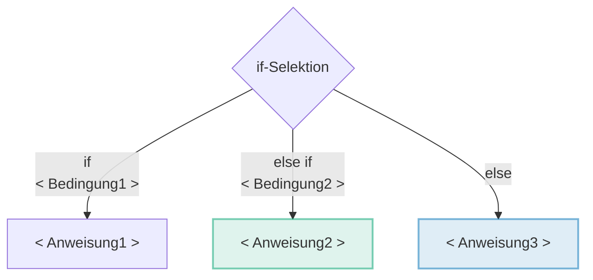
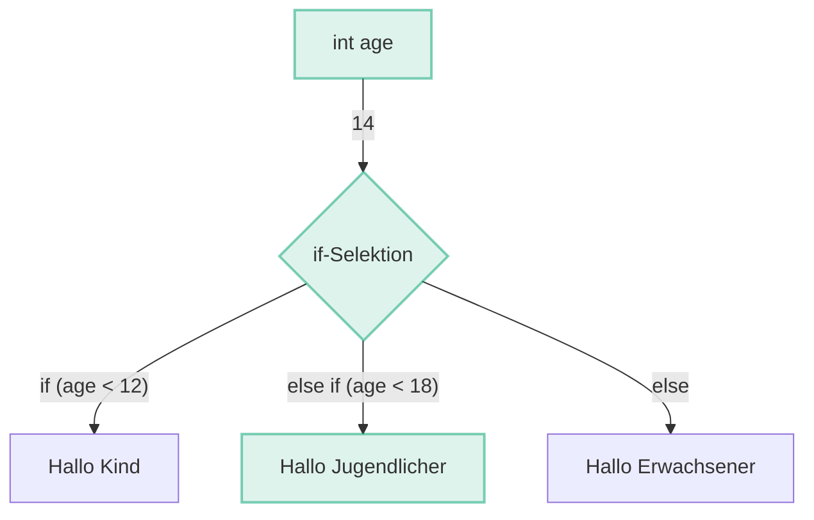

# 📖 if / else - Selektion

Mit dem Schlüsselwort **if** _(engl. falls)_ in Kombination mit dem **Datentyp
boolean** können Programme erstellt werden, die abhängig von Benutzereingaben
oder Variablenwerten unterschiedlich reagieren.

:::info Bedingungen und Vergleichsoperatoren

- Der Datentyp `boolean` wird durch
  [👮 Bedingungen](/docs/woche03/selektion/bedingungen.md) generiert und ist
  **elementar für die `if`-Selektion**.
- Die Bedingungen wiederum kommen durch
  [Vergleichsoperatoren](/docs/woche02/operatoren.md#vergleichsoperatoren)
  zustande.

:::

## Anatomie

Eine Selektion mit einem `if` sieht so aus, wie im folgend dargestellt. Ein
**praktisches Beispiel** zur Veranschaulichung kann ausgeklappt werden.

Hier ist nun eine `if-Selektion` mit drei möglichen Codeblock Anweisungen
dargestellt. Im laufenden Programm wird immer nur eine der Anweisungen
ausgeführt. Dies ermöglicht es dynamisch auf die Benutzereingabe zu reagieren
indem je nach Eingabe einen anderen Code ausgeführt wird.

Die Bezeichnungen `<Bedingung>` und `<Anweisung>` dienen als **Platzhalter**.
Sie sind sogenannter Pseudocode und somit **nicht korrekter Java-Code**. Im
späteren praktischen Beispiel werden diese mit korrektem Java-Code ersetzt.

<div className="grid"><div>

### Aufbau einer if-Selektion

```java
// highlight-start
if (<Bedingung1>) {
    <Anweisung1>
}
// highlight-end
// highlight-green-start
else if (<Bedingung2>) { // Optionaler Block
    <Anweisung2>
}
// highlight-green-end
// highlight-blue-start
else {                  // Optionaler Block
    <Anweisung3>
}
// highlight-blue-end
```

</div><div>

### Flow Diagram einer if-Selektion



</div></div>

<div className="theme-code-block-highlighted-line">

1. Der erste Block `if (<Bedingung1>) { <Anweisung1> }`
   - ist zwingend
   - und zwar von `if` bis zur ersten schliessenden geschweiften Klammer.
   - Wenn die `<Bedingung1>` `wahr` ist, wird nur die `<Anweisung1>` ausgeführt.

</div>

<div className="code-block-green-line">

2. Der nächste Block `else if (<Bedingung2>) { <Anweisung2> }`
   - Wenn die `<Bedingung1>` `falsch` und die `<Bedingung2>` `wahr` ist, wird
     nur die `<Anweisung2>` ausgeführt.
   - ist optional
   - kann auch noch mehrfach wiederholt folgen
   - kann nie alleine stehen _(nie ohne vorausgehender `if`-Block)_
   - wird ausgeführt, sofern die Bedingung vom vorausgehendem `if` oder
     `else if` Block **false** war

</div>

<div className="code-block-blue-line">

3. Der letzte Block `else { <Anweisung3> }`
   - ist optional
   - besitzt keine Bedingung
   - darf nur ein Mal vorkommen, und zwar ganz am Schluss
   - wird ausgeführt wenn kein anderer Block ausgeführt wurde
   - Wenn die `<Bedingung1>` `falsch` und die `<Bedingung2>` `falsch` ist, wird
     nur die `<Anweisung3>` ausgeführt.

</div>

## Praktisches Beispiel

Im praktischen Beispiel wollen wir herausfinden ob es sich um ein Kind,
Jugendlicher oder Erwachsener handelt. Dazu existiert eine Variable `int age` in
der das Alter gespeichert ist. In der if-Selektion wird nun das Alter geprüft
und je nach Situation in die Console geschrieben ob es sich um ein Kind,
Jugendlicher oder Erwachsener handelt.

<div className="grid"><div>

### Programmcode

```java showLineNumbers
// highlight-green-next-line
int age = 14;

if (age < 12) {
    System.out.println("Hallo Kind");
}
// highlight-green-start
else if (age < 18) {
    System.out.println("Hallo Jugendlicher");
}
// highlight-green-end
else {
    System.out.println("Hallo Erwachsener");
}
```

:::tip

Die Variable `int age` könnte nun auch von der Konsole eingelesen werden und
somit "dynamisch" sein. Dann macht die Kondition auch mehr Sinn!

:::

</div><div>

### Flussdiagramm



</div></div>

### Erläuterung

1. Es existiert eine Variable _age_ vom Typ `int` mit dem Wert `14`
2. Die `if`-Block Bedingung **_(Linie 3)_ wir ausgeführt**
   - Die Bedingung prüft ob es sich um ein Kind handelt, also kleiner als 12 ist
   - Da der Wert von _age_ `14` ist, ist der `boolean` der Prüfung `false`, also
     falsch
   - Der Code-Block **_(Linie 4)_ wird übersprungen**
3. Die `else if` Bedingung _(Linie 6)_ wird nun ausgeführt
   - Es wird geprüft ob der Wert von `age` kleiner als 18 ist.
   - Da der Wert 14 kleiner als 18 ist, ist der `boolean` der **Prüfung `true`,
     also richtig**
   - Der **`else if`-Block _(Linie 7)_ wird ausgeführt**.
4. Da eine Bedingung `true` war, wird der **`else`-Block _(Linie 10)_
   übersprungen!**
