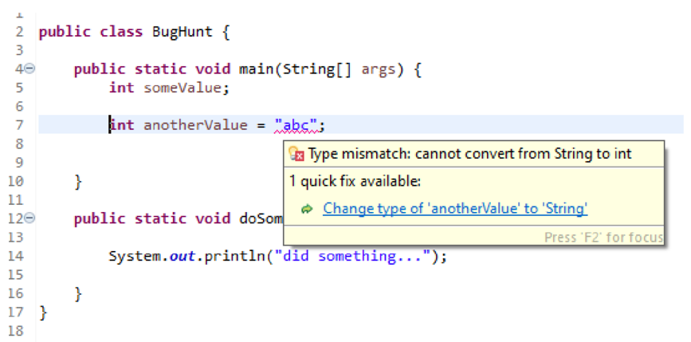
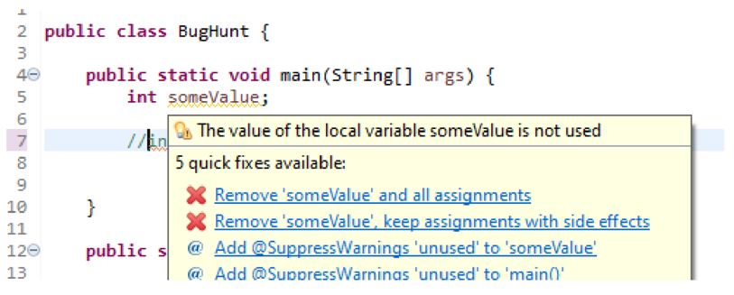
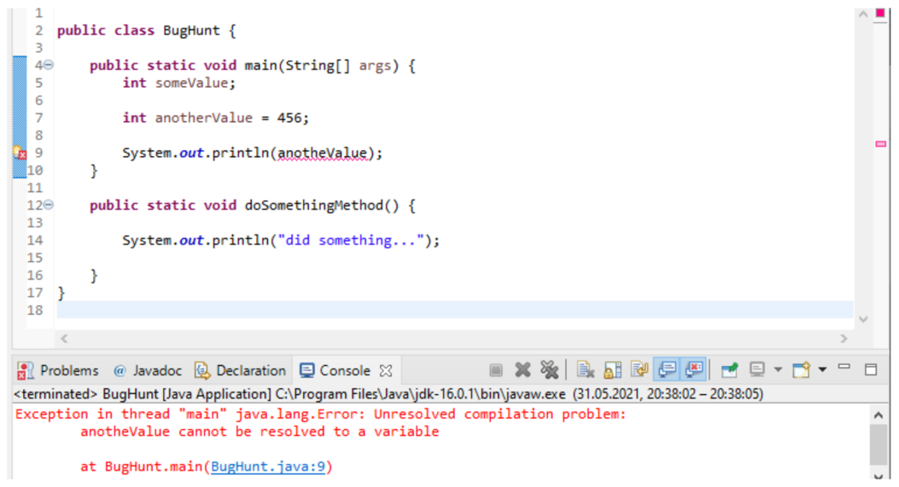
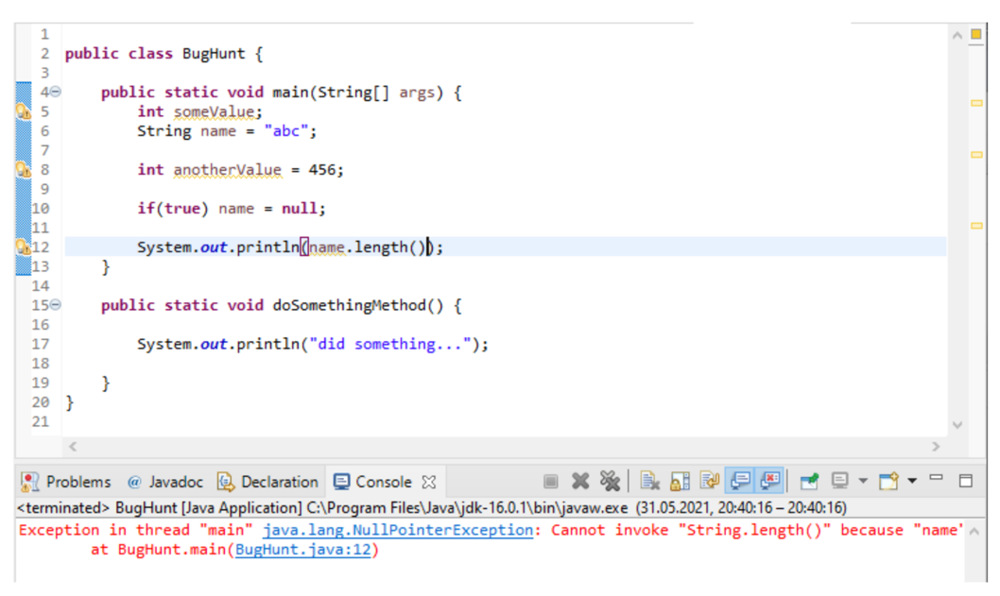

# 🧐 Fehleranalyse

## :dart: Ziele

- Sie kennen die vier Arten von Fehlern, können Sie benennen und reproduzieren
- Sie können bei Laufzeitfehlern (das Programm stürzt ab) den Stacktrace
  erkennen und von dort angezeigte Fehlerstellen in Ihrem Programm anspringen.

## :pen: A1: Bewusst Fehler generieren

1. Machen Sie eine **Kopie** einer bereits gelösten Aufgabe Ihrer Wahl
2. Machen Sie sich mit den
   [vier Arten von Fehlern](#bug-die-vier-arten-von-fehler) bekannt
3. Verschlimmbessern Sie die Kopie, sodass Sie jede der vier Arten einmal zu
   Gesicht bekommen

:::tip lesen und direkt nachstellen

Wenn Sie die Kopie des Programmes bereits zur Hand haben während Sie die Theorie
lesen, können Sie direkt beim lesen versuchen den Fehler zu reproduzieren.

1. Dies spart Zeit :wink:
2. Sie können das gelesene besser verarbeiten :brain:

:::

## :bug: Die vier Arten von Fehlern

Um Herausforderungen beim Programmieren zu lösen, müssen Sie erkennen können,
welche Meldungen von Eclipse nur Warnings sind, die Sie mindestens zuerst mal
nicht beachten müssen.

Dann bleiben **vier Fehlerarten**:

1. Fehler, die bereits **beim Programmieren/Eintippen** angezeigt werden
   - Syntaxfehler (analog zu Rechtschreibefehler im Deutschen)
2. Fehler, die **beim Kompilieren** angezeigt werden und anhand des angezeigten
   Fehlers analysiert werden können
3. Fehler die **zur Laufzeit** eine "Exception" ergeben, für die ein
   "Stacktrace" besteht, der einen Link zu einer möglichen Fehlerquelle enthält.
4. Fehler in der **Logik**. Das Programm ist zwar korrekt, macht jedoch das
   Falsche.
   - Dies ist die schwerwiegendste und fieseste Fehlerart!
   - Dafür braucht man vor allem den Debugger

### 1. Syntaxfehler, die direkt angezeigt werden

Bei verschiedenen Fehlern kann Eclipse direkt erkennen, dass ein Fehler
vorliegt. Sowie hier im Beispiel, auf **Zeile 7**, wo versucht wird, einen
**`String`-Wert in einer `int`-Variablen zu speichern**.

Die Fehlerquelle ist mit einer **roten Schlangenlinie** unterstrichen und rechts
erscheint neben der Zeilennummer ein **rotes Quadrat mit einem weissen x**.

Wenn man nun mit dem Cursor über das unterstrichene Wort fährt, wird ein Dialog
mit dem Fehlerbeschrieb und möglichen Lösungen vorgeschlagen. Ob die
vorgeschlagene Lösung sinnvoll ist, muss im Einzelfall geprüft werden.

#### Warnings (Gelb unterwellt)

Nicht alles was Eclipse anzeigt, sind Fehler. So zeigt Eclipse auch verschiedene
Warnings an. Dabei kann ein **gelbes Dreieck mit einem Ausrufezeichen** bei den
Zeilennummern angezeigt werden.

Meist ist dann ein Ausdruck mit einer **gelben Schlangenlinie unterstrichen**.
Wenn man mit der Maus darüberfährt, wird ein Dialog anzeigt, der es ermöglich,
die Ursache der Warnung zu entfernen.

### 2. Kompilierfehler

Werden **direkt angezeigte Fehler ignoriert** und das Programm wird kompiliert,
zeigt Eclipse einen Kompilierfehler an. Die Fehlerursache kann im sogenannten
"Stacktrace", der Ausgabe der Fehlermeldung, analysiert werden.

Kompilierfehler sind meistens **Rechtschreibefehler**. Im Beispiel wurde die
Variable `anotherValue` falsch geschrieben `anotheValue`. Wird dieser Code nun
Kompiliert erscheint folgender Fehler.

- In der ersten Zeile steht «unresolved compilation problem».
- In der vierten Zeile ist die Fehlerquelle angegeben, der Klassenname und die
  Fehlerzeile.
- Diese Fehlerquelle kann man anklicken, dann springt der Cursor direkt an diese
  Position.
- Der Fehler wird ebenfalls direkt beim Code (Zeile 9) rot markiert.

:::tip Analogie: Aufsatz schreiben in Word.

Der Fehlertyp 1 und 2 sind quasi Gleich. Der Unterschied liegt darin wer den
Fehler findet.

- **Syntaxfehler**: Word unterstreicht ein Wort weil es falsch geschrieben wird
  - Der Schühler ignoriert es trotzdem
- **Kompilierfehler**: Der Lehrer liest den Aufsatz, unterstreicht das Wort
  ebenfalls und gibt Abzug!
  - Nur dass ein Kompilierfehler keinen Abzug gibt :sweat_smile:
  - Es wir einen Link zum Problem ausgegeben

:::

### 3. Fehler zur Laufzeit

Laufzeitfehler sind die gängigsten und auch die am schwierigsten zu finden!
Fehler zur Laufzeit sind **Inhaltsfehler**. Sie passieren, wenn die Eingabe vom
Benutzer nicht korrekt geprüft wurde. Der häufigste Laufzeitfehler ist die
`NullPointerException`. Dieser tritt auf, wenn ein Objekt noch nicht
initialisiert wurde und somit `null` ist. Wird dann versucht eine Methode auf
dem Objekt auszuführen gibt es einen Fehler.

Im Beispiel ist das Problem eine solche `NullPointerException`. Es wird versucht
auf Zeile 12 die Länge vom String-Objekt name herauszufinden. Nur wurde die
Variable "name" auf der Zeile 10 mit `null` überschrieben. Es wird also wieder
ein "Stacktrace" angezeigt die Hinweise zum Fehler ausgeben. Die letzte Zeile
der Meldung ist wiederum Klassenname und die Zeile. Es ist wieder ein Link, den
man anklicken kann, damit der Cursor direkt an der Fehlerquelle steht.

Diesmal wird jedoch kein Fehler direkt bei der Zeile 12 dargestellt. Eclipse
zeigt nur Rechtschreibefehler direkt bei der Zeile an. Inhaltsfehler werden
ausschliesslich durch den "Stacktrace" beschrieben.

### 4. Logische Fehler

Der Logische Fehler ist nun der Problematischste. Stellt euch vor Ihr habt eine
Kassensoftware geschrieben. Viele Kunden verwenden diese bereits in Ihren
Geschäften. Nun stellt jemand Fest, dass in der Software ein `<` mit einem `>`
verwechselt ist.

- Es erhalten also alle einen Rabatt unter 1000 und nicht über 1000 Franken.
  :scream:

Dies zu finden kann schnell oder lange dauern. Es gibt jedoch keinen Error! Der
Fehler ist nicht technischer sondern Inhaltlicher Natur. Der Fehler hat die
Kunden schon mehrere 1000.- gekostet!

:::tip Debugging

Logische Fehler können am Besten **durch das
[Debugging](../woche03/debugging.md) analysiert** werden.

Wirklich helfen tut jedoch nur eine **gute Qualitätssicherung** während der
Software-Entwicklung durch manuelle und automatisierte Tests

:::
