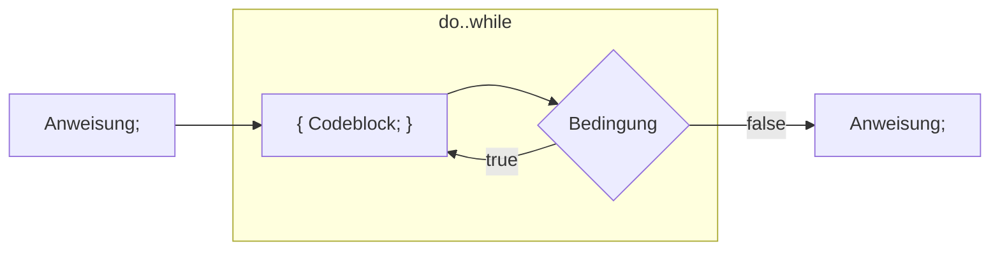

# 📖 `do..while` - Schleife

Zusätzlich zur `while`-Schlaufe existiert eine sogenannt "flussgesteuerte"
Variante von `while`. Diese Variante **beginnt mit dem Schlüsselwort `do`**, und
das `while` rutscht an den Schluss.

Hier ein explizites Beispiel zur `do..while`-Schlaufe:

<div className="grid"><div>

```java title="do { } while Code-Beispiel"
int x = 10;
do {
    System.out.println("value of x: " + x);
    x = x-1;
} while (x > 0);
```

</div><div>

### Ablaufdiagram



</div></div>

- Der `do`-Block in den gescheiften Klammern `{}` wird immer einmal ausgeführt,
  bevor die Bedingung überprüft wird.
- Ist die Bedingung, wie z.B. `while (x > 0)`, erfüllt, wird der do-Block erneut
  ausgeführt, solange bis die Bedingung nicht mehr erfüllt ist. Die `do..while`

:::info do..while

- Der Code-Block wird **immer zuerst einmal ausgeführt**
- **_Solange-die-Bedingung-zutrifft_** wird der Code-Block wiederholt
  ausgeführt.

:::
