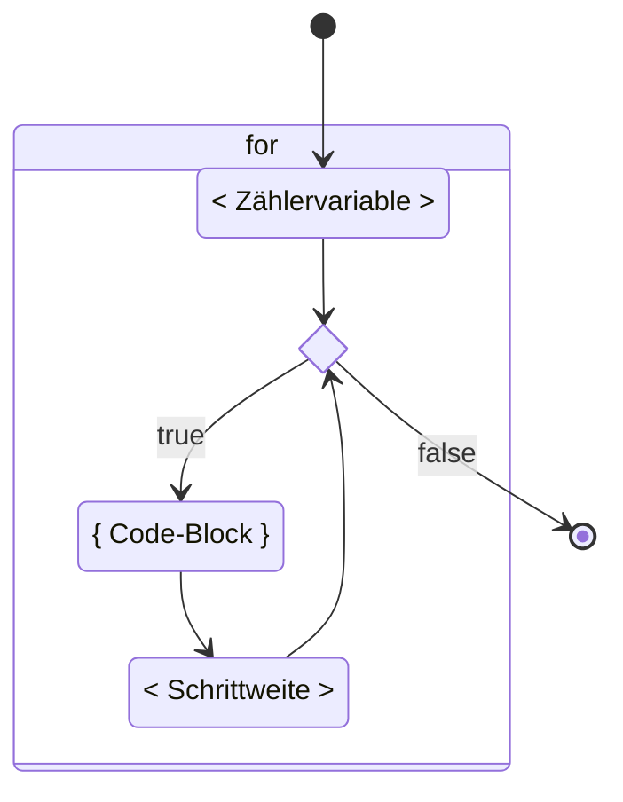

# `for`-Schleife

Neben `while` und `do..while` existiert noch eine dritte Schleifenart, die
`for`-Schleife.

Die `for`-Schleife ist eine Erweiterung der `while` Schleife, sodass zwischen
den runden Klammern `()` nicht nur eine `<Bedingung>` definiert wird, sonder
auch eine `<Zählervariable>` sowie eine `<Schrittweite>`.

- :bulb: Die drei Teile werden mit einem `;` Semikolon getrennt.
- :bulb: Für die `for`-Schleife existiert <s>keine `do..for`</s> Variante.

## Grundform

Die for Kontrollstruktur ist zuerst einmal gewöhnungsbedürftig. Das Muster sieht
so aus:

<div class="grid"><div>

#### for - Muster

```java
for (
  <Zählervariable>;
  <Bedingung>;
  <Schrittweite>
) {
    <Anweisungen, Sequenz>
}
```

:::info Semikolon

Die 3 Teile in den Runden Klammern `()` sind mit einem Semikolon `;` getrennt!
_(und stehen meist auf einer Linie nebeneinander)_

:::

</div><div>

#### for - Ablaufdiagram



</div></div>

<div class="grid three"><div>

#### `<Zählervariable>`

**Ganz am Anfang** wird die `<Zählervariable>` initialisiert und ist im
Code-Block sichtbar.

:bulb: Häufig dient die `<Zählervariable>` als Indexnummer und heisst dadurch
`i`.

</div><div>

#### `<Bedingung>`

**Vor jeder Sequenz** wird die Bedingung auf Wahrheit geprüft (`true`), ob die
die `<Anweisungen, Sequenz>` ausgeführt werden sollen oder ob die Schlaufe
beendet wird.

:bulb: Meistens betrifft die `<Bedingung>` die `<Zählervariable>`.

</div><div>

#### `<Schrittweite>`

**Am Schluss einer Sequenz**, vor der `<Bedingung>`, wird die `<Zählervariable>`
hoch oder runter gezählt.

:bulb: `i++` Zählt z.B. die Variable `i` mit der Schrittweite 1 hoch.

</div></div>

#### `<Anweisungen, Sequenz>`

Die `<Anweisungen>` im Code-Block werden Ausgeführt, solange die `<Bedingung>`
wahr (`true`) ist.

### Grundform am Beispiel

Damit es weniger abstrakt ist, hier ein Beispiel als `for` sowie `while`
Schleife, welches die Zahlen 0 bis 4 ausgibt. Dies soll veranschaulichen, wieso
die `for`-Schleife zusätzlich zur `while`-Schlaufe in fast jeder
programmiersprache existiert.

<div class="grid"><div>

**for**

```java title="for: Wiederhole 5 mal fix"
public class FixeWiederholung {

    public static void main(String[] args) {
        // highlight-start
        for (int i = 0; i < 5; i++) {
            System.out.println(i);
        }
        // highlight-end
    }

}
```

Es wird als Erstes die Variable `int i = 0;` initialisiert. Sobald die
Anweisungen innerhalb des Code-Blocks abgearbeitet sind
(`System.out.pringln(i);`), springt die Programmausführung bei der schliessenden
geschweiften Klammer wieder zurück zum for, verändert die Variable um die
Schrittweite (`i++`) und prüft, ob die Bedingung (`i < 5`) noch erfüllt ist.
Wenn ja, wird die Schleife erneut ausgeführt.

</div><div>

**while**

```java title="while: Wiederhole 5 mal fix"
public class FixeWiederholungWhile {

    public static void main(String[] args) {
        // highlight-yellow-next-line
        int i = 0;
        // highlight-start
        while (i < 5) {
          System.out.println(i);
          i++;
        }
        // highlight-end
    }

}
```

Die `while` Variante verhält sie gleich wie die `for` Variante. Sie brauch
jedoch mehr Zeilen.

:::caution Wieso wird `for` hier bevorzugt?

`int i = 0;` ist ausserhalb der Schlaufe initialisiert!

Dadurch ist diese also in der ganzen äusseren Methode sichtbar und nicht nur im
Code-Block der Schlaufe und existiert auch nach dem Beenden der Schlaufe weiter.

:::

</div></div>

<div class="grid three"><div>

**`<Zählervariable>`**

`int i = 0`: Eine Variable `i` mit Datentyp `int` wird mit `0` initialisiert

</div><div>

**`<Bedingung>`**

`i < 5`: Solange `i` kleiner als 5 ist, wird die for-Schleife weiterhin
ausgeführt

</div><div>

**`<Schrittweite>`**

`i++`: Die Variable `i` wird bei jedem Durchlauf um 1 erhöht

</div></div>

**`<Anweisungen, Sequenz>`**

Mir der Anweisung `System.out.println(i);` wird bei jeder Sequenz/Iteration bei
der die `<Bedingung>` wahr ist, die Variable `i` auf die Konsole ausgegeben.

## Programmablauf

Eine for-Schleife wird so durchlaufen, wie folgend dargestellt. Wenn die
Bedingung nicht mehr erfüllt ist, wird die Schleife beendet und es wird die
erste Anweisung unterhalb der Schleife ausgeführt (roter Pfeil).


1. Die Bearbeitung der for-Schleife beginnt beim roten Pfeil. Es wird im ersten
   Teil die `<Zählervariable>` `i` mit 0 initialisiert.
2. Im zwieten Teil, der `<Bedingung>`, wird geprüft ob die Zählervariable `i`
   kleiner als 5 ist.
3. Da dies der Fall ist, wird nun die `<Anweisungen>` (`System.out.println(i);`)
   im Code-Block `{}` ausgeführt.
4. Danach wird "nach oben" zum letzten Teil, der `<Schrittweite>` gesprungen.
   Hier wird durch `i++` die `<Zählervariable>` `i` um 1 hochgezählt.
5. Nun wird wieder zur `<Bedingung>` gesprungen.
6. Wenn die Variable `i` immer noch kleiner als 5 ist, wird die `<Anweisung>`
   wiederholt ausgeführt.

Die Punkte 3-6 (grün), werden solange wiederholt, bis die `<Bedingung>` falsch
(`false`) und somit die Variable `i` mindestens 5 ist. Im oberen Beispiel wird
das nach der 5. Wiederholung der Fall sein.

```bash title="Ausgabe vom oberen Beispiel"
0
1
2
3
4
```

## :pen: Aufgaben

### Auftrag 1

1. Geben Sie die Zahlen von 1 bis 10 aus.
2. Geben Sie die Zahlen von 37 bis 55 aus.
3. Geben Sie jede zweite Zahl von 18 bis 96 aus.
4. Fragen Sie den Benutzer nach Startwert, Endwert und Schrittweite und geben
   Sie die entsprechenden Zahlen aus.

<details>
<summary>Musterlösung</summary>

```java
public class A1aFor1to10 {

	public static void main(String[] args) {
		for(int i = 1; i <= 10; i++) {
			System.out.println(i);
		}
	}

}
```

```java
public class A1bFor37to55 {

	public static void main(String[] args) {
		for(int i = 37; i <= 55; i++) {
			System.out.println(i);
		}
	}

}
```

```java
public class A1cFor18to96 {

	public static void main(String[] args) {
		for(int i = 18; i <= 96; i = i + 2) {	// es würde auch gehen  i += 2;
			System.out.println(i);
		}
	}

}
```

```java
import mytools.StdInput;

public class A1dFor {

	public static void main(String[] args) {
		System.out.print("Startwert: ");
		int start = StdInput.readInt();

		System.out.print("Endwert: ");
		int ende = StdInput.readInt();

		System.out.print("Schrittweite: ");
		int sw = StdInput.readInt();

		for(int i = start; i <= ende; i = i + sw) {	// es würde auch gehen  i += sw;
			System.out.println(i);
		}
	}
}
```

</details>

### Auftrag 2a

- Schreiben Sie ein Programm, das eine Zeile mit 10 Sternen ausgibt.
- Die Sterne sollen einzeln in einer for-Schleife ausgegeben werden (also bei
  jedem Durchlauf der Schleife wird ein Stern der Zeile hinzugefügt).
- Verwenden Sie dazu die Methode `System.out.print` (und nicht
  System.out.println). Die Ausgabe sieht also so aus:

```bash title="Ausgabe"
**********
```

<details>
<summary>Musterlösung</summary>

```java
public class A2aSterne {

	public static void main(String[] args) {

		for(int i = 0; i < 10; i++) {
			System.out.print("*");
		}
	}

}
```

```java
public class A2bSterne {

	public static void main(String[] args) {

		for (int j = 0; j < 5; j++) {
			for (int i = 0; i < 10; i++) {
				System.out.print("*");
			}

			System.out.println();
		}
	}

}
```

</details>

### Auftrag 2b

Erweitern Sie das obige Programm so, dass 5 Zeilen mit jeweils 10 Sternen
ausgegeben werden. Die 5 Zeilen müssen auch in einer for-Schleife erstellt
werden. Die Ausgabe sollte also so aussehen :

```bash title="Ausgabe"
**********
**********
**********
**********
**********
```

<details>
<summary>Musterlösung</summary>

```java
public class A2bSterne {

	public static void main(String[] args) {

		for (int j = 0; j < 5; j++) {
			for (int i = 0; i < 10; i++) {
				System.out.print("*");
			}

			System.out.println();
		}
	}

}
```

</details>

### Auftrag 3

Schreiben Sie ein Programm Flaggen, das folgende Anforderungen erfüllt:

- die Anzahl Zeilen für die Flaggen werden vom Benutzer angegeben
- Zeile 1 enthält 1 Stern, Zeile n enthält n Sterne Die Ausgabe soll so
  aussehen:

```bash title="Ausgabe"
Anzahl Zeilen: 5
*
**
***
****
*****
```

<details>
<summary>Musterlösung</summary>

```java
import mytools.StdInput;

public class A3aFlaggen {

	public static void main(String[] args) {
		System.out.println("Flaggen 1");
		System.out.print("Anzahl Zeilen: ");
		int lines = StdInput.readInt();

		for(int currentLine = 0; currentLine < lines; currentLine++) {
			for(int currentPos = 0; currentPos <= currentLine; currentPos++) {
				System.out.print('*');
			}

			System.out.println();
		}
	}

}
```

```java
import mytools.StdInput;

public class A3bFlaggenMethode {

	public static void main(String[] args) {
		System.out.println("Flaggen 1");
		System.out.print("Anzahl Zeilen: ");
		int lines = StdInput.readInt();

		flag(lines);
	}

	public static void flag(int nr_of_lines) {
		for (int currentLine = 0; currentLine < nr_of_lines; currentLine++) {
			for (int currentPos = 0; currentPos <= currentLine; currentPos++) {
				System.out.print("*");
			}

			System.out.println();
		}

	}

}
```

</details>

### Auftrag 4

Erweitern Sie das Programm so, dass der Benutzer das Zeichen, mit dem die Flagge
gezeichnet wird, selbst festlegen kann.

Die Ausgabe soll so aussehen:

```bash title="Ausgabe"
Anzahl Zeilen: 5
Zeichen: x
x
xx
xxx
xxxx
xxxxx
```

<details>
<summary>Musterlösung</summary>

```java
import mytools.StdInput;

public class A4aFlaggen {

	public static void main(String[] args) {
		System.out.print("Anzahl Zeilen: ");
		int lines = StdInput.readInt();

		System.out.print("Zeichen: ");
		String zeichen = StdInput.readString();

		for (int currentLine = 0; currentLine < lines; currentLine++) {
			for (int currentPos = 0; currentPos <= currentLine; currentPos++) {
				System.out.print(zeichen);
			}

			System.out.println();
		}
	}

}
```

```java
import mytools.StdInput;

public class A4bFlaggenMethode {

	public static void main(String[] args) {
		System.out.print("Anzahl Zeilen: ");
		int lines = StdInput.readInt();

		System.out.print("Zeichen: ");
		String zeichen = StdInput.readString();

		flag(lines, zeichen);
	}

	public static void flag(int nr_of_lines, String character) {
		for (int currentLine = 0; currentLine < nr_of_lines; currentLine++) {
			for (int currentPos = 0; currentPos <= currentLine; currentPos++) {
				System.out.print(character);
			}

			System.out.println();
		}

	}
}
```

</details>

### Auftrag 5

Erweitern Sie das Programm so, dass der Benutzer eingeben kann, wie viele
Flaggen gezeichnet werden.

Die Ausgabe soll so aussehen:

```bash title="Ausgabe"
Anzahl Zeilen: 5
Anzahl Flaggen: 2
Zeichen: @

Flagge 1
@
@@
@@@
@@@@
@@@@@

Flagge 2
@
@@
@@@
@@@@
@@@@@
```

<details>
<summary>Musterlösung</summary>

```java
import mytools.StdInput;

public class A5aFlaggen {

	public static void main(String[] args) {
		System.out.print("Anzahl Zeilen: ");
		int lines = StdInput.readInt();

		System.out.print("Anzahl Flaggen: ");
		int flags = StdInput.readInt();

		System.out.print("Zeichen: ");
		String zeichen = StdInput.readString();

		for (int currentFlag = 0; currentFlag < flags; currentFlag++) {
			System.out.println();
			System.out.println("Flagge " + (currentFlag + 1));
			
			for (int currentLine = 0; currentLine < lines; currentLine++) {
				for (int currentPos = 0; currentPos <= currentLine; currentPos++) {
					System.out.print(zeichen);
				}

				System.out.println();
			}
		}
	}

}
```

```java
import mytools.StdInput;

public class A5bFlaggenMethode {

	public static void main(String[] args) {
		System.out.print("Anzahl Zeilen: ");
		int lines = StdInput.readInt();
		
		System.out.print("Anzahl Flaggen: ");
		int flags = StdInput.readInt();

		System.out.print("Zeichen: ");
		String zeichen = StdInput.readString();

		for (int currentFlag = 0; currentFlag < flags; currentFlag++) {
			flag(currentFlag + 1, lines, zeichen);
		}
		
		// eine andere Variante fuer das Zaehlen der Flaggen ist:
		for (int currentFlag = 1; currentFlag <= flags; currentFlag++) {
			flag(currentFlag, lines, zeichen);
		}
	}

	public static void flag(int flagNumber, int nr_of_lines, String character) {
		System.out.println();
		System.out.println("Flagge " + flagNumber);
		
		for (int currentLine = 0; currentLine < nr_of_lines; currentLine++) {
			for (int currentPos = 0; currentPos <= currentLine; currentPos++) {
				System.out.print(character);
			}

			System.out.println();
		}
		
	}

}
```

</details>

## :tv: Erklärvideos von Studiflix

- [for-Schleife einfach erklärt](https://studyflix.de/informatik/for-schleife-226)
