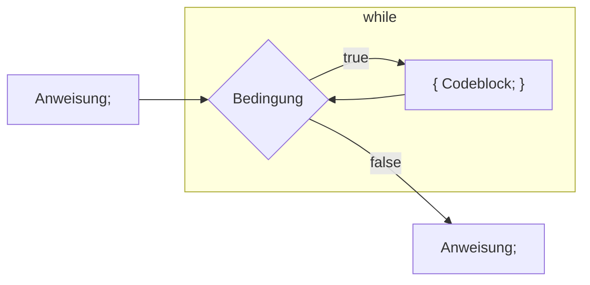

# 📖 `while` - Schleife

Die `while`-Schlaufe ermöglicht es grundsätzlich, dass Programme geschrieben
werden können, die nicht nur einmal durchlaufen, sondern Abschnitte resp. Blöcke
enthalten, die mehrfach ausgeführt werden. Sie ist dem `if` dadurch ähnlich da
Sie auch eine Bedingung besitzt. Es existiert aber nur einen Code-Block, der
solange ausgeführt wird, bis die Bedingung den boolean Wert `false` ergibt.

Ein explizites Beispiel der `while`-Kontrollstruktur sieht folgendermassen aus:

<div class="grid"><div>

```java title="While Code-Beispiel" showLineNumbers
int i = 10;
while (i > 0) {
  System.out.println("value of i: " + i);
  i--;
}
```

</div><div>

### Ablaufdiagram



</div></div>

Der Aufbau der Anweisung ist also so:

1. Es besteht ein Anfangsstatus.
   - Hier eine Variable `int i = 10;`.
2. Es folgt das Schlüsselwort `while` mit einer **booleschen Bedingung** im
   runden Klammerpaar `()`.
   - Hier `i` grösser als `0` also `(i > 0)`
3. dann folgt zwischen den beiden geschweiften Klammern `{}` der Code- Block,
   dessen Ausführung durch das `while` kontrolliert wird.
   - Er wird solange ausgeführt bis die Bedingung `false` ergibt.

**Und wie oft wird also obige Anweisung ausgeführt?**

- Beim ersten Durchlauf hat `i` den Wert 10 wie auf **Zeile 1** initialisiert.
- Dann wird dieser Wert auf **Zeile 4 um 1 verringert**
- Sobald `i` von 1 nach 0 verringert wird ist die Bedingung nicht mehr erfüllt,
  da die Bedingung verlangt, dass der Wert von i grösser als 0 sein muss.
- Die Schlaufe wird somit 10 Mal durchlaufen.

:::info while

- **_Solange-die-Bedingung-zutrifft_** wird ein Code-Block ausgeführt.
- Trifft die Bedingung von Anfang an nicht zu, wird der Code-Block auch nie
  ausgeführt.

:::

## :tv: Erklärvideos von Studyflix

- [while-Schleife einfach erklärt](https://studyflix.de/informatik/while-schleife-224)
