# 📖 `for` - Schleife

Neben `while` und `do..while` existiert noch eine dritte Schleifenart, die
`for`-Schleife.

Die `for`-Schleife ist eine Erweiterung der `while` Schleife, sodass zwischen
den runden Klammern `()` nicht nur eine `<Bedingung>` definiert wird, sonder
auch eine `<Zählervariable>` sowie eine `<Schrittweite>`.

- :bulb: Die drei Teile werden mit einem `;` Semikolon getrennt.
- :bulb: Für die `for`-Schleife existiert <s>keine `do..for`</s> Variante.

## Grundform

Die for Kontrollstruktur ist zuerst einmal gewöhnungsbedürftig. Das Muster sieht
so aus:

<div className="grid"><div>

#### for - Muster

```java
for (
  <Zählervariable>;
  <Bedingung>;
  <Schrittweite>
) {
    <Anweisungen, Sequenz>
}
```


:::info Semikolon

Die 3 Teile in den Runden Klammern `()` sind mit einem Semikolon `;` getrennt!
_(und stehen meist auf einer Linie nebeneinander)_

:::

</div><div>

#### for - Ablaufdiagram

```mermaid
flowchart TD
    A[Anweisung;] --> B["Zählervariable: i = 0;"]
    subgraph for
      B --> C{"Bedingung: i < 5"}
      C --> |true| D["`{
      &nbsp;&nbsp;// Code-Block
      &nbsp;&nbsp;System.out.println(i);
      }`"]
      D --> E["Schrittweite: i++;"]
      E --> C
    end
    C --> |false| F[Anweisung;]
    
    style D text-align:left
```




</div></div>

<div class="grid three"><div>

#### `<Zählervariable>`

**Ganz am Anfang** wird die `<Zählervariable>` initialisiert und ist im
Code-Block sichtbar.

:bulb: Häufig dient die `<Zählervariable>` als Indexnummer und heisst dadurch
`i`.

</div><div>

#### `<Bedingung>`

**Vor jeder Sequenz** wird die Bedingung auf Wahrheit geprüft (`true`), ob die
die `<Anweisungen, Sequenz>` ausgeführt werden sollen oder ob die Schlaufe
beendet wird.

:bulb: Meistens betrifft die `<Bedingung>` die `<Zählervariable>`.

</div><div>

#### `<Schrittweite>`

**Am Schluss einer Sequenz**, vor der `<Bedingung>`, wird die `<Zählervariable>`
hoch oder runter gezählt.

:bulb: `i++` Zählt z.B. die Variable `i` mit der Schrittweite 1 hoch.

</div></div>

#### `<Anweisungen, Sequenz>`

Die `<Anweisungen>` im Code-Block werden Ausgeführt, solange die `<Bedingung>`
wahr (`true`) ist.

### Grundform am Beispiel

Damit es weniger abstrakt ist, hier ein Beispiel als `for` sowie `while`
Schleife, welches die Zahlen 0 bis 4 ausgibt. Dies soll veranschaulichen, wieso
die `for`-Schleife zusätzlich zur `while`-Schlaufe in fast jeder
programmiersprache existiert.

<div className="grid"><div>

**for**

```java title="for: Wiederhole 5 mal fix"
public class FixeWiederholung {

  public static void main(String[] args) {
    // highlight-start
    for (int i = 0; i < 5; i++) {
      System.out.println(i);
    }
    // highlight-end
  }
}
```

Es wird als Erstes die Variable `int i = 0;` initialisiert. Sobald die
Anweisungen innerhalb des Code-Blocks abgearbeitet sind
(`System.out.pringln(i);`), springt die Programmausführung bei der schliessenden
geschweiften Klammer wieder zurück zum for, verändert die Variable um die
Schrittweite (`i++`) und prüft, ob die Bedingung (`i < 5`) noch erfüllt ist.
Wenn ja, wird die Schleife erneut ausgeführt.

</div><div>

**while**

```java title="while: Wiederhole 5 mal fix"
public class FixeWiederholungWhile {

  public static void main(String[] args) {
    // highlight-yellow-next-line
    int i = 0;
    // highlight-start
    while (i < 5) {
      System.out.println(i);
      i++;
    }
    // highlight-end
  }
}
```

Die `while` Variante verhält sie gleich wie die `for` Variante. Sie brauch
jedoch mehr Zeilen.

:::caution Wieso wird `for` hier bevorzugt?

`int i = 0;` ist ausserhalb der Schlaufe initialisiert!

Dadurch ist diese also in der ganzen äusseren Methode sichtbar und nicht nur im
Code-Block der Schlaufe und existiert auch nach dem Beenden der Schlaufe weiter.

:::

</div></div>

<div class="grid three"><div>

**`<Zählervariable>`**

`int i = 0`: Eine Variable `i` mit Datentyp `int` wird mit `0` initialisiert

</div><div>

**`<Bedingung>`**

`i < 5`: Solange `i` kleiner als 5 ist, wird die for-Schleife weiterhin
ausgeführt

</div><div>

**`<Schrittweite>`**

`i++`: Die Variable `i` wird bei jedem Durchlauf um 1 erhöht

</div></div>

**`<Anweisungen, Sequenz>`**

Mir der Anweisung `System.out.println(i);` wird bei jeder Sequenz/Iteration bei
der die `<Bedingung>` wahr ist, die Variable `i` auf die Konsole ausgegeben.

## Programmablauf

Eine for-Schleife wird so durchlaufen, wie folgend dargestellt. Wenn die
Bedingung nicht mehr erfüllt ist, wird die Schleife beendet und es wird die
erste Anweisung unterhalb der Schleife ausgeführt (roter Pfeil).


1. Die Bearbeitung der for-Schleife beginnt beim roten Pfeil. Es wird im ersten
   Teil die `<Zählervariable>` `i` mit 0 initialisiert.
2. Im zwieten Teil, der `<Bedingung>`, wird geprüft ob die Zählervariable `i`
   kleiner als 5 ist.
3. Da dies der Fall ist, wird nun die `<Anweisungen>` (`System.out.println(i);`)
   im Code-Block `{}` ausgeführt.
4. Danach wird "nach oben" zum letzten Teil, der `<Schrittweite>` gesprungen.
   Hier wird durch `i++` die `<Zählervariable>` `i` um 1 hochgezählt.
5. Nun wird wieder zur `<Bedingung>` gesprungen.
6. Wenn die Variable `i` immer noch kleiner als 5 ist, wird die `<Anweisung>`
   wiederholt ausgeführt.

Die Punkte 3-6 (grün), werden solange wiederholt, bis die `<Bedingung>` falsch
(`false`) und somit die Variable `i` mindestens 5 ist. Im oberen Beispiel wird
das nach der 5. Wiederholung der Fall sein.

```bash title="Ausgabe vom oberen Beispiel"
0
1
2
3
4
```

## :tv: Erklärvideos von Studiflix

- [for-Schleife einfach erklärt](https://studyflix.de/informatik/for-schleife-226)
