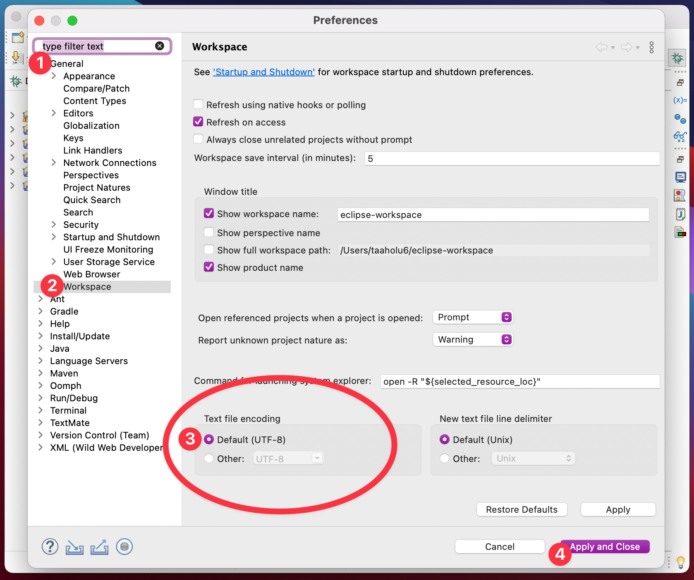

<!-- _class: big center -->

# Woche 9

## Bald geschafft! :sweat_smile:

---

<!-- _class: big emoji-list -->

# :compass: Agenda

- :juggling_person: Üben, üben, üben
- :checkered_flag: LB2 Vorbereitung (Login Workstation)
- :coffee: Grosse Pause

- ### :student: LB 2 (90 Minuten)

---

<!-- _class: big center -->

# :juggling_person: Üben

---

<!-- _class: big emoji-list -->

# :checkered_flag: LB 2 / **Vorbereitung**

- :computer: Workstation neustarten

- :cloud: Windows VM starten
- :bust*in_silhouette: **`e-`** `vorname.nachname` *(wie gewohnt, mit **e-**
  vorangestellt!)\_
- :file_folder: **`L:\Klassenarbeiten\M403-LB2-INB23AB`**
  - **`LB2.zip`** entzippen
  - in Eclipse **`File -> Open Projects from File System...`**

---

# :symbols: `UTF-8` in Eclipse!

**Eclipse Preferences** öffnen:

1. **General** auswählen
2. **Workspace** auswählen
3. **Default (UTF-8)** setzen

4. Speichern

> :scream: **Sonst compiliert euer Code auf meinem Mac nicht!**

---

<!-- _class: big center -->

# LB 2 / ****

Immer **1 Person, auf die Toilette**

**Faktenblätter** sind erlaubt!

**Teil 1** Ohne PC | **Teil 2** am PC

<!-- Display the countdown timer in -->

