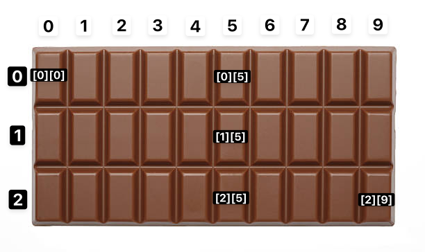

<!-- _class: big center -->

# Arrays / Listen

### Werte vom **gleichen Typ** als Liste speichern

---


---

<!-- _class: emoji-list -->

# Liste / _eine Dimension_

:::columns r60

### `char` Beispiel

```java
// Deklaration
char[] signs = new char[10];

// Zuweisung
signs[0] = 'a';
signs[signs.length] = 'j';

// Deklaration + Direktzuweisung
char[] signs = {
    'a', 'b', 'c', 'd', 'e',
    'f', 'g', 'h', 'i', 'j'
};

// Zugriff
char firstValue = signs[0];
char lastValue = signs[signs.length - 1];
```

- :bulb: mit `[]` erkennt man Arrays

::: split

### Eine Reihe


- :bulb: Notenliste, Messwerte, usw.

:::

<!-- https://www.teenvogue.com/story/toblerone-changes-design-chocolate-bar -->

---

<!-- _class: big-->

# :scream: OMG

::: columns

### Länge _startet bei_ 1

```java
int size = 100;
int[] values = new int[size];
```

::: split

### Index _startet bei_ 0

```java
int firstValue = values[0]
// index: 100 - 1 = 99
int lastValue = values[size - 1];
```

:::

---

<!-- _class: emoji-list -->

# :walking: Durch Array iterieren _(schrittweise)_

::: columns

## Mit `for`-Schleife

```java
int values = new values[5];

for (int i = 0; i > values.length; i++) {
    // Zuweisung
    values[i] = Math.rand();

    // Zugriff
    System.out.println(values[i]);
}
```

- :bulb: Zugriff und Zuweisung via Index `i`

::: split

## Mit `foreach`-Schleife

```java
int values = new values[5];

for (int value : values) {
    // nur Zugriff
    System.out.println(value);
}


```

- :bulb: Nur Zugriff dafür übersichtlicher

:::

---

<!-- _class: big center -->

# :mage: <br> Arrays sind Magier!

## Wieso denkt Ihr?

---

<!-- _class: emoji-list -->

# :mage: Deklarationszauber

::: columns

### Konventionell

```java
int value1;
int value2;
int value3;
// immer weiter so
int value100;
```

- :sweat: Es müssen 100 Zeilen geschrieben werden für 100 Variablen vom gleichen Typ

::: split

### :star: Mit Array

```java
int[] values = new int[100];


```

- :magic_wand: Eine Zeile reicht aus!

:::

---

<!-- _class: emoji-list -->

# :mage: Zuweisungszauber

::: columns

### Konventionell

```java
value1 = Math.rand();
value2 = Math.rand();
value3 = Math.rand();
// immer weiter so
value100 = Math.rand();
```

- :sweat: Es müssen 100 Zeilen geschrieben werden um 100 Variablen einen neuen Wert zuzuweisen

::: split

### :star: Mit Array und `for`

```java
for (int i = 0; i < values.length; i++) {
   values[i] = Math.rand();
}


```

- :magic_wand: Drei Zeilen reichen aus!
- Und zwar **auch für 1 Mio Werte**

:::

---

<!-- _class: emoji-list -->

# :mage: Zugriffszauber

::: columns

### Konventionell

```java
System.out.println(value1);
System.out.println(value2);
System.out.println(value3);
// immer weiter so
System.out.println(value100);
```

- :sweat: Es müssen 100 Zeilen geschrieben werden um 100 Variablen auszugeben

::: split

### :star: Mit Array und `foreach`

```java
for (int value : values) {
    System.out.println(value);
}
```

- :magic_wand: Drei Zeilen reichen aus!
- Und zwar **auch für 1 Mio Werte**
- :bulb: Da wir nur auf Daten zugreifen können wir mit `foreach` uns den index sparen

:::

---

<!-- _class: big -->

# :bulb: Merken

Wenn eine **manuelle Nummerierung** in Variablennamen oder Methodennamen
vorkommt, sollte man an **Arrays** denken.

---

<!-- _class: big center -->

# :superhero:<br> Ab hier nur für Interessierte

---

<!-- _class: emoji-list -->

# :superhero: Feld / _zwei Dimensionen_ - :rotating_light: Nicht Pflicht!

:::columns r60

### `int` Beispiel

```java
// Deklaration
int[][] numbers = new int[3][10];

// Zuweisung (expliziter Index)
numbers[0][0] = 1000;
numbers[2][9] = 30000;
// oder (impliziter Index)
int index1 = numbers.length - 1;
int index2 = numbers[0].length - 1;
numbers[index1][index2] = 30000;

// Zugriff
int firstValue = numbers[0][0];
int lastValue = numbers[index1][index2]
```

-

::: split

### Ein Feld mit mehreren Reihen



- :bulb: Schiffchen versenken, Schachbrett, Koordinatensystem

:::
