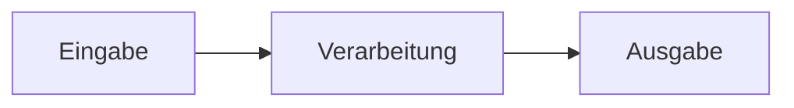

<!-- _class: big center -->

# Das EVA Prinzip

---

<!-- _class: big center -->

---

<!-- _class: big center -->

# Was gibt es für Eingabearten?

---

<!-- _class: center emoji-list -->

# Eingabe Beispiele

- Formular einer Applikation
- Mausbewegung
- Joystick bewegung
- Gamepad
- Wischgeste auf einem Smartphone
- Spracheingabe
- Kamera
- ...

---

<!-- _class: big center -->

# Was macht wohl die Verarbeitung?

---

<!-- _class: center emoji-list -->

# Verarbeitung Beispiele

- Cursor auf dem Bildschirm bewegen
- Im Computerspiel auf user Input reagieren. Z.B. Steuern
- Formulardaten in eine Datenbank speichern
- ...

---

<!-- _class: big center -->

# Und wo wird nun was Ausgegeben?

---

<!-- _class: center emoji-list -->

# Ausgabe Beispiele

- Bildschirm
- Konsole / CMD
- Visuell
- Text
- Roboterarm bewegt sich
- Lampe geht an
- Auto steuert
- NASA Rakete nimmt die richtige Laufbahn
