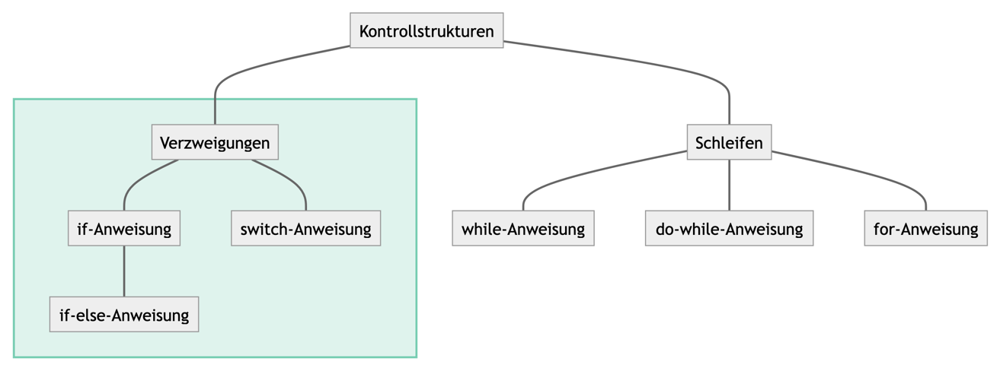
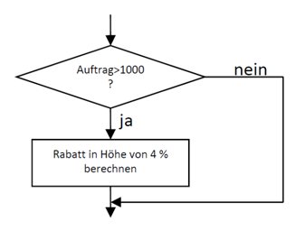

<!-- _class: big center -->

# Kontrollstrukturen

---

# Kontrollstrukturen

Vergleichs- und logische Operatoren kommen häufig dann zum Einsatz, wenn man
etwas nur unter einer bestimmten Bedingung ausführen soll.



<!-- ```mermaid -->
<!-- flowchart TD; -->
<!--     Kontrollstrukturen---Verzweigungen -->
<!--     Kontrollstrukturen---Schleifen -->
<!--     subgraph verz [ ] -->
<!--         Verzweigungen---if[if-Anweisung] -->
<!--         if---ifels[if-else-Anweisung] -->
<!--         Verzweigungen---switch[switch-Anweisung] -->
<!--     end -->
<!--     Schleifen---while[while-Anweisung] -->
<!--     Schleifen---dowhile[do-while-Anweisung] -->
<!--     Schleifen---for[for-Anweisung] -->
<!--     style verz fill:#00A17020,stroke:#00A17080,stroke-width:2px -->
<!-- ``` -->

---

# if / else if / else


- Wird dafür verwendet, **Bedingungen zu überprüfen**

- Als Bedingung dient ein **Bool'scher Wert** (`true`, `false`), welche über ein
  **Vergleichsoperator** erzeugt wird.

- Kontrolliert ob ein Codeabschnitt durchlaufen wird

---

# if / else if / else

::: columns

### Beispiel

Wenn, `if`, ein Kunde einen Auftrag über 1000.-- erteilt, bekommt er 4 % Rabatt.



::: split

### In Java

```java
double price = StdInput.readDouble();

if (price > 1000) {
    price *= 0.96;
}

System.out.println("Your price " + price);
```

- Bedingung: `price > 1000`
  - Operator: `>` grösser als
- Anweisung: `price *= 0.96`
  - Oder: `price = price * 0.96`

:::

---

<!-- _class: emoji-list -->

# if / else if / else

Mit `else if` kann priorisiert auf weitere Bedingungen reagiert werden

::: columns

### Schema

```java
if (<Bedingung1>) {
    <Anweisung1>
} else if (<Bedingung2>) { // Optionaler Block
    <Anweisung2>
} else {                  // Optionaler Block
    <Anweisung3>
}
```

- :bulb: if-Statements können beliebig verschachtelt werden!

::: split

### Code-Beispiel

```java
int age; // beliebiges alter
double betrag; // beliebiger Betrag
if (betrag > 10000 && age < 18) {
    // mehr als 10000 ausgegeben
    // UND unter 18 Jahre alt
    betrag *= 0.9;
} else if(betrag > 1000) {
    betrag *= 0.96;
} else { // Für alle andern
    betrag *= 0.98;
}
```

:::

---

# switch / case


- Wird dafür verwendet, **Gleichheit zu überprüfen**

- Als Bedingung dient die exakte Gleichheit von Werten (`==`)

- Mit `break` wird abgebrochen

- Ohne `break` wird die nächste Anweisung auch ausgeführt

---

<!-- _class: emoji-list -->
# switch / case

::: columns

### Schema

```java
switch(wert) {
  case vergleichsWert1:
    <Anweisung1>;
    // ohne `break` wird auch <Anweisung2>
    // bis zum `break` ausgeführt.
  case vergleichsWert2:
    <Anweisung2>;
    break;
  default:
    <StarndardAnweisung>;
}
```

- :bulb: Natürlich können beliebig viele `case` Blöcke folgen!

::: split

### Code Beispiel

```java
switch(kunde) {
    case "Hans":
        System.out.println("Hallo Hans!");
    case "Fritz":
        System.out.println("wie goots?");
        break;
    default:
        System.out.println("Ciao");
    }
}
```

- Hans: Hallo Hans! wie goots?
- Fritz: wie goots?
- Alle Anderen: Ciao

:::
