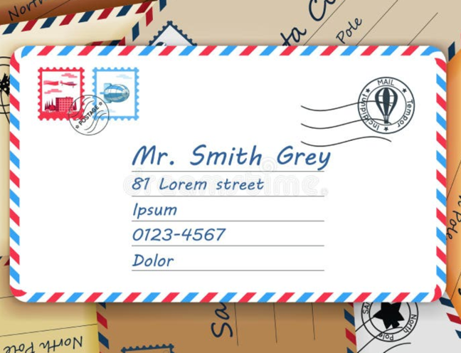
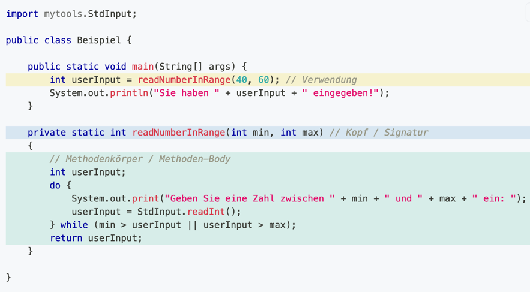
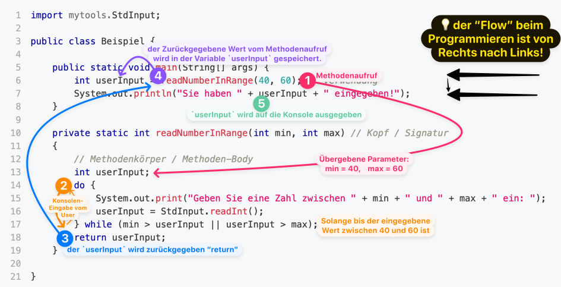

<!-- _class: big center -->

# :postbox:   Methoden

---

# Reales Beispiel

**Methodenname**: 

- verschickeBrief

**Parameter**: 

- Adresse, Briefmarke, Inhalt 

**Methodenkörper**: 

- Die Post verschickt den Brief

**Rückgabewert**:

- Nichts (senden und vergessen)

---

# Verantwortung einer Sache

- Jemand macht **eine Sache gut**
- Die Post ist gut in Briefe verschicken
- Sie Verschickt die Briefe für alle
- Der **Namen ist klar**, das jeder weis was geschieht

---

# Code-Beispiel

### Methoden Verwendung: 
Die Methode wird in einer Anweisung aufgerufen

### Methoden Kopf / Signatur: 

Definiert **wie** die Methode aufgerufen werden muss
### Methodenkörper

Definiert **was** die Methode genau macht

---

# Flow

