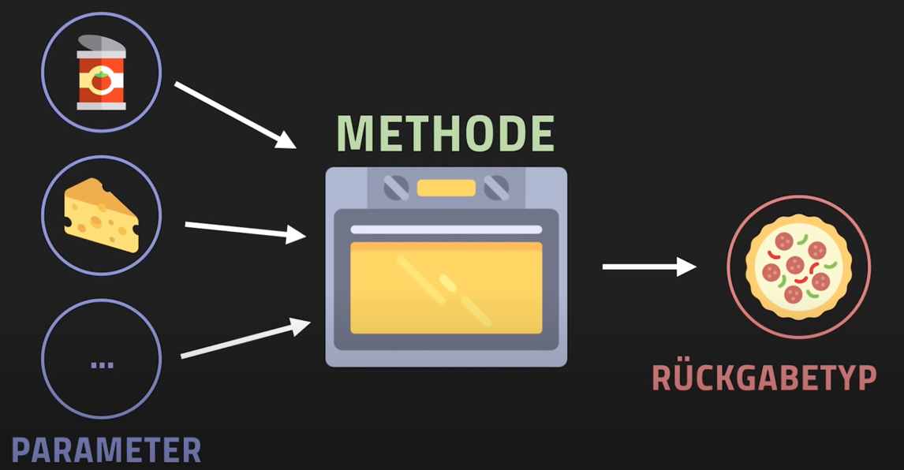

<!-- _class: big center -->

# :sparkles:  Methoden

### Eine Funktionalität unter einem Namen umsetzen

---

# :postbox: Brief verschicken

**Methodenname**: verschickeBrief

**Parameter**:

- Adresse, Briefmarke, Inhalt

**Methodenkörper**:

- Die Post verschickt den Brief

**Rückgabetyp**:

- `void` (senden und vergessen)
- alternativ einen Beleg

---

# :cook: Pizzabacken

**Methodenname**: pizzaSalamiMachen

**Parameter**:

- Teig, Käse, Tomaten, Salami, Zeit

**Methodenkörper**:

- Ofen backt die Pizza

**Rückgabetyp**: 

- Pizza Salami :pizza:

:::footnotes

Quelle: Kompezentnachweis Thema 3 einer Lehrnenden,
https://www.youtube.com/watch?v=oSDtCcDXcTM

:::

---

# Verantwortung einer Sache

- Jemand (Methode), macht **eine Sache gut** und übernimmt die Arbeit für alle
- Der **Methodennamen ist klar**, das jeder weiss was geschieht   

::: columns

### Beispiel Post

- Die Post ist gut in Briefe verschicken
- Sie Verschickt die Briefe für alle

::: split

### Beispiel Ofen

- Der Ofen kann gut backen
- Backt die Pizza

:::

---

# Nutzen

* Eine Programmlogik wird nur einmal programmiert
* Eine Programmlogik kann an verschiedenen Orten verwendet werden
* Ändert sich die Logik wird diese überall geändert
* Der Methodennamen beschreibt direkt den Quellcode
* Kleine Methoden machen den Quellcode übersichtlicher

---

# Code-Beispiel / _Struktur_

::: columns l65 s2

::: split
### Verwendung (Gelb)

Die Methode wird in einer Anweisung aufgerufen

### Methoden Kopf / Signatur (Blau)

Definiert **wie** die Methode aufgerufen werden muss

### Methodenkörper (Grün)

Definiert **was** die Methode genau macht

:::

---

# Code-Beispiel / _Flow_

::: columns l65 s1

::: split

1. Methodenaufruf, springt in die Methode

2. Schlaufe wird mehrfach wiederholt
3. `return` Wert wird ausgegeben
4. Der `return` Wert wird der Variable zugewiesen
5. Die Variable wird ausgegeben

:::

