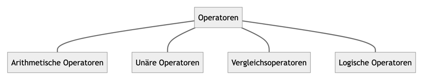
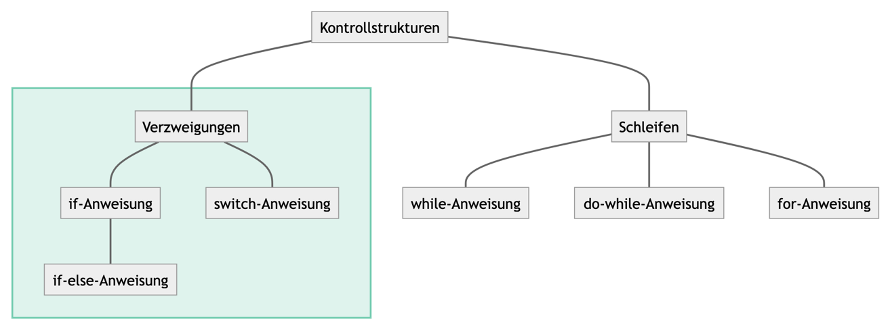
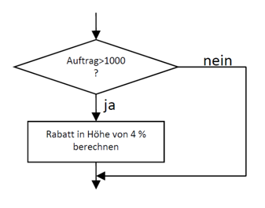

<!-- _class: big center -->

# Operatoren in Kontrollstrukturen

---

# Operatoren



<!-- ```mermaid -->
<!-- graph TD; -->
<!--     Operatoren---ao[Arithmetische Operatoren] -->
<!--     Operatoren---uo[Unäre Operatoren] -->
<!--     Operatoren---vo[Vergleichsoperatoren] -->
<!--     Operatoren---lo[Logische Operatoren] -->
<!-- ``` -->

---

<!-- _class: emoji-list -->

# Arithmetische Operatoren

## Grundrechenarten

::: columns

- \+ &nbsp;&nbsp;&nbsp; Addition
- \- &nbsp;&nbsp;&nbsp; Subtraktion
- \* &nbsp;&nbsp;&nbsp; Multiplikation
- \/ &nbsp;&nbsp;&nbsp; Division

## Modulo-Operator

- \% &nbsp;&nbsp;&nbsp; bestimmt den <u>Rest</u>

::: split

Involviert sind immer zwei Operanden.

Es gelten die selben Regeln wie in der
Mathematik:

- :black_small_square: Punktrechnung vor Strichrechnung
- :black_small_square: Durch Klammernsetzung `( )` wird der Ausdruck in den Klammern zuerst ausgewertet

:::

---

# Arithmetische Operatoren

## Beispiele

```java
int resultat = 3 + 4 * 5;      // = 23   Punkt vor Strich

int resultat = (3 + 4) * 5;    // = 35   Klammer zuerst

int resultat = 14 / 5;         // = 2    Kommastellen entfallen bei int

int resultat = 14 % 5;         // = 4    14 / 5 = 2 Rest 4
```

---

# Arithmetische Operatoren: _Verkürzt geschrieben_

::: columns

Da oft der Wert einer Variable mit **sich selbst berechnet** wird, gibt es dafür eine verkürtzte Schreibweise mit folgenden Operatoren:

- `+=` Addition mit sich selbst
- `-=` Subtraktion mit sich selbst
- `/=` Division mit sich selbst
- `*=` Multiplikation mit sich selbst
- `%=` Rest von Division mit sich selbst

::: split

## In gut Deutsch

Ein Wert wird mit sich selber berechnet

## In Java

```java
int i = 15; // Startwert von i ist 15
int k = 3;  // Startwert von k ist 3
i += 5;     // i = i + 5; -> i = 20
i -= 7;     // i = i - 7; -> i = 16
i /= k;     // i = i / k; -> i = 5
i *= 7;     // i = i * 7; -> i = 35
i %= 4;     // i = i % 4; -> i = 3
```

:::

---

# Unäre Operatoren: _`++` und `--`_

::: columns

- besitzen kein Gleichheitszeichen

- beziehen sich **auf sich selbst**
- also **nur den "linken" Teil** einer Operation
- werden ausschliesslich zum Hoch- und Runterzählen verwendet
  - `++` Inkrementierung
  - `--` Dekrementierung

::: split

## In gut Deutsch

In Einerschritten sich selbst Hoch- oder Runterzählen

## In Java

```java
int i = 3;      // Startwert für i ist 3
double d = 1.5; // Startwert für d ist 1.5

i++; // i = i + 1    -> i = 4
d--; // d = d - 1.0  -> d = 0.5
```

:::

---

# Vergleichsoperatoren

- Mit Vergleichsoperatoren lassen sich Ausdrücke formulieren, welche einen Rückgabewert vom Typ `boolean`liefern.

- Eine Variable vom Typ `boolean` kann die Werte `true` oder `false` annehmen.
- Durch Vergleichsoperatoren können Wahrheitswerte ermittelt werden
- Diese können für Entscheidungen im Programmverlauf verwendet werden.
  - `if`, `while`
- Alle Vergleichsoperatoren:
  - `==`, `!=`, `<`, `>`, `<=`, `>=`

---

# Vergleichsoperatoren: _Tabelle_

Gegeben: `int a = 2; int b = 3;`

| Operator | Beschreibung                                    | Beispiel | Resultat |
| :------- | :---------------------------------------------- | :------- | :------- |
| `==`     | überprüft auf <u>Gleichheit</u> <sup>\*</sup>   | `a == b` | `false`  |
| `!=`     | überprüft auf <u>Ungleichheit</u> <sup>\*</sup> | `a != b` | `true`   |
| `>`      | ist linker Operand <u>grösser</u>               | `a > b`  | `false`  |
| `<=`     | ist linker Operand <u>grösser oder gleich</u>   | `a <= b` | `true`   |
| `<`      | ist linker Operand <u>kleiner</u>               | `a < b`  | `true`   |
| `>=`     | ist linker Operand <u>kleiner oder gleich</u>   | `a >= b` | `false`  |

::: footnotes

\* nur bei primitiven Datentypen. Nicht bei `String`!

:::

---

# Logische Operatoren: _Kombination von bool'shen Ausdrücken_

Gegeben: `boolean a = true; boolean b = false;`

| Operator | Beschreibung                                    | Beispiel   | Resultat |
| :------- | :---------------------------------------------- | :--------- | :------- |
| `&&`     | [UND]: **beide** Ausdrücke sind `true`          | `a && b`   | `false`  |
| `\|\|`   | [ODER]: **mindistens ein** Ausdruck ist `true`  | `a \|\| b` | `true`   |
| `^`      | [XOR]: **genau einer** der Ausdrücke ist `true` | `a ^ b`    | `true`   |
| `!`      | [NOT]: wandelt ein `boolean` ins Gegenteil um   | `!b`       | `true`   |

[und]: https://de.wikipedia.org/wiki/Konjunktion_(Logik)
[oder]: https://de.wikipedia.org/wiki/Disjunktion
[xor]: https://de.wikipedia.org/wiki/Kontravalenz
[not]: https://de.wikipedia.org/wiki/Negation

---

# Kontrollstrukturen

Vergleichs- und logische Operatoren kommen häufig dann zum Einsatz, wenn man etwas nur unter einer bestimmten Bedingung ausführen soll.



<!-- ```mermaid -->
<!-- flowchart TD; -->
<!--     Kontrollstrukturen---Verzweigungen -->
<!--     Kontrollstrukturen---Schleifen -->
<!--     subgraph verz [ ] -->
<!--         Verzweigungen---if[if-Anweisung] -->
<!--         if---ifels[if-else-Anweisung] -->
<!--         Verzweigungen---switch[switch-Anweisung] -->
<!--     end -->
<!--     Schleifen---while[while-Anweisung] -->
<!--     Schleifen---dowhile[do-while-Anweisung] -->
<!--     Schleifen---for[for-Anweisung] -->
<!--     style verz fill:#00A17020,stroke:#00A17080,stroke-width:2px -->
<!-- ``` -->

---

# Kontrollstruktur: **if / else if / else**

- Ein `if-Statement` wird dafür verwendet, **Bedingungen zu überprüfen**

- Kontrolle über einen Codeabschnitt, der nur unter besonderen Bedingungen durchlaufen wird.

- Als Bedingung dient ein **Bool'scher Wert** (`true`, `false`), welche über ein **Vergleichsoperator** erzeugt wird.

---

# Kontrollstruktur: **if / else if / else**

::: columns

### Beispiel

Wenn, `if`, ein Kunde einen Auftrag über 1000.-- erteilt, bekommt er 4 % Rabatt.



::: split

### In Java

```java
double price = StdInput.readDouble();

if (price > 1000) {
    price *= 0.96;
}

System.out.println("Your price " + price);
```

- Bedingung: `price > 1000`
    - Operator: `>` grösser als
- Anweisung: `price *= 0.96`
    - Oder:  `price = price * 0.96`

:::


---

<!-- _class: emoji-list -->

# Kontrollstruktur: **if / else if / else**

Mit `else if` kann priorisiert auf weitere Bedingungen reagiert werden

::: columns

### Schema

```java
if (<Bedingung1>) {
    <Anweisung1>
} else if (<Bedingung2>) { // Optionaler Block
    <Anweisung2>
} else {                  // Optionaler Block
    <Anweisung3>
}
```

- :bulb: if-Statements können beliebig verschachtelt werden!

::: split

### Code-Beispiel

```java
int age; // beliebiges alter
double betrag; // beliebiger Betrag
if (betrag > 10000 && age < 18) {
    // mehr als 10000 ausgegeben 
    // UND unter 18 Jahre alt
    betrag *= 0.9;
} else if(betrag > 1000) {
    betrag *= 0.96;
} else { // Für alle andern
    betrag *= 0.98; 
}
```
:::

