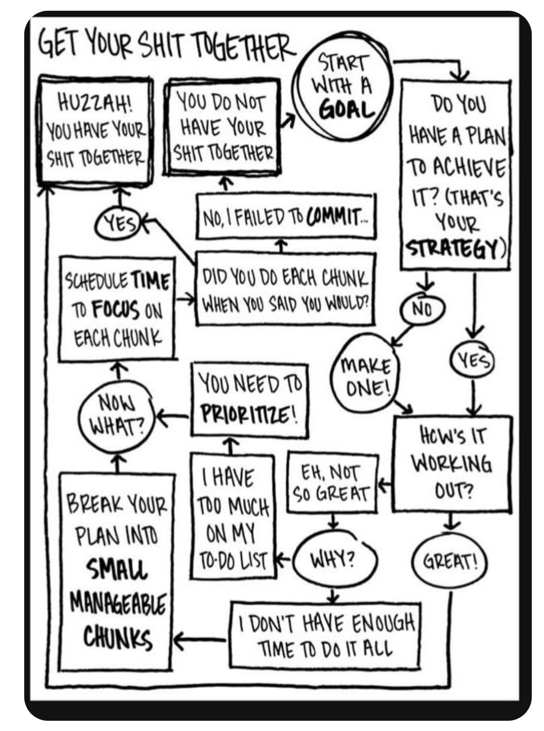
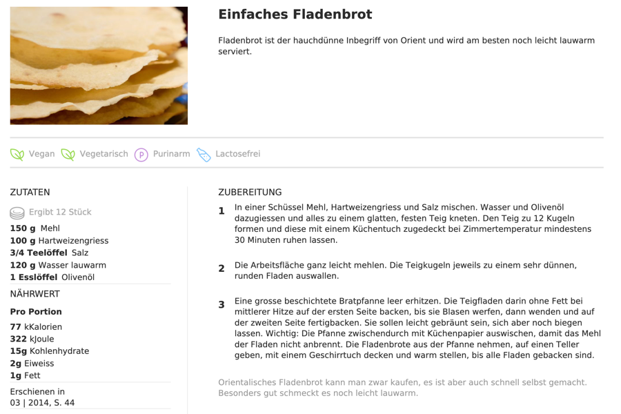

<!-- _class: big center -->

# Was ist Programmieren?

---

# Flowchart - Quiz

- Ablauf
- Fragen mit Ja/Nein
- Wiederholungen
- Ein Problem wird Gelöst rsp. Frage beantwortet

---

# Rezept

- Ablauf
- Wiederholungen
- Ein Problem wird Gelöst rsp. ein Fladenbrot gebacken

---

<!-- _class: big center -->

# Kennen Sie mehr Situationen?

---

# Grundstrukturen

Es wurden also 3 Grundstrukturen für Abläufe gefunden:

- Sequenz (Schritt für Schritt)
- Selektion / Bedingung (if, else, ...)
- Iteration (do, while, for, ...)

---

# Algorithmus

Eine **spezifische Kombination** vo

- Sequenz (Schritte)
- Selektion (Bedingungen `if`, `else`)
- und Iteration (Wiederholungen)

um ein **generelles Problem zu lösen**.

---

<!-- _class: big center -->

# + :robot:

---

<!-- _class: big center -->

# Was ist nun Programmieren?
---

<!-- _class: emoji-list big -->

Programmieren ist das Beschreiben einer Problemlösung mit Hilfe der
  drei Grundstrukturen, sodass es ein Computer versteht und ausführen kann.

 

- ### :bulb: Ein Computerprogramm ist daher immer auch ein Algorithmus.

---

<!-- _class: big center -->

# Und wie geht das?

---

<!-- _class: big center light-text -->

# Mit Programmiersprachen!

