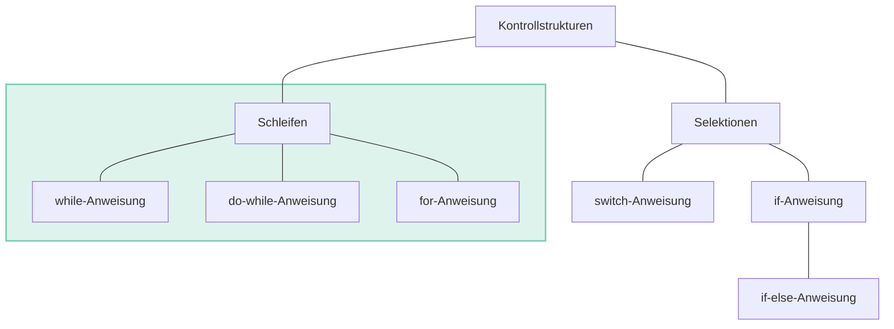
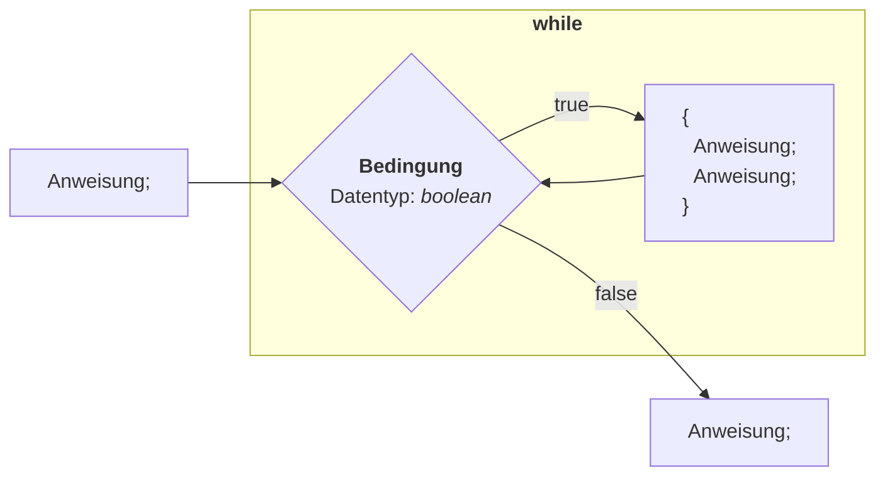
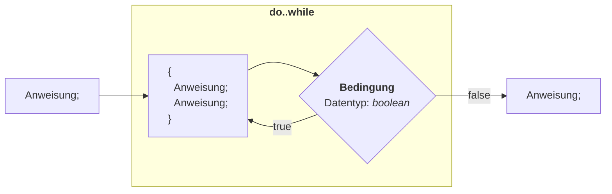
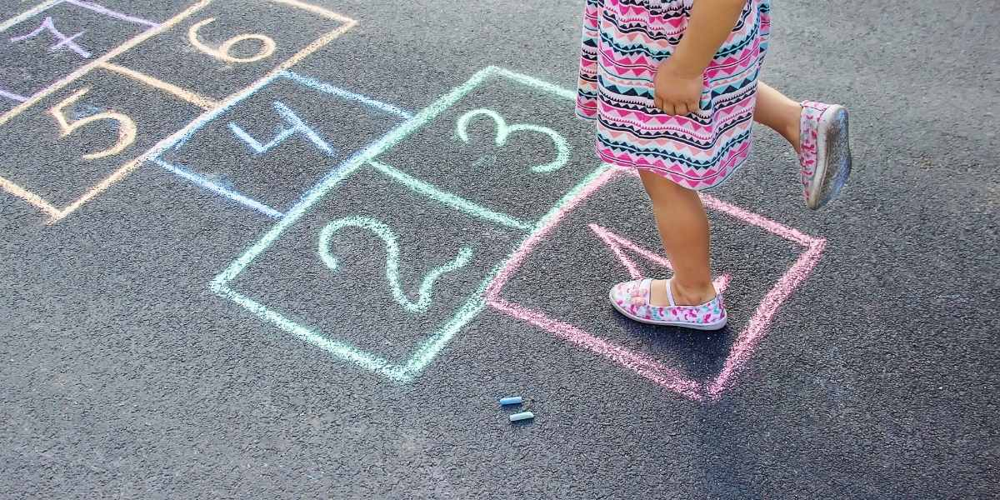

<!-- _class: big center -->

# 🔁 <br/> Schleifen und Wiederholungen

---

# Kontrollstrukturen

Vergleichs- und logische Operatoren kommen ebenfalls zum Einsatz, wenn man etwas nur **unter einer bestimmten Bedingung wiederholen** soll.



---

<!-- _class: big center light-text -->

# Zuerst Prüfen <br/> _dann solange machen bis ein Status erreicht wird_


---

# while



---

# while 

::: columns

## Schema

```java title="While Code-Beispiel" showLineNumbers
while (<Bedingung>) {
    <Anweisung>;
    <Anweisung>;
}
```


::: split

## Beispiel

```java title="While Code-Beispiel" showLineNumbers
int i = 5;
while (i > 0) {
  System.out.println("i: " + i);
  i--;
}

// Ausgabe:
// i: 5
// i: 4
// i: 3
// i: 2
// i: 1
```

:::

---

<!-- _class: big center light-text -->

# Zuerst Machen <br/> _dann prüfen bis ein Status erreicht wird_


---

# do..while



---

# do..while

::: columns

## Schema

```java
do {
    <Anweisung>;
} while (<Bedingung>);
```


::: split

## Beispiel

```java
String gedanken = "Kaffee";
String eingabe = "";
do {
  if (!eingabe.equals("")) {
    System.out.println("leider flasch :(");
  }
  System.out.println("was denke ich?: ");
  eingabe = StdInput.readstring();
} while (gedanken.equals(einbage));
System.out.println("jaaa");

// Ausgabe:
// Was denke ich?
// > quatsch
// leider falsch :(
// Was denke ich?
// > Kaffee
// jaaa
```

:::

---

<!-- _class: big center -->

# `do..while` <br/> Abfrage und Verifikation von Benutzereingaben

---

<!-- _class: big center light-text -->

# Eine bekannte Reihe/Liste durchlaufen



---

# for

::: columns

## Schema

```java
for (<Zählervariable>;
     <Bedingung>;
     <Schrittweite>
) {
    <Anweisungen, Sequenz>
}
```

### Explizites Beispiel

```java
for (int i = 0; i < 5; i++) {
    System.out.println(i);
}
```

::: split

## Ablauf


:::
