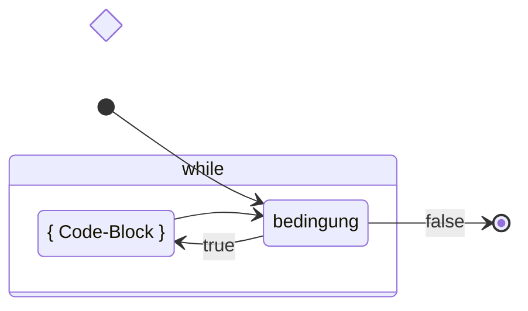
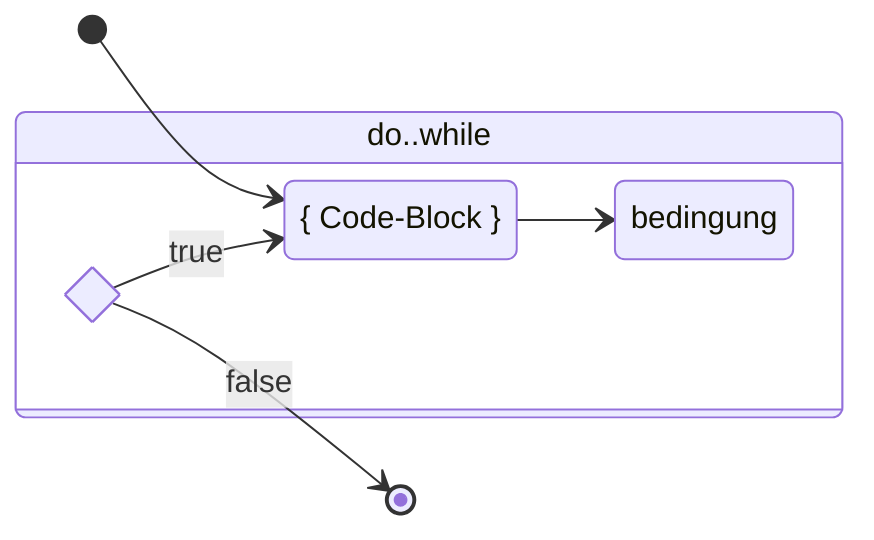
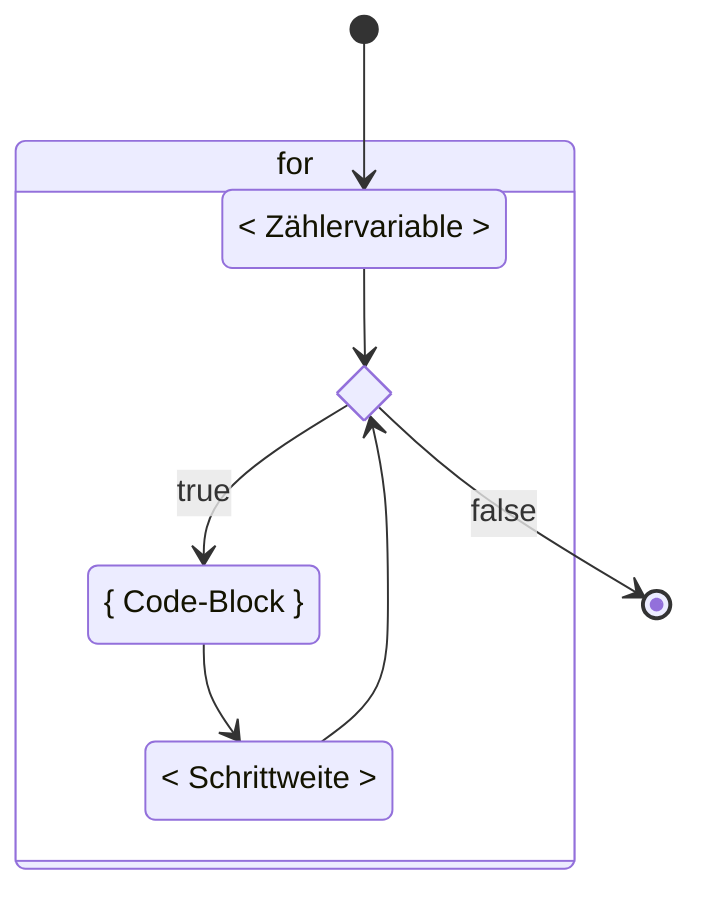

<!-- _class: big center -->

# :ferris_wheel: <br/> Schleifen und Wiederholungen

---

# while

::: columns

## Schema

```java title="While Code-Beispiel" showLineNumbers
while (<Bedingung>) {
    <Anweisung>;
    <Anweisung>;
}
```

### Explizites Beispiel

::: split



:::

```java title="While Code-Beispiel" showLineNumbers
int i = 10;
while (i > 0) {
  System.out.println("value of i: " + i);
  i = i - 1;
}
```

---

# do..while

::: columns

## Schema

```java
do {
    <Anweisung>;
    <Anweisung>;
} while (<Bedingung>);
```

### Explizites Beispiel

::: split



:::

```java
int x = 10;
do {
    System.out.println("value of x: " + x);
    x = x-1;
} while (x > 0);
```

---

# for

::: columns


```java
for (
  <Zählervariable>;
  <Bedingung>;
  <Schrittweite>
) {
    <Anweisungen, Sequenz>
}
```
### Explizites Beispiel

```java
for (int i = 0; i < 5; i++) {
    System.out.println(i);
}
```

::: split




:::
