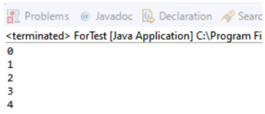

```mermaid width=70%
flowchart TD
    A[Anweisung;] --> B["Zählervariable: i = 0;"]
    subgraph for
      B --> C{"Bedingung: i < 5"}
      C --> |true| D["`{
      &nbsp;&nbsp;// Code-Block
      &nbsp;&nbsp;System.out.println(i);
      }`"]
      D --> E["Schrittweite: i++;"]
      E --> C
    end
    C --> |false| F[Anweisung;]

    style D text-align:left
```

<!-- _class: big center -->

# 🔁 <br/> Schleifen und Wiederholungen

---

# Kontrollstrukturen

Vergleichs- und logische Operatoren kommen ebenfalls zum Einsatz, wenn man etwas
nur **unter einer bestimmten Bedingung wiederholen** soll.


---

<!-- _class: big center light-text -->

# Zuerst Prüfen <br/> _dann solange machen bis ein Status erreicht wird_


---

# `while` - Schleife


---

# `while` - Schleife

::: columns

## Schema

```java title="While Code-Beispiel" showLineNumbers
while (<Bedingung>) {
    <Anweisung>;
    <Anweisung>;
}
```


::: split

## Beispiel

```java title="While Code-Beispiel" showLineNumbers
int i = 5;
while (i > 0) {
  System.out.println("i: " + i);
  i--;
}

// Ausgabe:
// i: 5
// i: 4
// i: 3
// i: 2
// i: 1
```

:::

---

<!-- _class: big center light-text -->

# Zuerst Machen <br/> _dann prüfen bis ein Status erreicht wird_


---

# `do..while` - Schleife


---

# `do..while` - Schema / Beispiel

::: columns

```java
do {
    <Anweisung>;
} while (<Bedingung>);
```


::: split

```java
String gedanken = "Kaffee";
String eingabe = "";
do {
  if (!eingabe.equals("")) {
    System.out.println("leider flasch :(");
  }
  System.out.println("was denke ich?: ");
  eingabe = StdInput.readstring();
} while (gedanken.equals(einbage));
System.out.println("jaaa");

// Ausgabe:
// Was denke ich?
// > quatsch
// leider falsch :(
// Was denke ich?
// > Kaffee
// jaaa
```

:::

---

<!-- _class: big center -->

# `do..while` <br/> Abfrage und Verifikation von Benutzereingaben

---

<!-- _class: big center light-text -->

# Eine bekannte Reihe/Liste durchlaufen


---
# `for` - Schleife

```mermaid
flowchart LR
    A[Anweisung;] --> B["Zählervariable"]
    subgraph for
      B --> C{"Bedingung"}
      C --> |true| D["`{
      &nbsp;&nbsp;Anweisung;
      &nbsp;&nbsp;Anweisung;
      }`"]
      D --> E["Schrittweite"]
      E --> C
    end
    C --> |false| F[Anweisung;]

    style D text-align:left
```



---

# `for` - Schema / Beispiel

::: columns

```java
for (
  <Zählervariable>;
  <Bedingung>;
  <Schrittweite>
) {
    <Anweisungen, Sequenz>
}
```

Beispiel:

```java
for (int i = 0; i < 5; i++) {
    System.out.println(i);
}
```

::: split



:::

---

# `for` - Ablauf und Ausgabe

 

---

<!-- _class: emoji-list -->

# `for` vs `while` für Aufzählungen

::: columns

for:

```java title="for: Wiederhole 5 mal fix"
 for (int i = 0; i < 5; i++) {
   System.out.println(i);
 }
```

- :white_check_mark: Variable `i` nur innerhalb der Schlaufe sichtbar
- :white_check_mark: kürzer

::: split

while:

```java title="while: Wiederhole 5 mal fix"
 int i = 0;
 while (i < 5) {
   System.out.println(i);
   i++;
 }
```

- :scream: Variable `i` wird **ausserhalb der Schleife** initialisiert

:::
