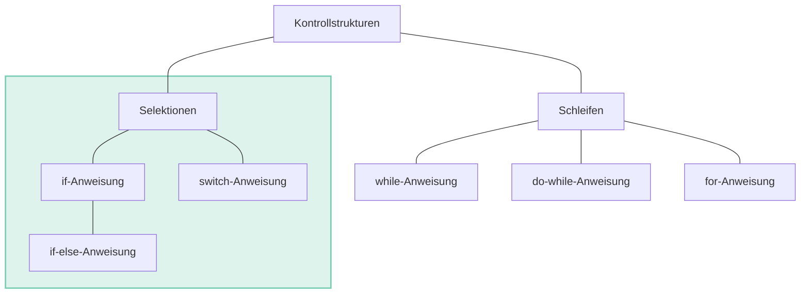
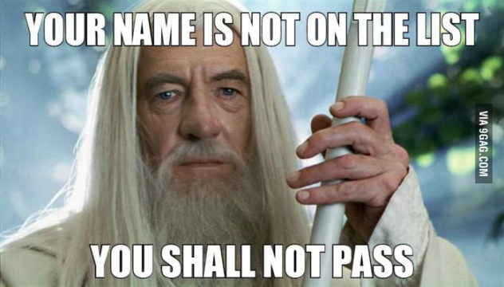
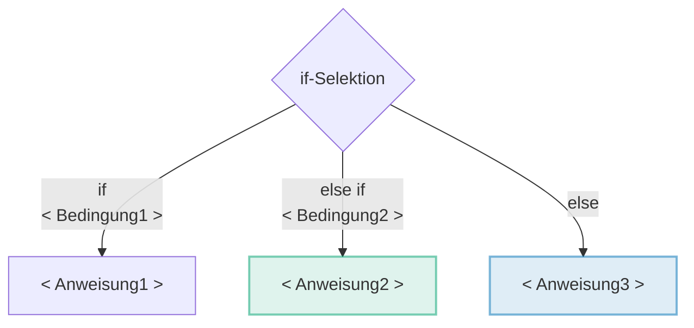
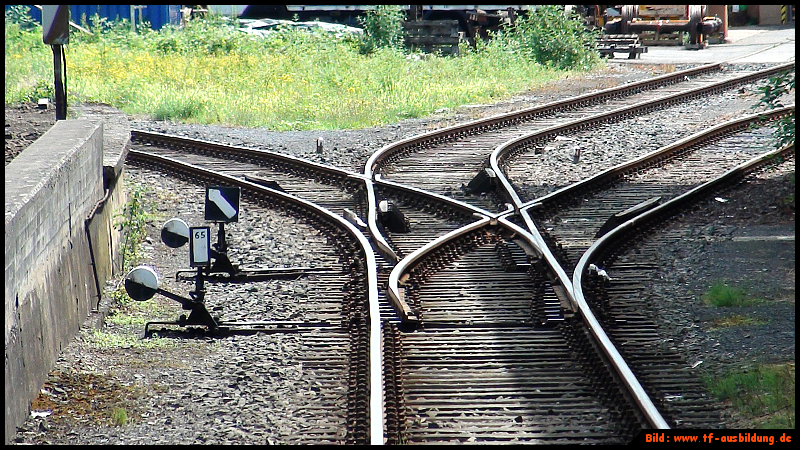
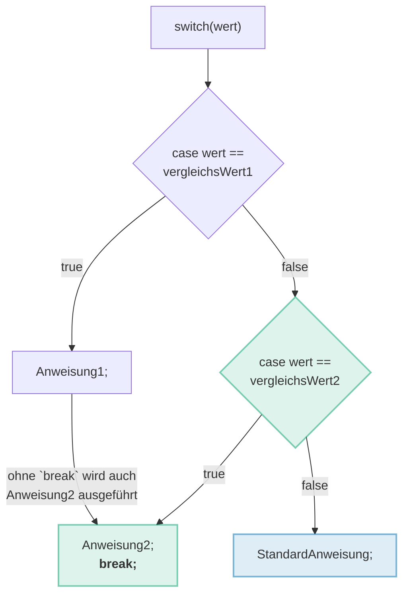

<!-- _class: big center -->

# :twisted_rightwards_arrows: <br/> Selektion

---

# Kontrollstrukturen

Vergleichs- und logische Operatoren kommen häufig dann zum Einsatz, wenn man
etwas nur **unter einer bestimmten Bedingung ausführen** soll.



---



---

# ⚖️ Bedingungen | _Vergleichsoperatoren_

Gegeben: `int a = 3; int b = 3;`

| Operator | Beschreibung                                    | Beispiel | Resultat |
| :------- | :---------------------------------------------- | :------- | :------- |
| `==`     | überprüft auf <u>Gleichheit</u> <sup>\*</sup>   | `a == b` | `true`   |
| `!=`     | überprüft auf <u>Ungleichheit</u> <sup>\*</sup> | `a != b` | `false`  |
| `>`      | ist linker Operand <u>grösser</u>               | `a > b`  | `false`  |
| `>=`     | ist linker Operand <u>grösser oder gleich</u>   | `a >= b` | `true`   |
| `<`      | ist linker Operand <u>kleiner</u>               | `a < b`  | `false`  |
| `<=`     | ist linker Operand <u>kleiner oder gleich</u>   | `a <= b` | `true`   |

::: footnotes

\* nur bei primitiven Datentypen. Nicht bei `String`!

:::

---

# :stew: Bedingungen kombinieren

Gegeben: `boolean a = true; boolean b = false;`

| Operator | Beschreibung                                    | Beispiel   | Resultat |
| :------- | :---------------------------------------------- | :--------- | :------- |
| `&&`     | [UND]: **beide** Ausdrücke sind `true`          | `a && b`   | `false`  |
| `\|\|`   | [ODER]: **mindistens ein** Ausdruck ist `true`  | `a \|\| b` | `true`   |
| `^`      | [XOR]: **genau einer** der Ausdrücke ist `true` | `a ^ b`    | `true`   |
| `!`      | [NOT]: wandelt ein `boolean` ins Gegenteil um   | `!b`       | `true`   |

[und]: https://de.wikipedia.org/wiki/Konjunktion_(Logik)
[oder]: https://de.wikipedia.org/wiki/Disjunktion
[xor]: https://de.wikipedia.org/wiki/Kontravalenz
[not]: https://de.wikipedia.org/wiki/Negation

---

# if / else if / else

::: columns

- Wird dafür verwendet, **Bedingungen zu überprüfen**

- Als Bedingung dient ein **Bool'scher Wert** (`true`, `false`), welche über ein **Vergleichsoperator** erzeugt wird.

- Kontrolliert ob ein Codeabschnitt durchlaufen wird

::: split



:::

---

# if / else if / else

::: columns

### Beispiel

Wenn, `if`, ein Kunde einen Auftrag über 1000.-- erteilt, bekommt er 4 % Rabatt.


::: split

### In Java

```java
double price = StdInput.readDouble();

if (price > 1000) {
    price *= 0.96;
}

System.out.println("Your price " + price);
```

- Bedingung: `price > 1000`
  - Operator: `>` grösser als
- Anweisung: `price *= 0.96`
  - Oder: `price = price * 0.96`

:::

---



---

<!-- _class: emoji-list -->

# if / else if / else

Mit `else if` kann priorisiert auf weitere Bedingungen reagiert werden

::: columns

### Schema

```java
if (<Bedingung1>) {
    <Anweisung1>
} else if (<Bedingung2>) { // Optionaler Block
    <Anweisung2>
} else {                  // Optionaler Block
    <Anweisung3>
}
```

- :bulb: if-Statements können beliebig verschachtelt werden!

::: split

### Code-Beispiel

```java
int age; // beliebiges alter
double betrag; // beliebiger Betrag
if (betrag > 10000 && age < 18) {
    // mehr als 10000 ausgegeben
    // UND unter 18 Jahre alt
    betrag *= 0.9;
} else if(betrag > 1000) {
    betrag *= 0.96;
} else { // Für alle andern
    betrag *= 0.98;
}
```

:::

---

# switch / case

::: columns

- Wird dafür verwendet, **Gleichheit zu überprüfen**

- Als Bedingung dient die exakte Gleichheit von Werten (`==`)

- Mit `break` wird abgebrochen

- Ohne `break` wird die nächste Anweisung auch ausgeführt

::: split



:::

---

<!-- _class: emoji-list -->

# switch / case

::: columns

### Schema

```java
switch(wert) {
  case vergleichsWert1:
    <Anweisung1>;
    // ohne `break` wird auch <Anweisung2>
    // bis zum `break` ausgeführt.
  case vergleichsWert2:
    <Anweisung2>;
    break;
  default:
    <StarndardAnweisung>;
}
```

- :bulb: Natürlich können beliebig viele `case` Blöcke folgen!

::: split

### Code Beispiel

```java
switch(kunde) {
    case "Hans":
        System.out.println("Hallo Hans!");
    case "Fritz":
        System.out.println("wie goots?");
        break;
    default:
        System.out.println("Ciao");
    }
}
```

- Hans: Hallo Hans! wie goots?
- Fritz: wie goots?
- Alle Anderen: Ciao

:::
