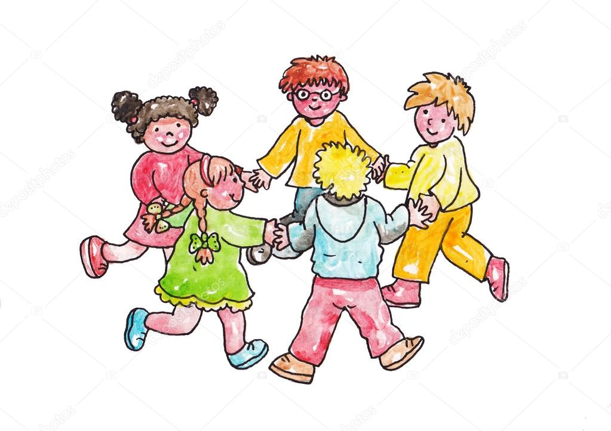

<!-- _class: big center -->

# :joystick: <br/> Spiele

---

<!-- _class: big center -->

# Spiele kombinieren alles bis jetzt gelernte

---

# :scroll: Variablen / Typen


- Spieler
- Punkte
- Spielstand
- Inhalt

---

# :twisted_rightwards_arrows: Selektion


- Spielregeln
- Entscheidungen
- Wer hat gewonnen wann?

### :bulb: Vergleichsoperatoren

---

# 🔁 Schleifen



- Spiele haben oft Wiederholungen
- Abfragen bis ein Wert stimmt
- Nach einem Spieler kommt der nächste
- Das wird auch **Game Loop** genannt

---

# :sparkles: Methoden


- Komplexe Spiele übersichtlich halten
- Regeln auslagern

### :bulb: Nicht immer nötig aber hilfreich

---

<!-- _class: big center -->

# Und fügt noch :heart: dazu! durch...

---

<!-- _class: big center -->

# :game_die: <br /> Zufall <br /> :zany_face: :scream: :flushed: :sob: :star_struck:

---

**Zahl zwischen 0 und 1**

```java
double zufallszahl = Math.random(); // 0.1, ..., 0.5, ... 0.9
```

**Zahl von 1 bis und mit 6** :game_die:

```java
int wuerfelZahl = (int) (Math.random() * 6) + 1;
```

| `Math.random()` | 0.1   | 0.2   | 0.3 | 0.4   | 0.5   | 0.6 | 0.7   | 0.8 | 0.9   | 1.0 |
| --------------- | ----- | ----- | --- | ----- | ----- | --- | ----- | --- | ----- | --- |
| `* 6`           | 0.6   | 1.2   |     | 2.4   | 3.0   |     | 4.2   |     | 5.4   |     |
| `+ 1`           | 1.6   | 2.2   |     | 3.4   | 4.0   |     | 5.2   |     | 6.4   |     |
| `(int)`         | **1** | **2** |     | **3** | **4** |     | **5** |     | **6** |     |
