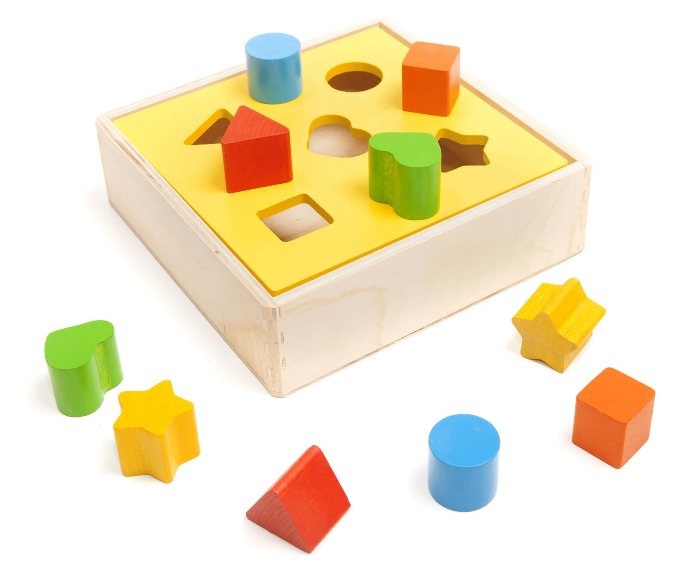
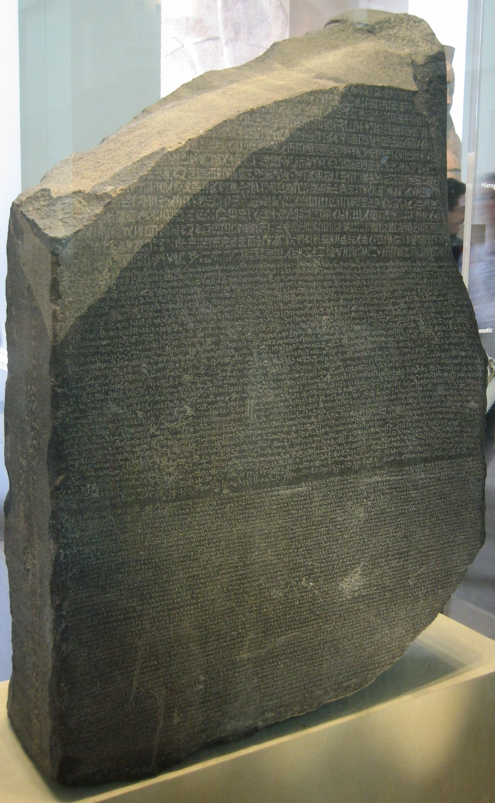

<!-- _class: big center -->

# Variablen & Datentypen

---

# Variablen


- Speicherbereich
- Beinhalten Informationen

## Reale Beispiele

- Karteikarten
- Regal
- Schrank

---

# Datentypen



- Verschiedene **Arten** von Informationen
- Brauchen **verschieden viel Platz**

## Reale Beispiele

- Papiergrössen A1, A2, A3, A4
- Viereck, Dreieck, Kreis
- Zahlen, Buchstaben, Bilder

---

# Konstante



- Nicht veränderbar
- In den Stein gemeisselt

## Reale Beispiele

- Rosetta Stein
- Die Zahl Pi: 3.14159...
- Lichtgeschwindigkeit: </br> 299792458 m/s

---

# Datentypen / **Zahlen**

| Datentyp   | Grösse       | Beschreibung                                                                              |
| ---------- | ------------ | ----------------------------------------------------------------------------------------- |
| byte       | 1&nbsp;byte  | Speichert ganze Zahlen von `-128` bis `127`                                               |
| short      | 2&nbsp;bytes | Speichert ganze Zahlen von `-32'768` bis `32'767`                                         |
| **int**    | 4&nbsp;bytes | Speichert **ganze Zahlen** `-2'147'483'648` bis `2'147'483'647`                           |
| long       | 8&nbsp;bytes | Speichert ganze Zahlen von `-9'223'372'036'854'775'808l` bis `9'223'372'036'854'775'807l` |
| float      | 4 bytes      | Speichert Gleitkommazahlen von `6` bis `7` Dezimalstellen                                 |
| **double** | 8 bytes      | Speichert **Gleitkommazahlen** von `15` Dezimalstellen                                    |

---

# Datentypen / **Bedingung**

| Datentyp    | Grösse | Beschreibung                                            |
| ----------- | ------ | ------------------------------------------------------- |
| **boolean** | 1 bit  | Speichert `true` _(wahr)_ oder `false` _(falsch)_ Werte |

# Datentypen / **Zeichen (Schrift)**

| Datentyp   | Grösse            | Beschreibung                                     | Spezifika |
| ---------- | ----------------- | ------------------------------------------------ | --------- |
| **char**   | 2 bytes           | Speichert ein einzelnes **Zeichen** oder [ASCII] | `''`      |
| **String** | 2&nbsp;bytes/char | Speichert eine **Kette von `char`**              | `""`      |

---

# Deklarierung einer Variable

```java
// Datentyp     Variablenname  Semikolon
   int          number         ;
   char         sign           ;
   ...
```

## Mit initialisierung (Wertzuweisung)

```java
// Datentyp     Variablenname   Zuweiseoperator   Wert   Semikolon
   int          number         =                 5     ;
   long         longNumber     =                 123l  ;
   char         sign           =                 'c'   ;
   String       text           =                 "Hi"  ;
```
