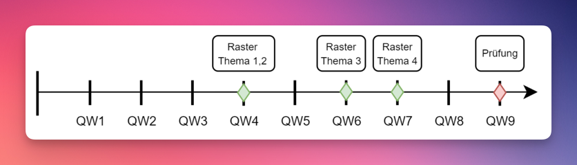

<!-- _class: big center -->

# Woche 2 / Modul 319

### Applikationen entwerfen und implementieren

---

<!-- _class: big center -->

# Ablauf

### Siehe grosser Screen :point_right:

---

# LB1: Kompetenzraster

:::columns

## Google Classroom

Die Dokumente zum Beurteilungsraster befinden sich im
[Google Classroom](https://classroom.google.com).

Diese können dort bearbeitet und abgegeben werden.

- Für die Klasse INP23A: **lx4viyj**

::: split

## Webseite

Bitte lest alle als Hausaufgaben die Beschreibung zum LB1 durch!

Macht euch mit dem Bewertungsraster im Google Classroom vertraut

:::

---

# LB1: Themenübersicht

**Woche 4**

1. :scroll: Variablen / Datentypen
2. :heavy_division_sign: Operatoren / 
   :twisted_rightwards_arrows: Selektion (if / else)

**Woche 6**

3. :factory: Methoden / Funktionen

**Woche 7**

4. :bug: Fehleranalyse und Debugging

---

<!-- _class: emoji-list -->

# LB1: Checkliste

- :white_check_mark: Abgegebener Quellcode entspricht der **Konvention**
  - :exclamation: Es gibt pro Konventionsfehler 0.1 Notenpunkt Abzug

- :white_check_mark: Die **Abgabefrist** ist eingehalten
  - :exclamation: Pro Dokument gibt es 0.25 Notenpunkte Abzug

- :white_check_mark: **Eigene Beispiele** mit eigenen **Ideen** für den Schwierigkeitsgrad "C" des Rasters sind vorhanden
  - :exclamation: Ohne eigene Beispiele und Ideen 0 Punkte für diesen Teil

---

<!-- _class: emoji-list -->

# :computer: EVA Prinzip

::: columns l60

- :dart: Sie können das EVA-Prinzip erklären.
- :dart: Sie können Bibliotheken in Eclipse-Projekt einbinden und Benutzereingaben einlesen.

::: split

- :man_teacher: Lehrergespräch  mit Präsentation (10min)

:::

### :pencil: Auftrag

::: columns l60

Zusammen werden wir das EVA-Prinzip ergründen und in Eclipse die Voraussetzung dazu schaffen.

- [:link: Das EVA-Prinzip | Modulwebseite](https://codingluke.github.io/bbzbl-modul-319/docs/woche02/2a-eva/)

::: split

- :dna: Plenum / Live-Coding
- :clock1: Bis zur grossen Pause

:::

---

<!-- _class: emoji-list -->

# :scroll: Variablen und Datentypen

::: columns l60

- :dart: Sie kennen die primitiven Datentypen und den höheren Datentyp String
- :dart: Sie können diese als Variablen in Programmen nutzen.

::: split

- :man_teacher: Präsentation von der Lehrperson (15min)

:::

### :pencil: Auftrag

::: columns l60

Die Aufgaben [A1](/docs/woche02/2b-datentypen/primitive-datentypen.md#pen-a1-datentypen-bestimmen), [A2](/docs/woche02/2b-datentypen/variablen.md#pen-a2-datentypen-initialisieren), und [A3](/docs/woche02/2b-datentypen/casting.md#pen-a3-datentypen-konvertieren) auf der Modulwebseite lesen und bearbeiten

- [:link: Variablen & Datentypen | Modulwebseite](https://codingluke.github.io/bbzbl-modul-319/docs/woche02/2b-datentypen/)

::: split

- :dna: Freies Arbeiten
- :clock1: Bis 15:30

:::

---

<!-- _class: emoji-list -->

# :heavy_division_sign: Operatoren und rechnen

::: columns l60

- :dart: Sie wissen was Operatoren sind
- :dart: Sie können mit Variablen rechnen

::: split

- :man_teacher: Präsentation von der Lehrperson (15min)

:::

### :pencil: Auftrag

::: columns l60

1. Die Aufgaben auf der Modulwebseite lesen
2. Die Aufgabe [A1: Noten berechnen](/docs/woche02/operatoren.md#pen-a1-noten-berechnen) lösen

- [:link: Variablen & Datentypen | Modulwebseite](https://codingluke.github.io/bbzbl-modul-319/docs/woche02/2b-datentypen/)

::: split

- :dna: Freies Arbeiten
- :clock1: Bis 16:15

:::

