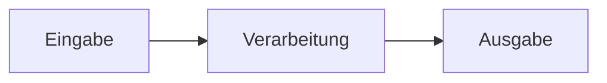

<!-- _class: big center -->

# Woche 2 / Modul 319

### Applikationen entwerfen und implementieren

---

<!-- _class: big center -->

# Ablauf

### :point_right: Siehe grosser Screen

---

# LB1: Kompetenzraster

:::columns

## Google Classroom

Die Dokumente zum Beurteilungsraster befinden sich im
[Google Classroom](https://classroom.google.com).

Diese können dort bearbeitet und abgegeben werden.

- Für die Klasse INP23A: **lx4viyj**

::: split

## Webseite

Bitte lest alle als Hausaufgaben die Beschreibung zum LB1 durch!

Macht euch mit dem Bewertungsraster im Google Classroom vertraut

:::

---

# LB1: Themenübersicht

 

1. :scroll: Variablen / Datentypen
2. :twisted_rightwards_arrows: Operatoren / Kontrollstrukturen (if / else)

3. :factory: Methoden / Funktionen

4. :bug: Fehleranalyse und Debugging

---

<!-- _class: big -->

# LB1: Wichtige Details :rotating_light:

- Code Beispiele müssen der **Konvention entsprechen**
  - Es gibt pro Konventionsfehler 0.1 Notenpunkt Abzug

- Die **Abgabefrist** muss eingehalten werden
  - Pro Dokument gibt es 0.25 Notenpunkte Abzug
- Für den fortgeschrittenen Schwierigkeitsgrad Rasters benötigen Sie **eigene Beispiele mit eigenen Ideen**

---

<!-- _class: big center -->

# Meilensteine

---

<!-- _class: big center -->

# EVA Prinzip

---

<!-- _class: big center -->

# Was gibt es für Eingabearten?

---

# Eingabe Beispiele

- Formular einer Applikation
- Mausbewegung
- Joystick bewegung
- Gamepad
- Wischgeste auf einem Smartphone
- Spracheingabe
- Kamera
- ...

---

<!-- _class: big center -->

# Was macht wohl die Verarbeitung?

---

# Verarbeitung Beispiele

- Cursor auf dem Bildschirm bewegen
- Im Computerspiel auf user Input reagieren. Z.B. Steuern
- Formulardaten in eine Datenbank speichern
- ...

---

<!-- _class: big center -->

# Und wo wird nun was Ausgegeben?

---

# Ausgabe Beispiele

- Bildschirm
- Konsole / CMD
- Visuell
- Text
- Roboterarm bewegt sich
- Lampe geht an
- Auto steuert
- NASA Rakete nimmt die richtige Laufbahn
