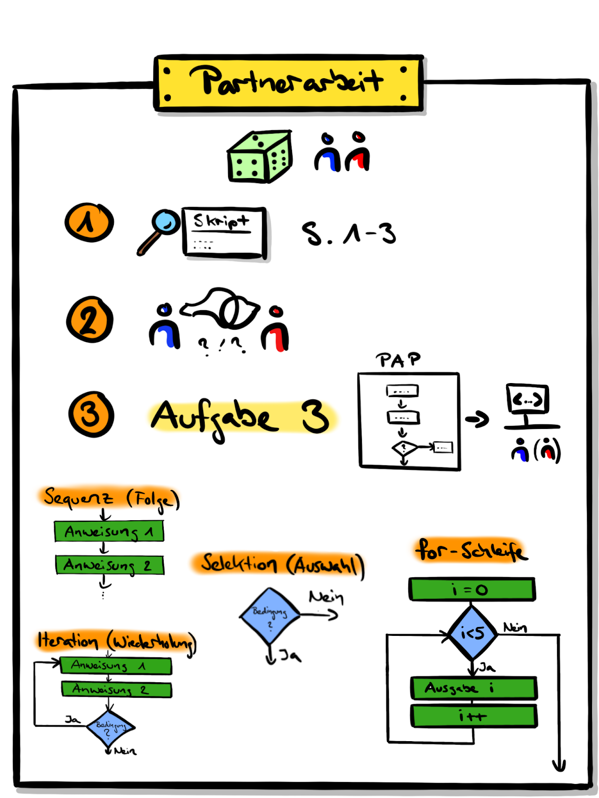

<!-- _class: big center -->

# Woche 8 / Modul 319

### 🔁 for - Schleife | 🍡 Array | :recycle: Repetition

---

<!-- _class: big center -->

# Ablauf

### Siehe grosser Screen :point_right:

---

<!-- _class: big center -->

# 🎖️   Prüfung nach den   :christmas_tree: Ferien :fireworks:

---

<!-- _class: big center -->

# :man_teacher:   Schleifen und Wiederholungen

---

# :pencil: `for`-Schleife

:game_die: Zufällige Partnerzuweisung

:clock2: Bis zur grossen Pause

1. Lest die [:open_book: Theorie auf der Webseite zur `for`-Schleife](https://codingluke.github.io/bbzbl-modul-319/docs/woche07/5a-while/for)
2. Tauscht euch gegenseitig aus
3. Löst [🖊️ A3: Erweiterte Sterne](https://codingluke.github.io/bbzbl-modul-319/docs/woche07/5a-while/for-aufgaben#a3-erweiterte-sterne-star2)

   1. **zuerst Visuell!**
   2. Dann erst im Code.

---

<!-- _class: big center -->

# :man_teacher:   Array / Listen

---

# :pencil: `array` - Notenliste

:game_die: Zufällige Partnerzuweisung

:clock2: Bis 16:00

1. Lest die [:open_book: Theorie auf der Webseite zur `array` und `foreach`](https://codingluke.github.io/bbzbl-modul-319/docs/woche07/7a-for-arrays/arrays)
2. Tauscht euch gegenseitig aus

3. Löst [🖊️ A7: Noten](https://codingluke.github.io/bbzbl-modul-319/docs/woche07/7a-for-arrays/array-aufgaben#a7-noten-star2)

---

<!-- _class: big center -->

# 🎖️   Prüfung nach den   :christmas_tree: Ferien :fireworks:
